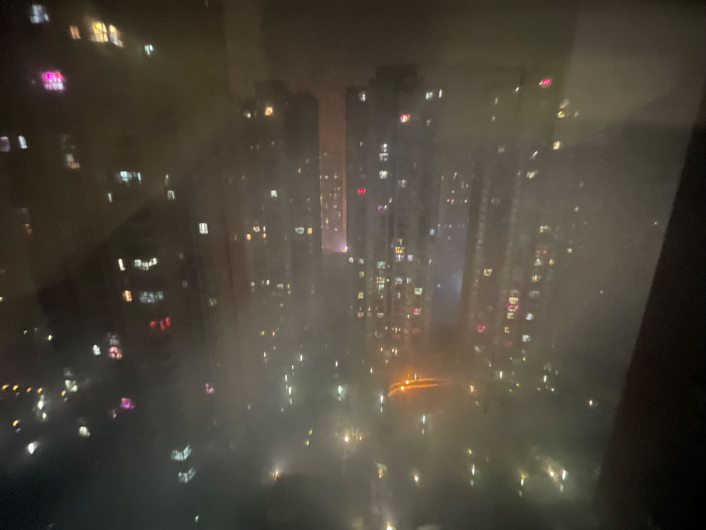

# 1.21 大年三十

> 打工的最后一天，也是今年最后一天，同样也是明年的前一天。故事即将于此结束，也将于此开启新的篇章。

今早发生的一切仿佛就是昨日的复制粘贴，关灯睡觉，起床上班。今天和昨天在打工方面有什么区别吗？似乎没有，唯一的区别可能就是前来买春联的人出手更加阔绰些。毕竟大年三十了，谁也不想为了那么十几块钱斤斤计较，大家都想顺顺利利、开开心心地过个年。

午饭后，刚把车车停在店门口，就接到了一个支线任务——去动车站接表哥。按下“E”键，开始行动！进入三档加速模式，恰一路绿灯，遂狂飙不止。下车，寻找目标人物，扫视四周一圈，褐色卫衣美男子，get it！接上车后，与表哥聊天。发现**“劝人学医，天打雷劈”**确实不是空穴来风，单说这“晚班从晚上八点到早上八点，一连半个月晚班”的工作强度，就不是一般人能 cover 的。虽说收入不菲，但也得有命享受。\
14：56，为期六天的打工生活正式结束，妈妈也象征性地发了 300CNY 作为工钱。金钱的数量并不重要，因为没有达到那种量级，但毕竟是自己的劳动所得，因此倍感快乐与满足！

回到外婆家已经是 15：07 了。从三年前开始，每年这个时候就有一项光荣且艰巨的任务等待着我和表哥——贴春联，从六楼的天台到一楼的入户大门，八幅春联，并不小的一个工作量，因此我们得抓紧时间了！我拿起扶梯往天台走去，表哥一手端着秘制浆糊，一手提着春联袋紧随其后。\
辨认上下联，比对位置，刷浆糊于墙，固定春联最上端，粘紧春联剩余部分，一气呵成，重复 n 次。\
由于我和表哥已经是多年的黄金搭档，这些基操我们烂熟于心了。今年与往年不同的地方在于，今年是我爬上扶梯贴春联的最上端。前人东坡说“高处不胜寒，起舞弄清影，何似在人间”，我今言“扶梯不太稳，高处有点怕，能否快一点😣”

贴完了春联，手上乌漆嘛黑，全是墙上脱落的灰（可能是因为去年贴的春联太牢靠了，今年撕春联的时候，连带将墙皮也带了一部分出来）。用高贵的蓝月亮洗手液，反复搓洗，直至洁白无垢，上桌洗手吃饭。今年的年夜饭还是我、爸爸、妈妈、外婆一起吃，吃一餐简简单单的火锅，朴实无华。刚开始动筷子三五分钟，舅妈突然下来喊我去她家吃饭，因为一些意外，她家多煮了非常多道菜，于是想叫我上去吃，而后在爸妈、外婆的首肯下，我就跟随舅妈上楼去她家蹭了一顿年夜饭。共有十道菜肴，寓意十全十美。有春只鱼、卤牛肉、虾、螃蟹、芋泥……风卷云残过后，饱腹，直呼“太好吃了，可惜没有第二个肚子吃。”滞留十来分钟后，告别舅舅、舅妈一家，回到楼下外婆家帮忙收拾一下东西，紧接着又与外婆告别，回自己的新家。

此时天开始慢慢下起淅淅沥沥的小雨，我、爸爸、妈妈三个人每人骑一部电动车，身披雨衣，在满天烟花爆竹的陪伴下，踏上了回家的路。在等红绿灯的时候，我拍下了如下这张图。一家人在一起，再平凡的时刻，也洋溢着幸福与欢乐。

<figure><figcaption></figcaption></figure>

十多分钟后，到达地下车库的车位，发现旁边停着一辆超大型越野车，不禁感叹“这车真气派！”爸爸也为该车巨大的身躯而感到震惊，但他随后说“不必羡慕它，他这辆车再 NB 也只有四个轮子。你、你妈和我，我们三部电动车加起来有六个轮子呢，比它还多俩个”听后，莞尔一笑，一家人前往搭乘电梯，完成回家的最后一道关卡。\
电梯里，看着爸爸妈妈，开始回忆搬家前后的过年感受，发现新家和老家除了生活条件方便了许多外，在心理方面的感受相差无几，大体上都是很欢乐的。虽然有几年的除夕夜，爸爸的一些小的坏毛病 + 妈妈的暴脾气 => 一场争吵，但所幸无大碍，都说“夫妻床头吵架床尾和”，问题不大。

但我没来由地进一步想自己为什么在心理方面的感受差异不大呢？思来想去，可能有一个不确切的答案：**我始终被爱**。\
从出生到初三那年，一直住在登高路的老家，老家是上世纪七十年代的建筑，已被鉴定为危房。遇上下雨天，得变身“齐天大圣”，穿梭各式各样的“水帘洞”。但我从小到大并不觉得这有什么，除了没办法邀请同学到家里玩，在老家生活的十六年间，总体上是很开心的。因为可以在家中榕树下乘凉看星星，可以在家里的小院子里拍拍篮球……最重要的是：**家人都很爱我**。\
因为爸爸妈妈很忙，小时候我辗转各家混口饭吃，其中有大姑妈家、二姑妈家、三姑妈家、爷爷奶奶家、外公外婆家、小姨家……幸运的是，家中每个带我的长辈都很疼我，时常带我去吃这吃那，逛着逛那。尤其是三姑妈，每次去三姑妈家，三姑妈都给我很多很多好吃的，而且三姑妈做饭也特别香，恨不得一次吃饭都吃五碗。三姑妈还经常带我去新华都、三狮买玩具，时至今日，三姑妈家依然留存着许多套我小时候穿的衣服以及在她家中拍摄的照片。当然了，还有许多温馨的小故事留藏在我心中，永不褪色。

_因为从小被爱，我的内心世界是完整的，没有缺失的。_\
_因为被爱过，我获得了爱别人的能力。我也希望去爱别人，构建我与他人之间爱与被爱的正向循环。_\
_这也许就是《爱的教育》，也是爱的秘密。_

回到家中，一家人一如既往地看起了春晚，刷起了微信，打起了电话，与他人道一声“新年快乐！”一切是那么熟悉，那么令人安心。与往年有所不同的是，今年的鞭炮烟花声不绝于耳。也许是为了庆祝疫情结束，也许是为了释放这三年的压抑，也许是为了告别过去的一年，也许是为了庆祝自己又长大了一岁。烟花爆竹承载着人们的心愿，在空中绚烂地绽放，正如这璀璨如歌的生命，可歌可泣！

\
正所谓：

> “爆竹声中一岁除，春风送暖入屠苏”

<figure><figcaption></figcaption></figure>

今年过年，有那年味了。祝大家，新年快乐！！！万事胜意！！！
