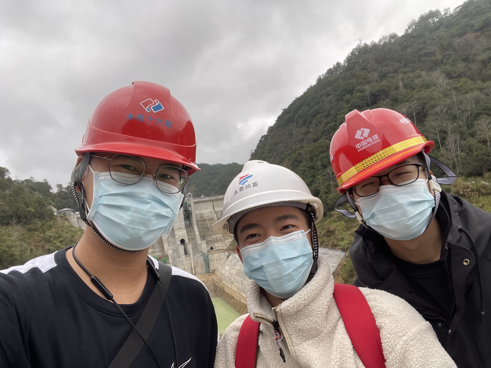
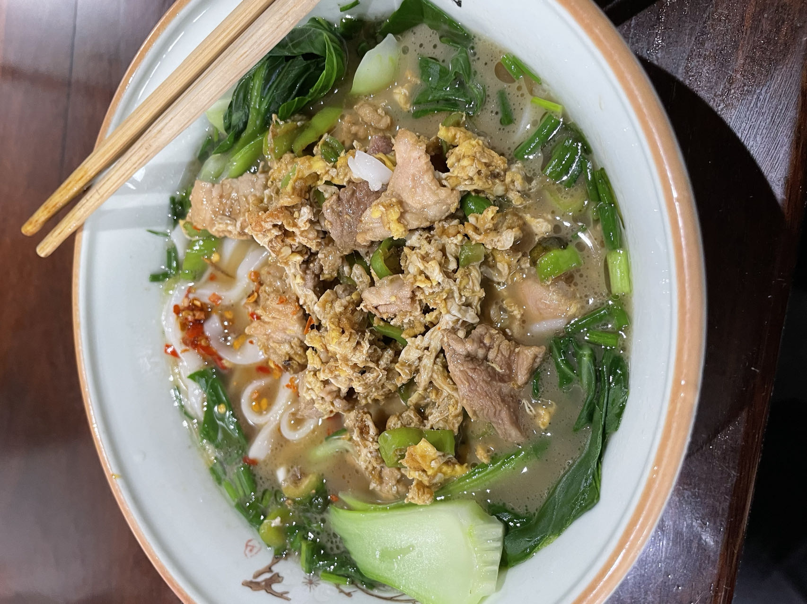
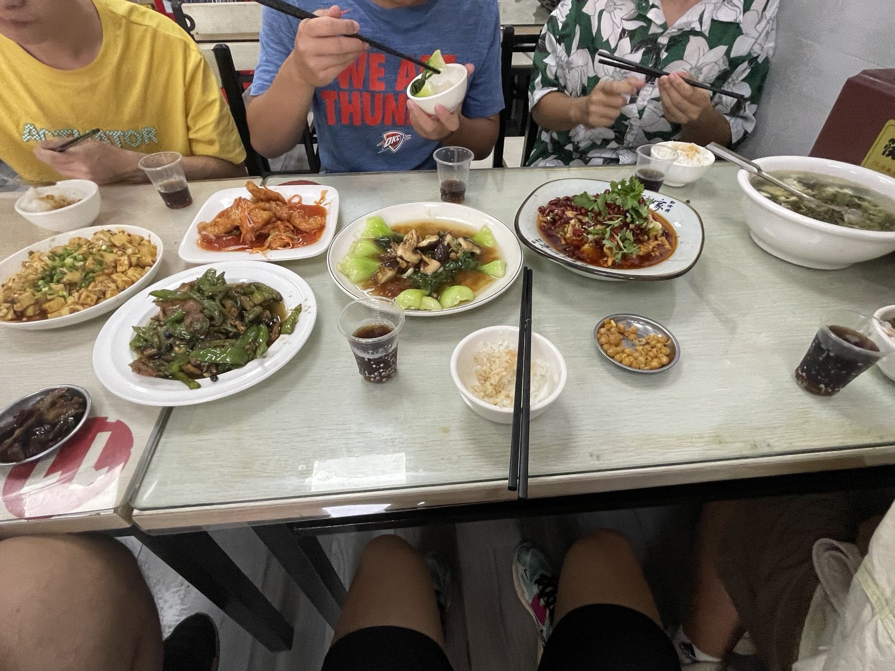
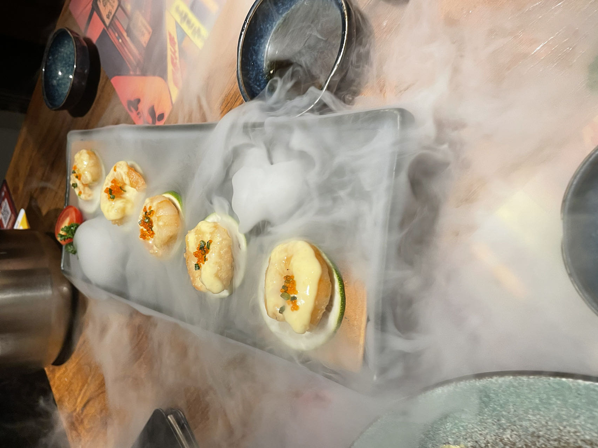
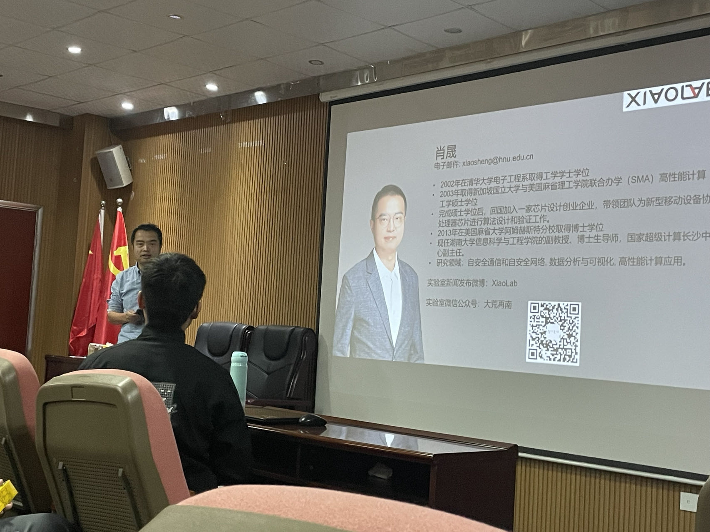
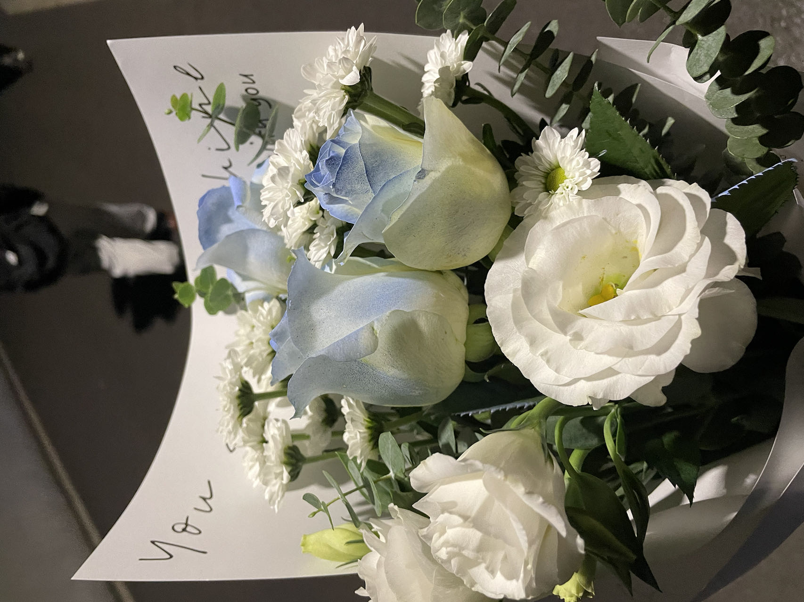
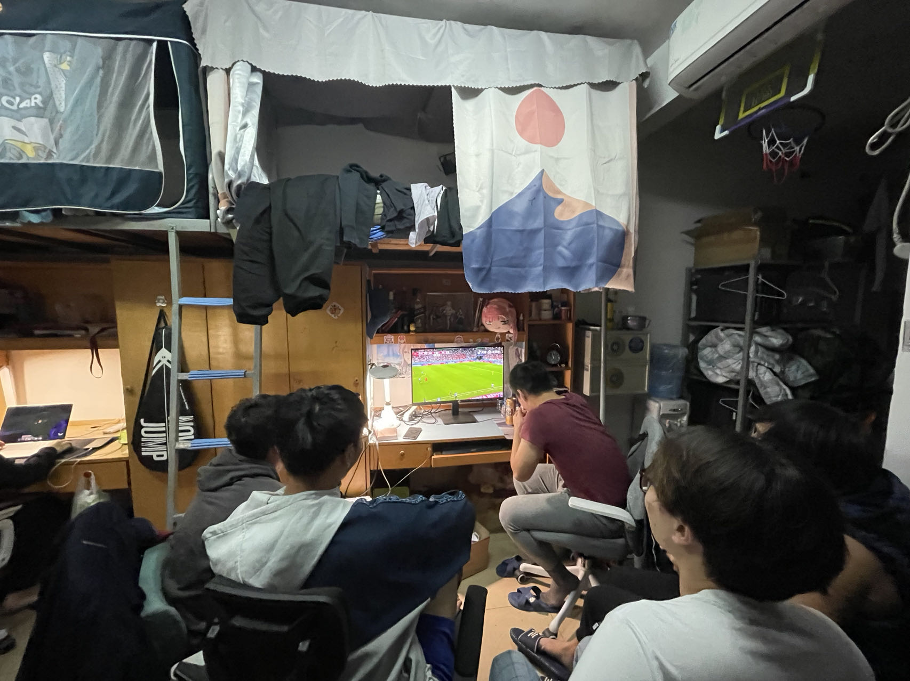

# 2022，我的年度总结

_马上要过新年啦，又要长大一岁。人生不过匆匆几十载，还是值得花点时间回忆一下过去一年发生的点点滴滴。谨以此文纪念过去的 **2022**🎞️_

### 一月

南方的孩子第一次看到雪是真得很激动。雪人也不再仅仅停留在电视屏幕上，穿过了虚无，变成了真像，我眼中倒映着的像。

此时正值期末周，大一上学期的期末考试，考试强度：五场考试 / 十天，不得不说真是太轻松了。每天早起去图书馆复习，下午躺在沙发上看杂志 / 书籍（《刑警江湖》与《弹在膛上》真好看嘿嘿），晚上回宿舍激情打牌，那段日子真是充实啊哈哈哈。

记得有一天晚上去 MC 吃饭，碰上了[学委吴](https://skywt.cn/)，我们一拍即合，怀揣着“去 TM 的考试吧，我们要去玩啦”的想法，骑了四公里的共享单车，前往北校一探究竟，回来还在公寓门口美美地吃了一顿烧烤。

还是在[学委吴](https://skywt.cn/)的指导下，开始走上了“购买服务器，搭建博客”的漫漫折腾之路。

也是在这一时间和[学委吴](https://skywt.cn/)合作完成了程设的大作业，第一次接触了 github、LaTeX、nodeppt 等一系列对我来说十分新奇的东西。[学委吴](https://skywt.cn/)真是我最好的 CS 专业老师了。

之后就回到了俺的老家福建永泰，开始了愉快的玩耍之旅。试问，谁能拒绝精灵宝可梦的诱惑？？

感谢县团委的大力支持，体验了一把~~领导视察~~(包工头)的感觉，游览了一些工程，很开心看到了家乡近些年的发展。

当然也还有必不可少的老友聚会环节，能看到那么多熟悉的面孔，不禁感叹回家真好！\
回家期间看了一些书，犹记得其中一段浪漫的话：

> “谁实为之？”是我情愿，是你心许？\
> 朋友，开始结局之间，\
> 演了一出浪漫的悲剧。

“告别2021 拥抱2022”

***

### February

二月伊始，开始了一项社会调查。真正去做了一些访谈，实地去看了看乡村的生产建设、生态环境，了解了社会运行的一部分，总体来说做这件事还是很有意义的。

时间一天天过去，发现寒假还是太短了，老友刚见面就要说再见，唏嘘这岁月不留情。这个寒假让我坚定了**“人是最珍贵”**的价值观，也难怪我们中国人常说“家和万事兴”，人是这世间最宝贵的东西，人与人之间真挚的感情是任何东西都无法替代的，现在想想这也许是我后来加入自训队的一个契机。

从 2.24 正式开始了我的博客记录！

***

### Mäerz

来到三月，就不得不提 3.8 了，这一天实在是太重要了！

1. 正式加入了 Xiaolab，开始可视化研究，第一次认真研究论文；
2. 召集咱们班的男孩给女生送花；
3. 完成了刷乐跑、洗澡、前往德图三事合一只花四十五分钟的壮举。

3.13 阳光正好，和同学们愉快地骑行，前往在 CG 胡作非为的**松雅湖**。

在月末，一则**原地静止**的通知，开启了为期两周的封校生活。

***

### apríl

在宿舍逐渐演化成棋牌室的过程中，本人立下了汗马功劳，并做出了一晚四把要啥来啥 carry 全场的惊人壮举。经宿舍人大——百草园的一致认可，本人正式加冕为 437 周润发（限时 24h）。

在 4.10 解封的中午吃了 KFC，看到街上熙熙攘攘，感觉自己重回人间。

其实封校的期间和 crush 聊得挺欢乐的，用实践诠释了“凌晨两点不睡觉，想睡也睡不着”。很可惜，一切都在 4.13 落下来帷幕啦，也许正如她所说“有些人就是用来错过的。”

当 lab 安排的可视化任务取得阶段性胜利后，终于能稍微放松一下啦，前往【空中花园】小酌一杯。

***

### Peut

迎来了高中母校的一百二十周年校庆，百二十载风华正茂！！一中，是我魂牵梦萦的地方。

依旧是和[学委吴](https://skywt.cn/)一起出去玩，这次我们去听音乐会，**国乐正当燃**，fancy！

正式入坑 linux，linux 地表最强 OS。认识到技术真的能改变世界，种下了对技术向往的种子。\

***

### Июнь

期末考试结束，去后湖跑步，想起高三清晨一个人在操场跑步的情景。那时候遇到了一位中年男子，他走上前来夸我“小伙子常看见你，挺会坚持”，这真是对我莫大的鼓舞。这段时间慢慢爱上了跑步，因为跑步的时候可以什么也不想，暂时忘却一切烦恼。跑完出一身汗，体内产生的内啡肽也会提供一种正反馈，使人心情愉悦。当然，也要感谢我的跑步教练张，传授给我科学的跑步方式，并以身作则，带我训练，使我的配速有了较大的提升。

考试完了，闲来无事继续学习哲学。哲学王子、复旦教授王德峰真是太 NB 了，直接刷完了他在 b站 的[系列视频](https://www.bilibili.com/video/BV1Mg411g7C8/?spm\_id\_from=333.337.search-card.all.click\&vd\_source=68401e073d6cf69f6f72f1ad56c67eaf)。他能把中国传统的儒释道讲得深入浅出，并且将中西方文化进行了详细的对比。除了服也没啥好说的了。

与高中敬爱的数学、物理老师在长沙相聚，真是无比奇妙的体验，倍感亲切，原来这就是“老乡见老乡，两眼泪汪汪”嘛。

没想到期末考试完，后面还有小学期埋伏着我。每天 >= 六小时高强度 CG 训练，可惜后来的 CSP 还是没过哈哈哈，还是太菜啦。不过我觉得也挺好的，摔一下跟头记忆深，时常的敲打提醒我要时刻保持谦卑。

***

### जुलाईमाह

暑假开始，和两位好友进行了一场两天一夜的小旅行，逛了一圈长沙！

回到家乡，考完了驾照，与朋友们吃了几顿饭，然后开始每天的图书馆与锻炼两点一线，曾痴迷于爬虫项目与论坛项目的学习，也曾厌倦到不想再触及相关的任何东西。\
直到快看见七月的尾巴啦，开始寻找我的小分队，寻找我的 hw、jh。那段时间主要把精力投入到了社交当中，跟各种各样的人打了交道，发现世界真的是五彩斑斓的，每个人的经历可以说都是截然不同的。\

***

### agosto

我又回到暑假最初的起点，开始两点一线的生活，说实话这样单调且规律的生活挺适合我的，它让我的生活变得极其充实又简单，我享受这样的平静生活。时间一晃就来到暑假的最后一周，那时候开始了我的教学生活，在一定程度上实现了我去年未实现的梦想———成为一名 teacher，“好的教育是心灵的震撼”，我竭尽全力去做到这一点，让自己无愧于心的同时，争取让他们的收获最大化。感谢他们的认真、努力与付出，看到他们确实有了相应的进步，我也收获了满满的成就感。爱我的学生们，他们都是好样的。\

离别的钟再次敲响，再次前往学校。这一回来到长沙，已是一名大二的 HNUer 了。到学生公寓门口，吃上这一碗美味的蛋炒肉，就这样开启我的大二生活啦！

回来继续小学期，大部分的时间都花在了阅读有关计算机的课外书籍上，对开源有了更深刻的理解，也爱上了开源，成为了一名坚定的开源支持者！

***

### syyskuu

午觉睡完，灵感迸发，说干就干！发现自己还是有一些优点的，比如想到就去做。**勇于尝试**真是自己上大学前后最大的变化。亲爱的自己，继续加油！未来可期！\
九月中旬，校园论坛项目初见成效，获得了总计 1000CNY 的项目奖金，颇有成就感。作为宿舍团建的传统项目，与伙伴们东北一家人搞起！！

饭后散步，夜晚的后湖很美耶。

月末，提交了自训队的**入队申请书**，实现自己半年来的心愿。这是我上大学来做的最正确的选择之一。为了加强自己的体能，开始训练三公里。四十多次的训练投入最终也有所回报，三公里配速到后来能稳定四分二十秒的水平；十一月份的一千米体测，五十人小组第一，成就满拉满！

***

### Oktober

盼星星盼月亮，盼来了**削减为三天**的国庆假期，于是乎报复性消费，正所谓“何以解忧，唯有干饭”。\

信安协会自行组织了一把 HNUCTF，参加了之后发现自己真的挺 fw 的。于是心里开始产生一些自我怀疑，混杂着对未来的迷茫，心态曲线呈正弦函数😣。

这一张照片自诩是**年度最有意义照片**。台下坐着的是肖佬（保送 THU 的至强学长），台上讲话的也是肖佬（逆天学历如图），如今他们也可以算是 THU 校友了。台下的肖佬看着台上的肖佬，我觉得他们真有种穿越二十年与自己对视的感觉。更巧的是，台下的肖佬与我是老乡，台上的肖佬是我实验室的导师。我在台下旁观，妙不可言。

自训队的训练拉开了序幕，那里就是我大学中的精神圣地，没有之一，自训队 yyds！无论再过多少年，我都会记得那冲上云霄的口号声——湖大脊梁，自训自强！

***

### නොවැම්බර්

这个月的 15 号是我的公历生日，这个月似乎注定是围绕着自己的一个月。

和[学委吴](https://skywt.cn/)去看脱口秀了，只能说是笑麻了，是真麻。

世界杯也开始了，大伙儿凑一起看世界杯，多有意思呀！

***

### Dezember

学校组织自愿返乡，初期稍显混乱，但总体安排有序，大家都高高兴兴回家了。\
我留守学校一周，考完了六级，也拍拍屁股，卷铺盖走人咯。\
回家之后，厨艺、吉他指法皆有所精进，甚悦。

今年最具有挑战性的事情发生在 12.27 这一天，鼓足百分之一万的勇气，发出此封邮件。原以为石沉大海，结果柳暗花明，获得一个实习的机会，开始漏洞分析的学习征程！江湖常言道：“撑死胆大的，饿死胆小的”，谁又说不是呢😊\

***

高一情人节吃完夜宵回家的路上，我对我的挚友侯说，

> “我在高中尽力去做好自己该做的，无愧于心，最后高考结果什么样其实我都能接受。”

现在看来，不止高中，大学也一样适用。\
至此，全剧终，2022终，2023始，敬请期待🤗
