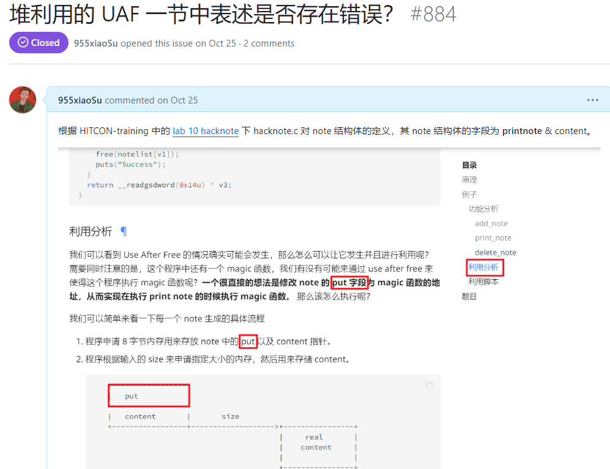
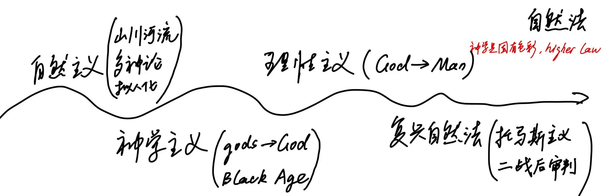

# 法律学习初体验

## 前言

> “这部中华人民共和国宪法，一共四百五十二条法条，五万六千六百八十一个字，从头到尾写的不就是四个字，公平正义吗？这难道不是每一个老百姓想要的吗？”
>
> “什么是法律？是天理，是国法，是人情”
>
> ——《第二十条》

法律作为一种社会规范，其研究的基本范畴是权利（自由权、请求权和诉权）与义务（应当作出和不得作出某种行为的界限）。法律以国家强制力为后盾，保障公民权利的同时约束公民的社会行为，其最终意义是实现每个人心中对公平正义最朴素的期待。

需要明确的一点是——法律是一个**集合**概念，而不是一个个体元素概念。例如根据位阶不同，在我国可以分为宪法、法律、行政法规、地方性法规、本级和下级地方政府规章，再比如根据法系不同，可以分为民法法系、普通法系、社会主义法系。

法律纷繁复杂，本 blog 作为一个记录性的文章，只想以《劳动法》、《西方法律思想史》的课程脉络作为一个切入点，分享笔者的学习体会，既不力求也无能力对法律进行一个全面系统的介绍，下文如有错误，恳请读者批评指正。（獬豸和正义女神分别是中西方法律形象的代表，图片源自 [Wikipedia](https://zh.wikipedia.org/wiki/%E6%B3%95%E5%BE%8B)）

<figure><figcaption>
獬豸
</figcaption></figure>

<figure><figcaption>
正义女神
</figcaption></figure>

## 劳动法

劳动法要求先修三门前置课程：法理、民法、行政法。作为一个法律小白，紧急自学舒国滢的《法理学导论（第二版）》、b站李建伟老师的民法、b站李佳老师的行政法，打下一点法律基础。

### 对法理、民法、行政法的基础认知

法律的研究对象是法律制度和社会现实的双向关系，关注“价值性事实”。而法理学是从内部视角看待法律，法理学的研究对象是：法和法学的一般原理、法律原则、法律制度及其机制，笔者粗略将法理梳理成本体论、价值论、认识论、方法论四块。

| 划分  | 内容                                                            |
| --- | ------------------------------------------------------------- |
| 本体论 | 从应然法和实然法的区别讲起，再介绍法的特性、基本范畴，说明不同法系的区别                          |
| 价值论 | 从时间效力、空间效力与对人效力三部分说明法的效力                                      |
| 认识论 | 提出了 n 多概念，如法律规范、法律规则、法律条文、法律原则、法律行为，尝试从规则、行为和关系三方面来说明法律的组成和作用 |
| 方法论 | 介绍立法、司法、执法的过程                                                 |

民法调整的对象是平等主体之间的财产与人身关系。民法属于私法的范围，其最大的特征是**意思自治**（民法当中 97% 以上是任意性条款），说简单一点儿就是只要双方当事人愿意，爱怎么整怎么整，谁也管不着。

行政法作为一个管政府的法，最核心的事情是**控权**，因为行政法要处理的事情总结起来就六个字：官管民，民告官。

### 课程脉络与学习体会

课程教材是马工程出版的劳动与社会保障法学（第二版），这门课分为两部分，第一部分讲劳动法，第二部分讲社会保障法。但由于课时原因，仅讲授了劳动法部分的内容。

先来看看劳动法的概念：劳动法是法律体系中的劳动法律部门，即调整劳动关系以及与劳动关系密切联系的其它社会关系的法律规范的总和。与劳动法直接关联的法律只有两部：

* [中华人民共和国劳动法](https://www.gov.cn/banshi/2005-05/25/content\_905.htm)
* [中华人民共和国劳动合同法](https://www.mohrss.gov.cn/xxgk2020/fdzdgknr/zcfg/fl/202011/t20201102\_394622.html)

通过阅读法条，易得劳动法要处理的是劳动者与用人单位之间的权利义务关系，因此本课程研究的法律主体是（劳动者，用人单位），课程顺理成章就从劳动是什么开始讲起，而后介绍劳动关系、劳动的主客体，再到就业、劳动合同，最后说明什么是劳动监察，发生劳动争议又该如何处理。

学习过程中，就业以及劳动合同这两部分给笔者留下的印象最深，因为这俩部分与生活密切相关。作为一个人，首先要考虑生存需求，为了满足生存需求，需要通过就业得到一个工作机会，让渡自身劳动力的使用权来获取劳动报酬，从而依靠劳动报酬活下去。那么如何就业？就业要考虑用人单位、劳动者的资质（e.g. 聘用 16周岁 以下公民是违法行为），在双方资质达标的条件下，一般来说，劳动者会通过招聘信息了解用人单位的用工需求，主动向用人单位投递简历表达求职意向，而后用人单位通过笔试 / 面试决定是否录用某位劳动者。在僧多粥少的市场环境下，难免出现用人单位对劳动者的歧视（比如性别、籍贯、宗教信仰），由于客观上用人单位是更加强势的一方，劳动者对此并无太多反抗的手段，因此国家出手干预就业市场（比如[“反就业歧视”](https://www.ndrc.gov.cn/fggz/jyysr/jysrsbxf/202204/t20220427\_1323414.html)）主持公道。

略过求职过程中的其他事情，假设劳动者此时成功获得 offer，下一步便是签订劳动合同。劳动合同一般分为书面、口头和推定三种形式，为保证双方的利益，最好的情况当然是签订**书面**劳动合同（白纸黑字胜过千言万语）。在劳动合同的订立阶段，用人单位和劳动者都负有**缔约告知义务**，这里面涉及到个人隐私保护等等问题故暂不展开。值得一提的是，劳动合同条款分为法定必备条款和约定必备条款，在签合同时得擦亮眼睛，看看合同中是否遗漏了法定必备条款， 若遗漏了得及时向用人单位提出，否则后续再追补确认相关条款的效力很麻烦。签订了劳动合同后，并不是万事大吉，一切都能顺风顺水按照合同约定走下去，由于工伤、四期（经期、孕期、产期、哺乳期）、“世界很大我想去看看”等一系列情况，合同的状态会发生转变，如中止、变更、承继、解除、终止，倘若一个不小心没处理好，很有可能与用人单位发生劳动争议，进而要通过协商 / 劳动仲裁 / 起诉等方式解决。

总的来说，劳动法 / 现实世界情况过于多变，学点儿法有助于增长对社会的认识，对自身从学生到社会人的社会化转型是有所帮助的。（补充一个很有趣的案例：

* [某宝买到扩容 iPad，我让卖家「退一赔三」](https://sspai.com/post/67209)

## 西方法律思想史

### 课程脉络

课程按照时间顺序，将历史划分成古代、中世纪、近代、现代、后现代五个时期，每个时期选取几位名人大家，展开介绍其学说思想。整体的脉络可参考下图：

<figure><figcaption></figcaption></figure>

### 学习体会

偷个懒，直接摘录笔者的结课论文：

如果把对法律的认知分为“感受、观点、观念、学派”四个层次，那么作为非法学专业的学生，新年期间欣赏的《第二十条》这部法律电影，极大地丰富了自身对于法律第一个层次的认知。

电影最后，检察官韩明在听证会上诸如“法不能向不法让步”、“我们办的不是案子，是一个人的人生”的发言，发人深省的同时不禁让人追问法律是什么？法律作为一种社会规范，其研究的基本范畴是权利（自由权、请求权和诉权）与义务（应当作出和不得作出某种行为的界限）。法律以国家强制力为后盾，保障公民权利的同时约束公民的社会行为，最终意义是实现每个人心中对公平正义最朴素的期待。

“立法者应如哲学家般思考，如农夫般言谈。”耶林的这句名言是一个深刻的法学思想，强调了立法者在制定法律时，既要有深邃的思考，又要贴近生活实际。然而，在现代中国的立法实践中，尤其是以学者为主导的立法实践，似乎并未完全践行这一原则。许多学者过于注重理论的严密性，而忽视了实际应用中的可操作性和现实性，导致了法律条文在现实中难以操作，甚至与社会实际脱节。这样的法律不仅不能有效地保护当事人的权利，反而可能成为权利实现的障碍。

一个例证便是2003年苏力对“奸淫幼女罪”直言不讳的批评：“我的分析结论是，这种错误主要来自的一方面是对部门法操作理论的过度信任和缺少学术的多样性，另一方面则来自对社会真实世界的不理解甚至是有意的忽视；而这背后，则反映出最高人民法院对自身作为最高上诉法院的功能定位模糊和专业知识装备不足”\[1]。

当然，我们不必因此灰心丧气，广东省佛山市顺德区人民法院(2020)粤 0606 刑初 2648 号这份判决书，证明了敢于突破僵化刻板的法学理论束缚还是大有人在。案件的客观事实是：2020年5月28日22时50分许，被告人何某驾驶一辆无号牌普通二轮摩托车行驶至佛山市顺德区陈村镇112省道文登路路口时，被执勤民警查获。经查，何某无摩托车驾驶资格，且血液中检出乙醇成份，含量为99.2mg/l00ml。公诉机关指控被告人何某犯危险驾驶罪，建议判处拘役一个月，并处罚金。而法院从刑法的谦抑性原则、司法实务、法律衔接等方面据理力争，认为被告人何某虽然酒后驾驶机动车，但其行为的社会危险性并未达到需要动用刑罚来规制和惩处的程度，最终判决被告人何某无罪。

为了探讨耶林的《为权力而斗争》\[2]，不妨先回顾一下19世纪的法律背景。19世纪的欧洲，尤其是德国，正处于法律体系的大变革时期，根据张晓辉的研究，这一时期的法律人类学学术史反映了西方法律思想从辉煌到沉寂的变化\[3]。舒国滢指出，德国“学说汇纂”体系的形成与发展，标志着欧陆近代法学知识谱系的建立，但同时也暴露了过于依赖理论体系的问题\[4]。陈华彬则强调，19、20世纪的德国民法学在强调系统化和科学化的同时，也需要更多关注实际应用和对社会现实的回应\[5]。

为权利而斗争就是为法律而斗争，推动权利人为权利而斗争的是法感情，这些都是权利心理学，其精髓体现在“牺牲一种被侵害的权利是怯懦的行为，人们的这一行为招致耻辱，招致对共同体的最大损害；为权利而斗争是伦理的自我维护的行为，是一种对个人自己和集体的义务”。通过对耶林法律思想的探讨，我们可以更加深刻地理解法律应有的本质和使命。法律不仅是规范社会行为的工具，更是维护社会正义的保障。在制定法律时，立法者应当充分考虑社会实际需求，确保法律能够真正保护公民的权利，而不是成为一种形式化的束缚。

简单来说，在尽义务的同时也要享权利，避免出现马丁•尼莫拉提到的“起初，纳粹抓共产党人的时候，我沉默，因为我不是共产党人。 当他们抓社会民主主义者的时候，我沉默，因为我不是社会民主主义者。 当他们抓工会成员的时候，我沉默，因为我不是工会成员。 当他们抓犹太人的时候，我沉默，因为我不是犹太人。 最后当他们来抓我时，再也没有人站起来为我说话了。”

参考文献

\[1] 司法解释、公共政策和最高法院——从最高法院有关“奸淫幼女”的司法解释切入

\[2] 耶林：为权利而斗争

\[3] 张晓辉 | 辉煌与沉寂：19世纪西方法律人类学学术史述评

\[4] 19世纪德国“学说汇纂”体系的形成与发展基于欧陆近代法学知识谱系的考察 舒国滢

\[5] 陈华彬：19、20 世纪的德国民法学

&#x20;
