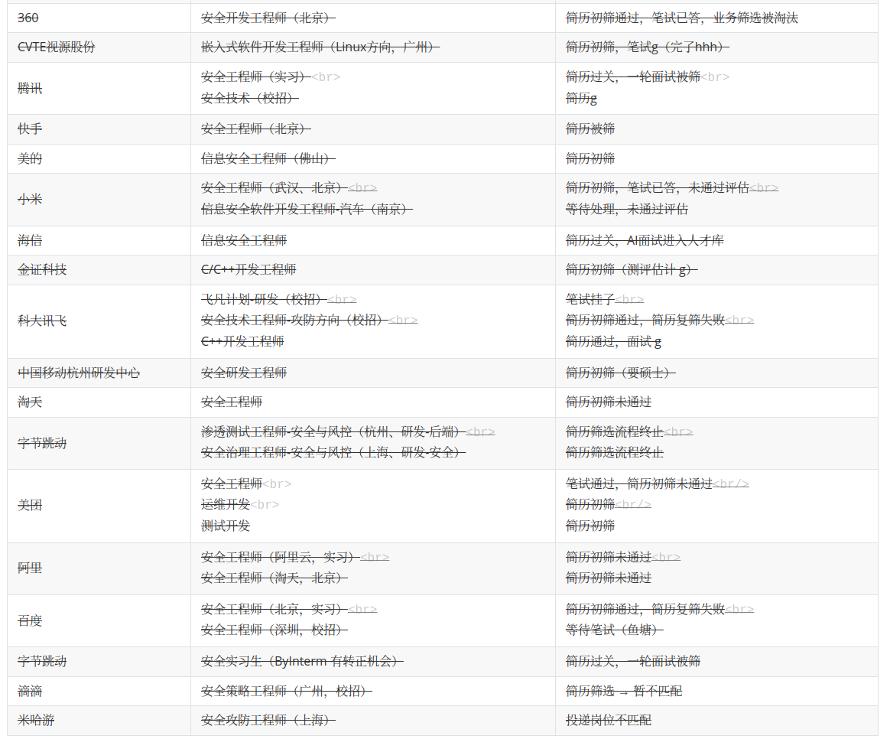

# 路在脚下

下文记录了笔者大三上、大三下和大四上三个学期关于未来的探索历程。

## 考研

大三上开学时，冥冥中感觉到必须对未来发展做出选择了，那么该走哪条路呢？跟导师、父母、学长学姐等交流后，排除了保研（rank 不够）、出国（没钱）、工作（能力不足）三条道路，最终选择了考研作为未来发展方向。

首先去中国研究生招生信息网看招生简章、考试大纲、录取情况，同时了解考研流程：9月中旬预报名（大四上学期） ➡️10月中下旬正式报名 ➡️ 11月打印准考证 ➡️ 12月参加笔试 ➡️ 若笔试过线，则明年3月参加复试。

考研是一锤子买卖，只能报考某一个院校的某一个专业，考得上行了，考不上拉倒。笔者想着考都考了，那就考 top1，于是~~丧心病狂~~去[清华大学研究生招生网](https://yz.tsinghua.edu.cn/zsxx/sszs/ptzk.htm)、[清华大学研究生招生综合信息平台](https://yzbm.tsinghua.edu.cn/publish/infors)了解梦校的招录情况：

* 考试科目：101政治、英语（一）、数学（一）、专业课912
* 理想专业进面要求如下：

| 083900（全日制） | 网络空间安全   | 330 | 55 | 60 | 100 | 90 |
| ----------- | -------- | --- | -- | -- | --- | -- |
| 081200（全日制） | 计算机科学与技术 | 353 | 55 | 65 | 100 | 90 |

* 如果有幸进面，总成绩计算公式：总成绩（满分值1000）＝初试总分（满分值500）+ 复试机考成绩（满分值100）+ 面试成绩（满分值100，包括专业面试80+综合能力面试20）\*4。

白日做梦还没醒，甚至提前看了一手导师：[024计算机科学与技术系](https://yzbm.tsinghua.edu.cn/publish/s03/s0303/detail/c2662d2c-9890-4dc5-aea6-d9d7cd7515fd?yxsdm=024)、[412网络科学与网络空间研究院](https://yzbm.tsinghua.edu.cn/publish/s03/s0303/detail/c2662d2c-9890-4dc5-aea6-d9d7cd7515fd?yxsdm=412)。现在来看真是无知者无畏，初生牛犊不怕虎，不过也没什么不好，如果考研都没有激情与梦想支撑，迟早得崩溃。

稳妥起见，笔者如法炮制去[湖南大学研究生招生网](http://gra.hnu.edu.cn/index.htm)查阅了本校的录取流程、考试科目、进面要求、总成绩计算。

因为笔者高中选修政治，并且英语基础较好，所以从国庆节开始准备政治和英语，每天看[徐涛](https://www.youtube.com/watch?v=_UutCH3QFAc\&list=PLo4DRZ9pgCGr5vrf6CTSB7Nsv83dRsqJh\&index=1)政治课或者学习英语（背 TED 演讲稿、背单词等）。这样考研马拉松的起跑阶段，负担不会太大，同时能让笔者兼顾学业、实习与社团。预期在大三寒假前，可以过一遍政治，并且打好英语基础，这样寒假就可以开始数学与专业课的学习。

## 转向考公

大三上一晃而过，大三寒假即将来到，一个念头在脑海中回荡“All in 考研的话，万一没考上研究生咋整？真回家种地？”说来奇妙，某个时刻想起了大二暑假前，师父曾云“X单位有招实习生，你想去不？”（当时笔者因为要参加暑期支教活动，毅然决然地拒绝了这个机会）打开 vx 联系师父，“师父我错了，我想去X单位，还有机会不？”经过**漫长的等待**，终于等来了X单位负责人的电话，交流过后，确定在大三下开启为期三个月的实习。这无疑是件好事：有了实习经历，既能提升个人能力，又能增色简历。然而这也让笔者考研的决心开始动摇。寒假期间，原先制定的考研计划完全搁浅，只能大三下再议。

开学伊始，实习如期而至。在这三个月的实习中，笔者深深被X单位负责人NB经历和满腔热血感染。经过慎重考虑，笔者最终决定放弃考研，转而选择考公，并立志加入X单位。听说考公务员准备周期相对较短，通常只需三到四个月，因此大三下学期笔者并未立即开始复习，而是拖到了暑假8月1日才全面投入准备。

同考研，笔者首先通过以下资料了解考公相关信息：

* [国家公务员局](http://bm.scs.gov.cn/pp/gkweb/core/web/ui/business/home/gkhome.html)
* [国家公务员法](http://bm.scs.gov.cn/pp/gkweb/core/web/ui/business/article/articledetail.html?ArticleId=8a81f3236dbf43a4016dc3c277e60002\&id=0000000062b7b2b60162bcd13002000c\&eid=0000000062b7b2b60162bcd1a324000d)
* [公务员录用体检特殊标准（试行）](http://bm.scs.gov.cn/pp/gkweb/core/web/ui/business/article/articledetail.html?ArticleId=8a81f3236dc459d2016dc45b76960000\&id=0000000062b7b2b60162bcd13002000c\&eid=0000000062b7b2b60162bcd1a324000d)

考公简单来说，可以分为**国考、省考与选调**。一般走国考的话，是进入中央机关及其直属单位，走省考的话就是进入省属机关及其直属单位。选调稍微特殊，因为选调生是由省委组织部从高校应届毕业生中择优选拔出来的特殊公务员，录用之后会安排到基层工作，当做省市机关工作人员或是领导干部的后备人选进行培养。

由于进入X单位走的是国考，所以笔者关注的是25年国考时间线：

* 报名时间：10.15 8:00——10.24 18:00
* 资格审查结果查询：10.15 8:00——10.26 18:00
* 查询报名序号：于 10.28 8:00 后登录专题网站查询报名序号，报名确认和下载打印准考证时需提供该序号
* 确认报名缴费：11.1 0:00——11.6 24:00 登录专题网站进行网上报名确认并缴费
* 打印准考证：11.25 0:00——12.1 15:00 期间登录专题网站打印准考证
* 行政职业能力测验：2024年12月1日上午 9:00—11:00   
* 申论：2024年12月1日下午 14:00—17:00   
* 查询成绩：明年1月
* 复试：明年3月前
* 体检、考察、公示、备案

国考考试科目：行政职业能力测验 + 申论

* 行政职业能力测验题型：政治理论、常识判断、言语理解与表达、数量关系、判断推理、资料分析
* 申论题型：归纳概括题、综合分析题、应用文、对策启示题、大作文
* 注意有总分和单科成绩的要求，所以不能偏袒，两个科目一定都得行；其他职位，笔试成绩按照行政职业能力测验、申论成绩**各占50%**&#x7684;比例合成；未组织专业能力测试的，综合成绩按照笔试、面试成绩**各占50%**&#x7684;比例合成

由于国考没有往年真题、答案，所以唯一的准备方法是仔细阅读《中央机关及其直属机构2025年度考试录用公务员公共科目笔试考试大纲》（每年大差不差），而后根据要求进行准备：

> 公共科目笔试是公务员录用工作的重要环节，**笔试内容突出公务员的政治标准和政治属性，重点测查用党的创新理论指导分析和解决问题的能力，教育引导报考者自觉做习近平新时代中国特色社会主义思想的坚定信仰者和忠实实践者；注重能力导向，主要测查从事公务员工作应当具备的基本能力和基本素质，教育引导报考者注重平时学习积累和能力提升**；实行分类分级，突出人事相宜，根据不同职位类别、不同层级机关的特点分别设置，以提高测评的科学性精准性；坚持公平公正，对各类报考者一视同仁，试题使用素材具有通用性。
>
> （一）中央机关及其省级直属机构综合管理类职位。主要测查报考者的阅读理解能力、综合分析能力、提出和解决问题能力、文字表达能力。
>
> **阅读理解能力**——全面把握给定资料的相关内容，准确理解给定资料的含义，准确提炼事实所包含的观点，并揭示所反映的本质问题。
>
> **综合分析能力**——对给定资料的全部或部分的内容、观点或问题进行分析和归纳，多角度地思考资料内容，作出合理的推断或评价。
>
> **提出和解决问题能力**——准确理解把握给定资料所反映的问题，提出解决问题的措施或办法。
>
> **文字表达能力**——熟练使用指定的语种，运用说明、陈述、议论等方式，准确规范、简明畅达地表述思想观点。

笔者的备考方法很简单：

* 行政职业能力测验
  * 刷题：粉笔app + 纸质版试卷
  * 模式：题型专项训练 + 套卷
* 申论
  * 刷题：粉笔app + 纸质版真题
  * 理论学习：学习强国 + 人民日报 + 深入学习**毛选、邓选、习近平谈治国理政**
* ps，笔者个人看过的考公视频都很鸡肋，所以并不推荐看视频学考公

## 考公与秋招并行

在准备考公的时候，遇到了与准备考研时同样的问题“All in 考公的话，万一没上岸咋整？毕业去要饭吗？”经过与舍友、同学的交流讨论，觉得不能吊死在一棵树上，还是得考公、秋招双线程并行。所幸8月下旬这个时候不算晚，只有一小部分公司开了秋招提前批，所以这个时候入场来得及。于是每天一部分时间整学业，一部分时间准备考公，另外一部分时间就混迹于各类校招平台搜罗信息（学校就业信息群、学校就业网、各类公司官网是比较靠谱的信息来源）。

秋招流程：给对应岗位投递简历 ➡️ 等待简历筛选 ➡️ （笔试）+ 面试 ➡️ offer 发放 ➡️ 体检 ➡️ 三方签署 ➡️入职 。

秋招前期，笔者自认为凭借还算不错的简历：985本 + 清华大学科研实习 + 公司实习 + 两个扎实的项目经历 + n个校奖，能够很快斩获保底 offer，**结果现实狠狠给笔者上了一课**。最先是被鹅厂一面光速拒绝（这个是因为笔者能力不足，没啥好说的），随后是一系列**简历初筛不通过**与**一面挂**，包括但不限于科大讯飞、字节、华为、美团、百度……（随意截张图，供各位大佬一乐，哭www）

<figure><figcaption></figcaption></figure>

理想很丰满，现实很骨感。笔者大厂梦碎，每天沉浸在自我怀疑中无法自拔。peer pressure 给笔者雪上加霜，保研的好友去了 PKU、SJTU、FDU、ZJU、WHU 等一众名校，找工作的好友已经手握 n个 offer 开始权衡比较，对比自身颗粒无收、前途渺茫的情况真是很难不心酸。

没办法的时候就只能苦苦煎熬，盼望着熬出头的日子早点来。黑暗中，笔者收到了第一份来自招银网络科技的 offer！爱招银，招银的面试特别友善，后续的人事流程特别迅速且规范，薪酬福利也很好！！是招银的这份 offer 让笔者重拾信心，稳住军心，不用再考虑毕业去讨饭的问题，所以特别特别感谢招银！！！随后陆续通过另外两家面试，收到了其中一家的 offer，另外一家估计是排序挂了一直没消息。

但现实又岂能让笔者一帆风顺，“大鹏一日同风起，扶摇直上九万里”的剧情注定只能发生在爽文男主身上，而不会发生在笔者身上。10月的某一天笔者被X单位正式告知不符合条件，打上 reject 的标记。懵逼、疑惑、不解、痛苦，万般情绪交织，到底做错了什么才会遭到如此报应？放弃考研选择考公的下场就是这？准备了两个半月结果连考都没得考？？你TM在逗我吧？？？

不过也奇怪，按说这等挫折高低得摧残笔者几天，但没想到两个小时后，笔者心如止水，没有其他任何想法或情绪，跟个机器人似的，紧急投递了Y单位作为考公补救措施后（毕竟准备这么久了，虽然不抱期待，但也蛮考一考），就继续准备秋招了。

接下来的一个多月，半摆不摆地投投简历，准备准备秋招，打打王者打打桌球聊以度日。转折点出现在某日下午，一个广东深圳的号码打了过来，一接原来是华为HR小姐姐，小姐姐说了两点，1.这边还招人；2.**简历被锁可联系官邮解锁**。笔者一听顿时来劲了，跟小姐姐一顿对接，然后笔试猛猛考面试猛猛面，也还真是老天保佑，一切顺利。

12月1日极其放松地考了个国考，12月24日收到了华为 offer。

数九寒天，与两位挚友围坐在羊肉火锅旁，热气氤氲间，汤香扑鼻，那滋味真是地道！一杯浊酒下肚，微醺之间，烟雾袅袅升腾，彼时彼刻，才明白那句“我们并非生活在未来，而是活在当下”的真谛。

大学探索未来的故事就这样结束吧。回首望去，更像一场荒诞的闹剧。生活啊，总是这样，荒唐无稽。罢了罢了，随风而去吧，但行好事，莫问前程！
