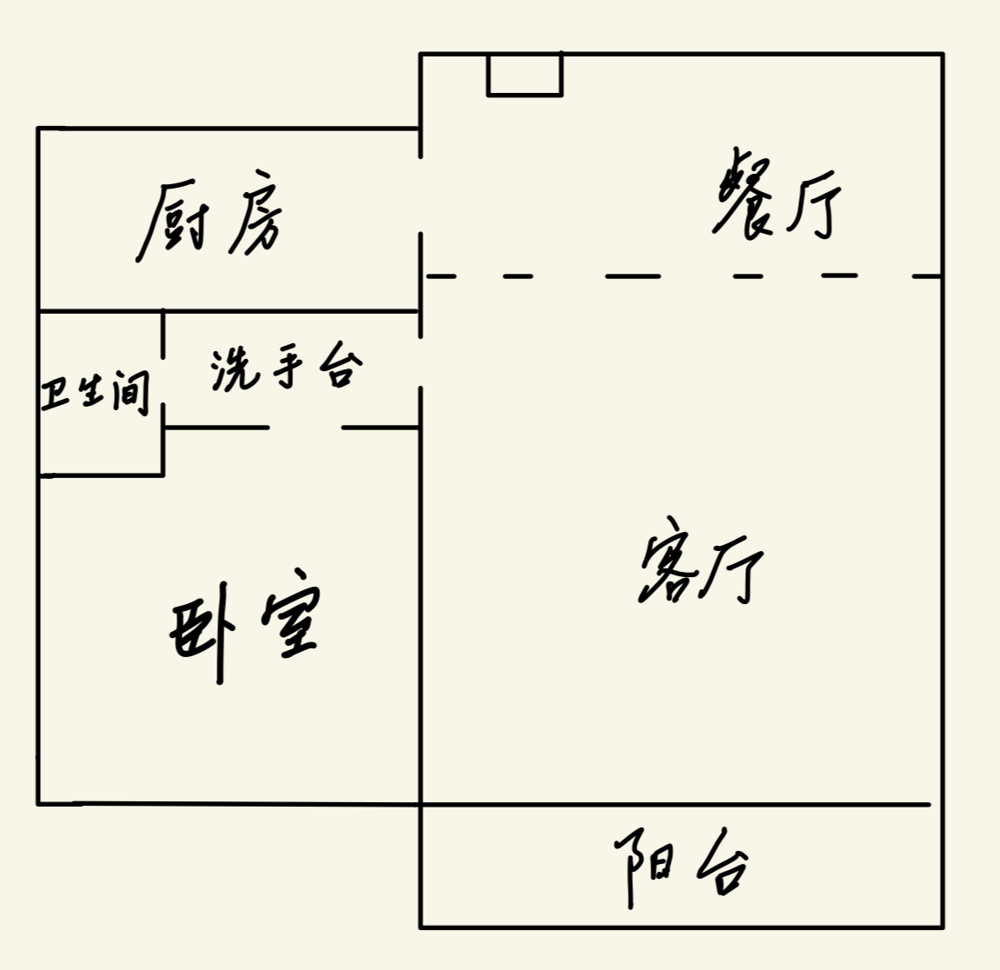
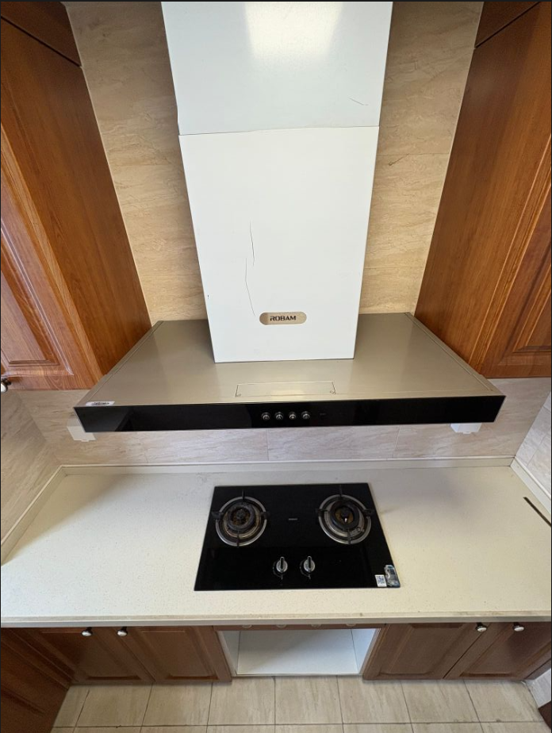
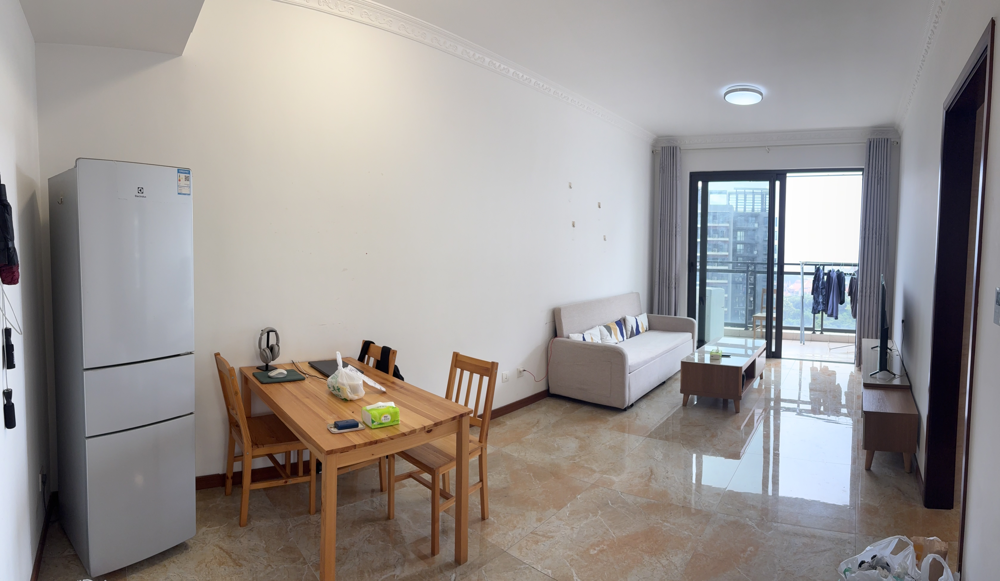
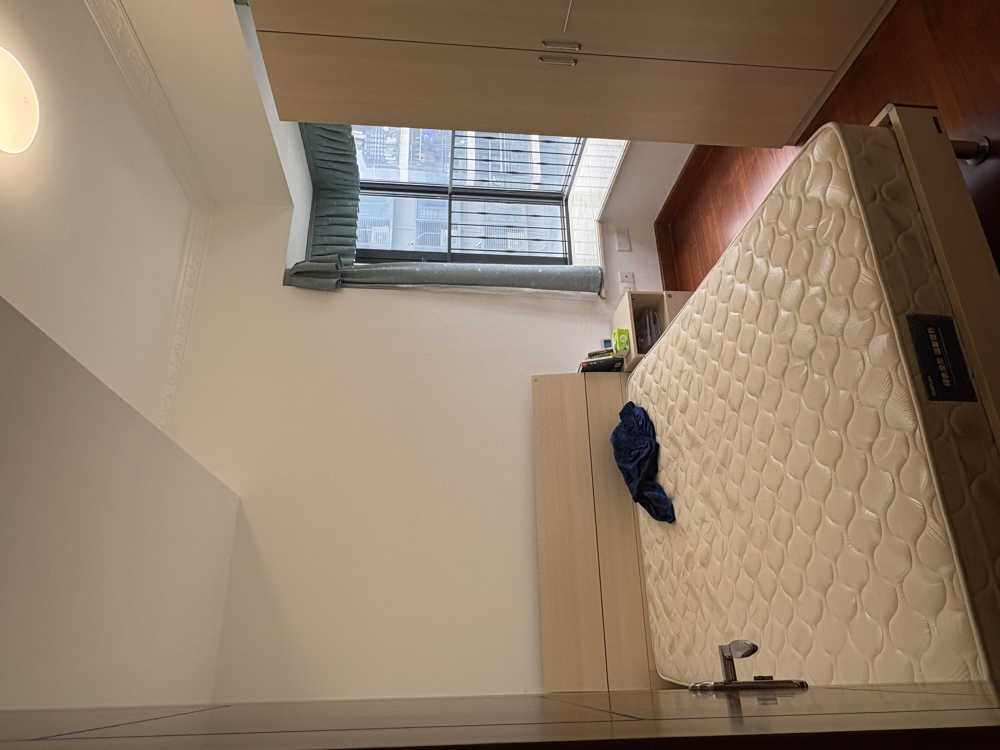
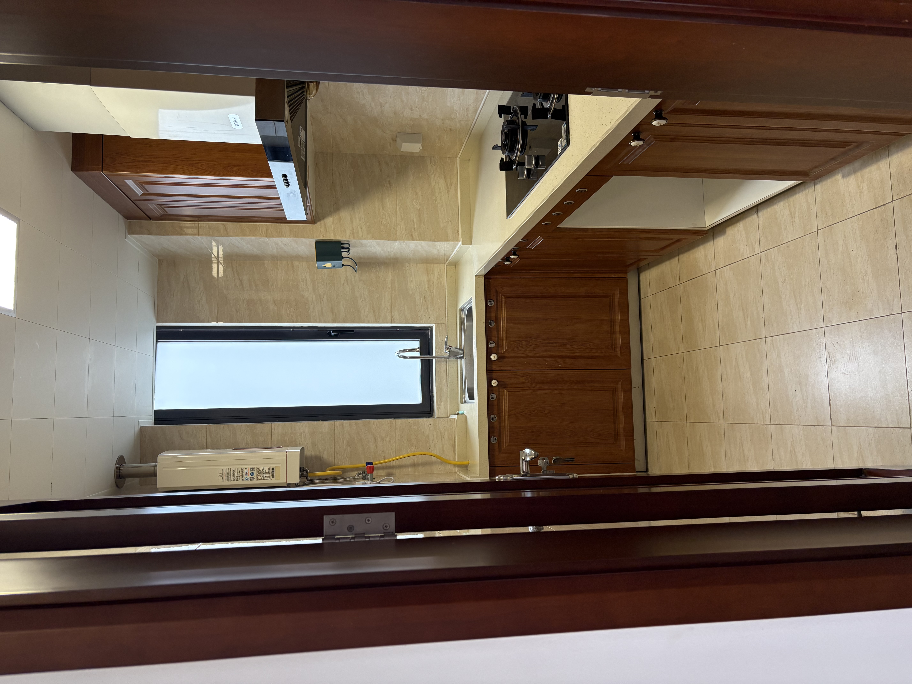

# 年轻人的第一次租房

<figure><figcaption>
最终租赁房屋的阳台风景
</figcaption></figure>

## 前期准备

笔者是一名应届毕业生，此前没有租房经验，因此先尝试构建租房概念。概念建立的过程是：独立思考 + 咨询朋友 + 上网搜寻攻略 + 租房软件查阅房源。

### 房屋期望

租房是一项经济活动，需要在期望与预算之间 trade off。笔者目前是单身状态，意向房型是单间与一室一厅，考虑到租住的舒适性 & 未来可能能有 girlfriend，所以更加偏向于**一室一厅**房型。

房屋期望配置：

* **地段**：通勤步行 25min 可达，电驴 15min 可达
  * 时间是最具价值的，所以把地段的优先级提至最高，在前期多投入的金钱用于节省时间，换取未来成长
* 房东：友善且是一房
* 室内：独立卫浴、采光好、洗衣机是洗烘一体 / 有阳台、有厨房、物业管理良好
  * 采光：窗户朝南全天有阳光；朝北全天阴冷；朝西下午有阳光；朝东上午有阳光。需要上午下午各去一次，确保采光
  * 厨房：具备做饭条件会极大提高周末的幸福感

由于笔者入职地在东莞松山湖，松山湖工作区域跨越巨大，故咨询 HR 以获悉具体上班区域，而后结合内部推荐指南 + 地图测距 + 房屋期望配置，得到了预期租房地点的集合｛溪村公寓，湖岸花园，湖畔花园｝。溪村公寓需入职后排队申请，而同为华为人才小区的湖畔花园户型相对湖岸花园差一些（客厅与阳台连接处正中间有一根柱子），故重点关注**湖岸花园**的租赁信息。

### 细节考量

有了预期租房地点后，接下来需要明确如何考察房屋质量。这一步需借鉴朋友经验 + 互联网攻略，系统且有价值的参考资料如下：

* [Weekly #16：年轻人的第二次租房](https://skywt.cn/blog/weekly-16)
* [毕业季最强租房攻略，防骗避坑，看这一个视频就够了！](https://b23.tv/ug8KxZF)

经学习，将租房注意事项总结成以下四个方面：**租房开销、家具电器、房屋租赁合同、Misc**。租房开销与预算强相关；家具电器直接影响入住体验；房屋租赁合同规定了双方的权利与义务；Misc 是指可能影响生活便利性的各类因素。

房租 + 水电 + （物业 + 宽带 + 天然气）组成了**租房开销**。

* 房租主要取决于地段 + 房型，可参考房屋所在小区同户型的市场均价
* 民水民电参考价格：民水 <5元/吨、民电 <1元/度，水电 \~50元/月（不含夏季用电高峰期）
* 非高档小区的物业费一般是 3-5元/平方米·月
* 得到上述参数后，经计算可得租房开销，若在预算范围内可进一步考察，若不在预算范围内直接看下一套房

对于**家具电器**，笔者主要关注其功能是否正常。具体而言，关注电器品质（如能耗等级）、所有开关是否正常工作、各类出水口（如水龙头、淋浴头、马桶）出水速度与出水量、地漏渗水速率、家具是否破损。

毕竟家具电器是房东购买 / 前租客遗留，不可能所有东西都称心如意，因此对于有损坏且无法正常使用的家具电器，可以与房东协商，看是否能丢弃 / 更换。另外根据好友推荐，可以在啄木鸟 app 上预约家电清洗服务，对专业的电器（如洗衣机、空调、冰箱）进行清洗。

**房屋租赁合同**显式规定了房东与租客的权利与义务，所以应尽可能写得详细具体，笔者考虑的细节如下：

* 确认房东是房屋所有者：身份证复印件 + 房产证
* 租期、费用支付方式（押金数额）
* 交房时间与形式
* 提前退租 / 转租的处理方式

此外，可以参考[商品房屋租赁管理办法第七条](https://www.gov.cn/zhengce/2022-01/25/content_5711968.htm)拟订房屋租赁合同。根据好友的经验，最好能争取显式约定租赁期间房东不得随意进出，如果要来的话要提前告知，不得带其他人前来看房；不续租或者涨租金需要提前告知，否则需要进行补偿。

**Misc**：

* 隔音：是否临街 + 入户门隔音 + 楼层高低
* 空气质量：需留意室内是否存在异味。尤其是新装修的房屋，应确认装修完成时间，警惕甲醛等有害物质残留。
* 规避隔断房：隔断房不仅居住体验差，更存在消防等安全隐患，且属于政策法规不允许的出租形式。《商品房屋租赁管理办法》规定，厨房、卫生间、阳台和地下储藏室不得用于居住。租房时应选择以原始设计的房间作为最小出租单位。在预算充足的情况下，还是尽可能不要租住隔断房。隔断房辨别办法：[小白租房如何识别隔断墙？](https://www.zhihu.com/question/365519882)
* 生活设施：实地考察房屋周边的配套设施，例如步行距离内的超市、餐馆、菜市场、快递点以及地铁/公交站的位置
* 前租户费用结清：向房东或物业核实，确认前租户所有账单均已结清，并保留相关凭证，避免承担不必要的旧账
* 门锁安全：非智能门锁考虑更换锁芯，智能门锁考虑恢复出厂设置并重新设置密码、指纹、人脸

## 看房经历

有了前期准备后，对后期看房有没有帮助呢？答案是：有但不多。

首先在寻找房源便卡上了 bug：

1. 传统看房是通过中介寻找意向地段的意向房源，由于中介手上有大量房源，所以看房效率极高。笔者本来也想采用类似方法，但可能是因为某项政策，华为人才小区（指上文提到的湖岸花园与湖畔花园）的所有房源均未在租房软件（如贝壳、链家、自如）公开出租，意味着笔者无法从中介获取房源信息并预约看房。
2. 根据内部租房指南，想租在华为人才小区，得用 w3 账号登录到心声社区上查找。尴尬的是，尚未入职的笔者没有 w3 账号。

由于以上 bug，笔者只能求助于 HR，麻烦 HR 从心声社区帮忙获取租房信息，并拉笔者进微信租房群。好在 HR 小姐姐非常上心，帮笔者找房源的同时，主动帮笔者发布求租信息，因此陆陆续续也加上了十多位房东。初步了解房源信息后，形成以下租房公式：

1. 微信申请用语，“房东您好，我这边有租房意愿，想了解一下房源～”
2. 加好友后，“房东您好，这边想要了解一下房源照片、租金、租期与楼层～”
3. 有意愿继续了解的话，与房东沟通看房时间与入住时间

笔者打算参加 6.20 毕业典礼，所以在 6.20 前只能线上看房。线上看房过程中遭遇了各种情况，比如还没加上房东就被告知房子已经租出去了，或者看了房源照片觉得未达到预期，又或者房源看起来挺满意的但是楼层在 3楼，亦或房源看起来是干净整洁，欲付定金时却被告知房源已出租。因为线上看房无法像线下看房那样即时决策，因此难以在与其他线下租客的竞争中获得优势，在一室一厅房源稀少市场竞争激烈的背景下，线上看房只能起到初步筛选的作用，而无法真正锁定房源。综上，线上看房只能看个热闹，实际起作用还得是线下看房。

笔者于 6.25 驱车 700km 从长沙直奔东莞，当晚看了第一套房。由于时间较晚，所以房东直接给了入户门密码，让笔者自行看房。家具电器没有功能上的问题，但是排布总给人一种怪怪的感觉。超长的电视柜上只有一个小小的电视；冰箱摆放在客厅最靠近阳台的角落，既不方便取用食物又挤占了客厅进出阳台的通道；卧室唯一充电插口紧挨着一个 2m 宽的衣柜，衣柜挨着床头柜，床头柜挨着床，床挨着飘窗。衣柜对一个人住显然太大，而且挡住了充电插口。床紧贴飘窗，如果你想拉窗帘，唯一的办法就是踩在床上。这些真的对吗......

<figure><figcaption>
房屋布局
</figcaption></figure>

总的来说，家具电器一个人住太冗余，两个人住又不够用。同笔者一起前往的好友柳指出：这房子给人感觉是拼凑出来的，颇为同意。这一套房被笔者移出了考虑范畴。

笔者看的第二套房是由现租客接待的，这大大提升了笔者的期待，毕竟租客最懂房子的痛点。一开门，发现现租客是一位小姐姐，心里又踏实了一分。一般来说女孩子心更细，对房屋、房东的要求下限应该会高于笔者，既然现租客可以在此房屋租住一年，那么笔者住应该是没啥大问题。check 家具电器，功能没问题，还有沙发床 + 大电视，同时品质远高于第一套房，卧室布局也十分合理。之后，笔者与现租客聊起了天。现租客非常坦诚，详细回溯了过去一年的租房经历，她特别说明若非工作需要，租住此处交通不便，否则绝对不搬。此外，她特别给予了房东高度评价。

笔者问，“房东事很少吧？”

现租客，“不是事少，是根本没事。”

现在回想，这段话一锤定音，敲定了“就租这套房”的念头。从聊天中进一步得知，前租客也是一位小姐姐（从前房源照片，餐桌上有成套化妆用品可以印证该事实），并且租住了四年之久。（更放心了）经与现租客讨论当前租房市场，得出的结论是：华为人才小区一室一厅的房租、装修、家具、朝向大差不差，仅楼层、房东有所差别。然而楼层在3梯5户的条件下对日常生活影响不大（实测从进电梯门到出电梯门，27层直达1层仅需41s），挑房屋到最后仅需挑个好房东就完事了。当晚，笔者、现租客与房东协商了后续租房事宜。

虽然在 6.25 已敲定租房事宜，但笔者之前已预约其他房东看房，并且两位房东都很友善，所以按照约定时间去看了房，完成约定的同时进一步了解了租房市场。

## 入住体验

6.28 下午，笔者与房东签订了电子房屋租赁合同。根据我国民法基本原则，房屋租赁作为一种民事法律行为，遵循“意思自治”原则。这意味着只要双方协商一致，其真实的意思表示，无论是通过口头、纸质还是电子形式达成，均具有同等法律效力。

为进一步确认电子合同的有效性，笔者查阅了[**《中华人民共和国电子签名法》**](https://www.gov.cn/flfg/2005-06/27/content_9785.htm)。该法第十四条明确规定：**“可靠的电子签名与手写签名或者盖章具有同等的法律效力。”**&#x8BE5;法同时界定了“可靠的电子签名”必须满足四个条件： （一）电子签名制作数据为签名人专有； （二）签署时该数据仅由签名人控制； （三）签署后对电子签名的任何改动能够被发现； （四）签署后对数据电文内容和形式的任何改动能够被发现。

经核对，本次签约所使用的电子签名完全符合上述法定要求。因此，这份电子合同已具备与传统纸质合同同等的法律效力，能够有效保障房东与笔者的合法权益。

6.29 上午，在房东知情并同意的情况下，笔者与现租客完成了房屋交接，包括但不限于：对房屋拍照、入户门钥匙交接与电子密码更改、结清物业费与水电费、支付押金。至此，笔者获得了房屋使用权，开始搬运行李 + 清洁房屋。

笔者共有五个背包、两个编织袋、一个行李箱需要搬运。背包、行李箱由笔者与好友手动搬运。编织袋前期已寄存到东莞亲戚处，通过货拉拉服务将编织袋从亲戚处运送到当前房屋，两处距离 8km，40kg 重的编织袋运费仅为 26.49元，相当划算的一笔交易！笔者之前没使用过货拉拉，且编织袋本身体积不大，盘算着省钱原本约滴滴进行运送，后面被滴滴司机告知运货必须有人跟车去，故中止了此方案改用货拉拉。

行李搬运完成后，开始清洁房屋。经租客小姐姐推荐，去嘉荣超市购买了强力清洁剂（如下）。

<figure><figcaption></figcaption></figure>

有了清洁剂 + 抹布后，从厨房开始对房屋高强度清洁。实测上述清洁剂去油污非常好用，把房屋擦洗得锃亮。（贴一张俯瞰抽油烟机的照片来说明效果）

<figure><figcaption>
抽油烟机，你干净了！
</figcaption></figure>

而后擦洗房屋每一处角落，包括电器开关、橱柜、桌椅、沙发、茶几、电视......擦洗过后，再用扫把扫一遍地，拖把拖一遍，至此亮堂且干干净净的房屋就收拾出来了，请看劳动成果！

<figure><figcaption></figcaption></figure>

<figure><figcaption></figcaption></figure>

<figure><figcaption></figcaption></figure>

<figure><figcaption></figcaption></figure>

经过两天实际居住，对租赁到的房屋比较满意！房屋处在华为人才小区，小区房东与租客基本都是华为员工，同时物业也是跟华为一套的。小区整体绿化不错，可以看到老人在楼下散步、小孩在欢乐玩耍，幸福洋溢在大家脸上。此外，家具电器没有隐式问题，外卖、快递可以直接送到门口，小区周围餐馆、超市、理发店能够满足基本需要。美中不足的是嘉荣超市规模偏小，商品种类不够齐全（想买一个塑料牙杯没有买到），好在这一不便可以通过京东超市弥补，选择同城沃尔玛超市，约三小时便可收到商品。

邓公曾言：“社会是最好的大学。” 此次顺利租房，也算是笔者迈入这所“大学”的正式报到。期待社会大学的第一课～

\
