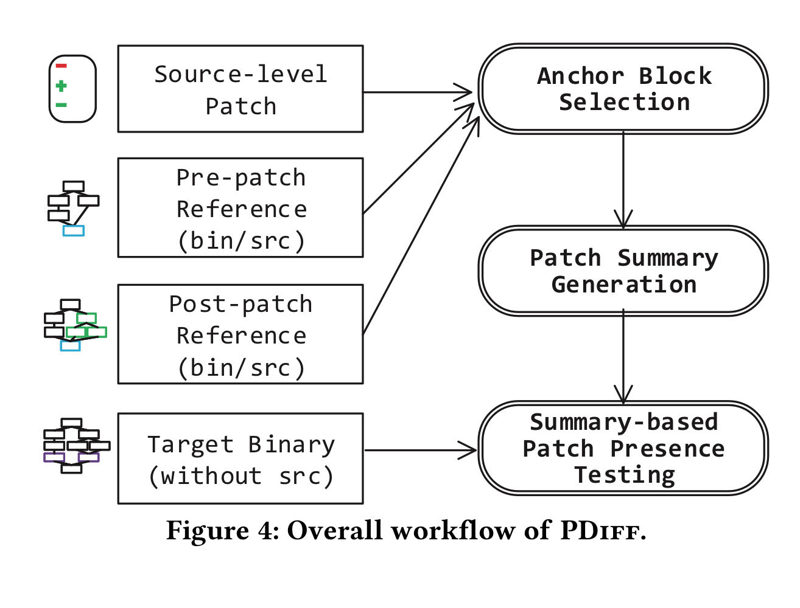
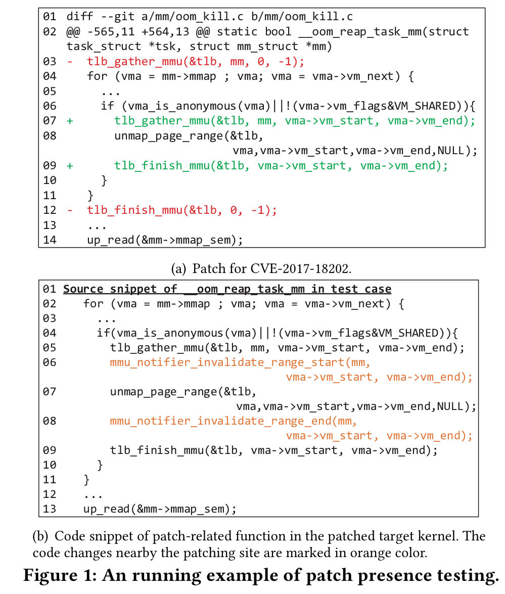
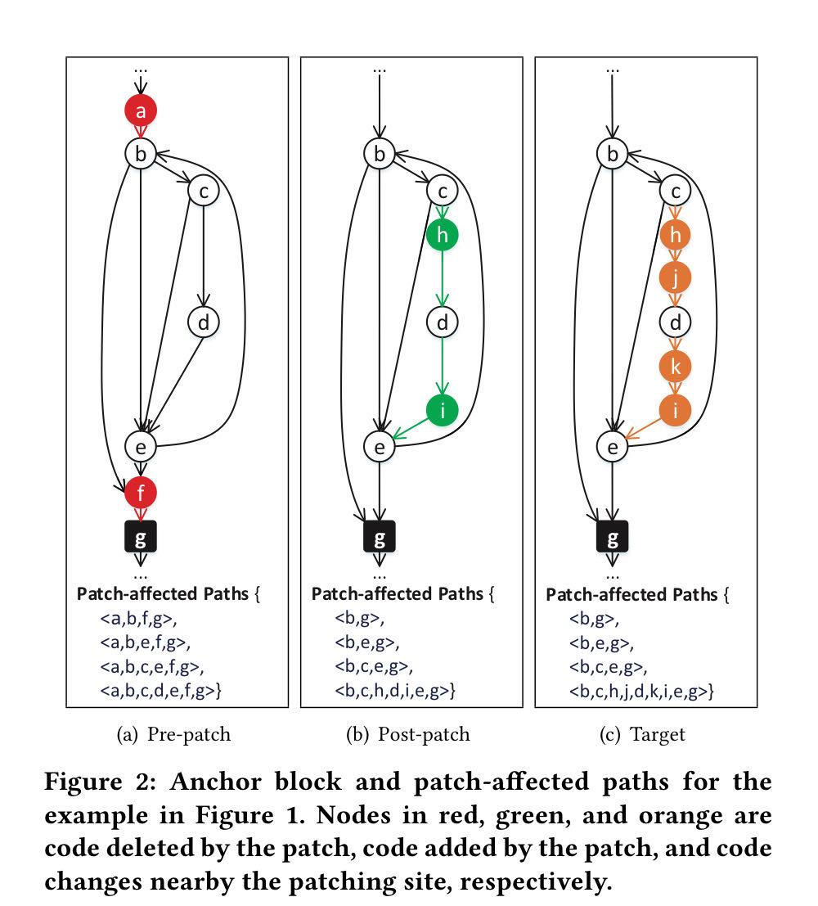
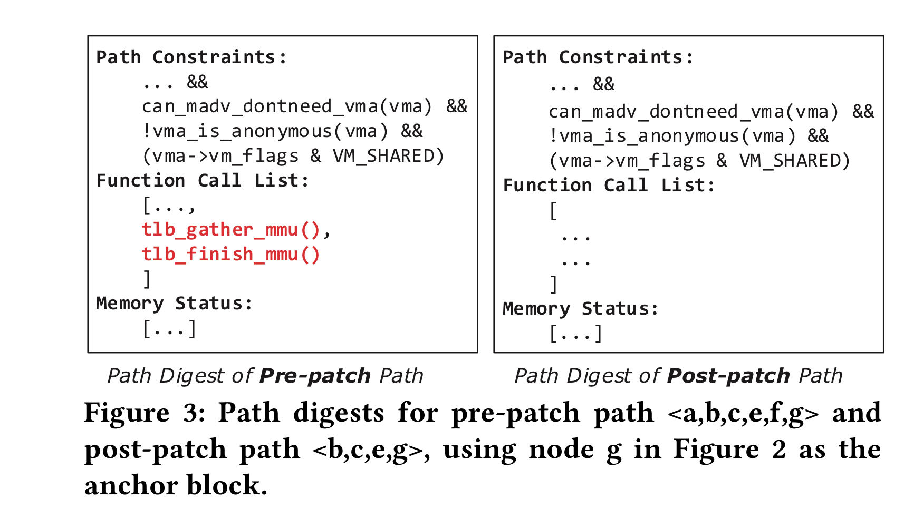
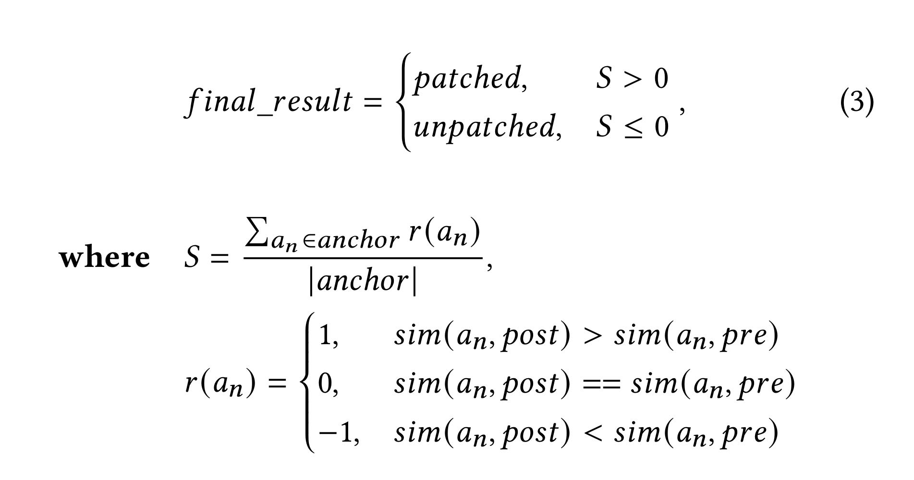

# PDIFF

这是一篇 2020 年发表在 CCS 上的[论文](https://dl.acm.org/doi/10.1145/3372297.3417240)，两位 co-first authors 均来自复旦大学。作者录制了 10min 左右的论文讲解视频，感兴趣的读者可以自行前往观看。

该论文要解决的问题是：For kernel images, check whether they have applied patches for known vulnerabilities.

### 背景

对于关心安全威胁的部门（如政府、企业），十分在意产品的补丁状态。然而对于 kernel 下游的厂商来说，十天半个月不更新上游补丁也是常有的事（偶尔也会出现厂商自行修补，却引入错误补丁的情况）。对于这样的现实情况，该如何有效地去检测下游产品是否存在特定补丁呢？

目前有两种方法：1. 构造 PoC 验证；2.通过 signature 验证（如 FIBER）。

补丁存在检测的难点：kernel 下游厂商的代码往往是难以获取 / 不可靠的，再加上为了实现定制化的服务，厂商们对于上游的补丁会进行 **third-party code customization** & **diversities in building configuration**。因此现有的方法在补丁存在检测表现不够理想。

针对以上问题，作者提出了 PDIFF，一种针对下游内核的新型补丁存在检测系统。其 idea 如下所述：

> The intuition behind the design of PDIFF is that the target kernel and its reference version should have similar semantics, regardless of the variations at the code level.

### 设计与实现

PDIFF 设计的关键在于比较：`similarity(downstream_binary, upstream_pre_patch)` 和`similarity(downstream_binary, upstream_post_patch)`。

基本的想法也很通俗易懂，你不是让我确认是否存在某特定补丁吗，我就提出一个**距离（即 similarity）**的度量标准，去判断下游厂商的 binary 究竟是更靠近上游打补丁前还是打补丁后。如果更靠近打补丁后，就认为 binary 打上了补丁，反之则认为 binary 不存在特定补丁。

PDIFF 分三步实现：

1. 识别补丁影响区域，收集补丁影响路径；
2. 生成基于语义的补丁摘要；
3. 基于补丁摘要，进行补丁存在测试。

<figure><figcaption></figcaption></figure>

以如下代码为例：

<figure><figcaption></figcaption></figure>

第一步目标：识别补丁打在了哪里，确认补丁前后的差别在哪里。首先收集有关与补丁相关的所有函数调用，而后借助 Anchor Block 剔除实际与补丁无关的部分，规避路径爆炸问题的同时确定**补丁影响路径**。那么 Anchor Block 是什么？又该如何产生呢？

以笔者有限的认知来看，Anchor Block 是指关键代码片段，用于记录补丁前后的差别。其产生过程是：先编译补丁前后的 kernel image，而后将代码改变的部分映射到 image 中的基本块。若存在多个 Anchor Block，选择能将 `sum(sim(an, pre), sim(an, post))` 最大化的 Anchor Block；若不存在，则将函数的退出码选作 Anchor Block。更加详细的产生过程可以参考 P7 的 Algorithm 1。

<figure><figcaption></figcaption></figure>

第二步目标：基于语义生成补丁影响路径的摘要（借助符号执行）。这里的语义指——函数调用、内存状态和路径约束。

<figure><figcaption></figcaption></figure>

第三步目标：根据距离算法，判断是否存在特定补丁。

<figure><figcaption></figcaption></figure>

<figure><figcaption></figcaption></figure>

<figure><figcaption></figcaption></figure>
