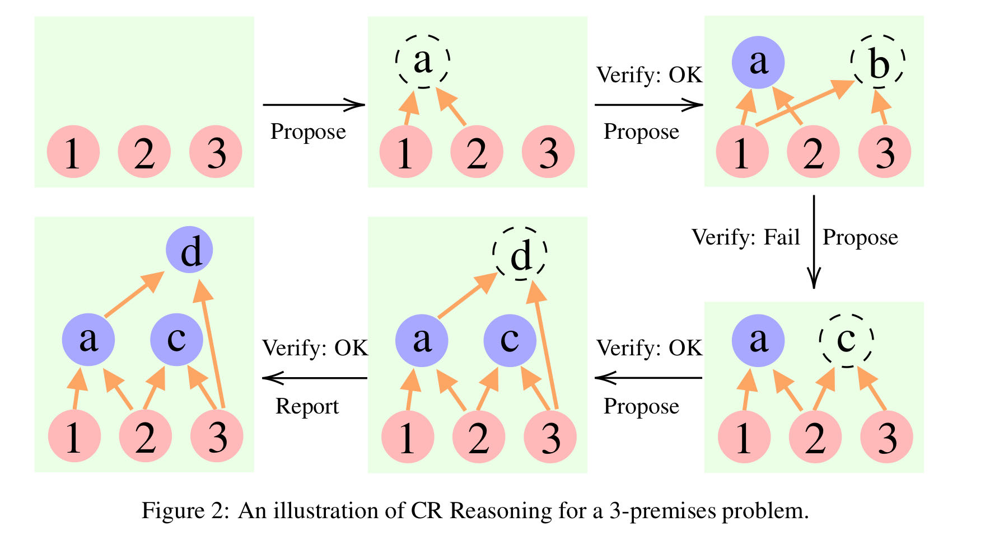
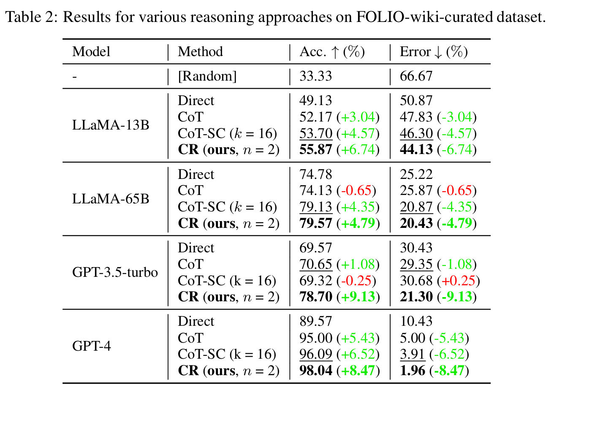

# Cumulative Reasoning With Language Model

这是一篇 2023 年发表在 arXiv 上的[论文](https://arxiv.org/abs/2308.04371)，领衔作者为**姚期智**。该论文提出了一种 LLM 解决复杂问题的方法——模仿人类思考过程，将复杂问题递归解决。文中该将方法命名为 Cumulative Reasoning(CR)。

该论文指出现存 LLM 的问题在于忽略了对人体第二认知系统的模仿，导致推理效果不佳。同时指出 CR 相较于现有 CoT / ToT 方法的优势在于其数据结构类型为 DAG，具有更高的自由度，面对复杂问题具有更强的可扩展性。

CR 主要部署了 proposer、verifier 和 reporter 三个 LLM，通过三个 LLM 的协同合作，实现对复杂问题的解决。

<figure><figcaption>
流程图
</figcaption></figure>

<figure><figcaption>
部分实验效果
</figcaption></figure>

ps：顶级论文确实不一样，观点鲜明，论述言简意赅，实验效果显著（开始实验效果不好，直接找数据集的问题，确实硬核🤣），这是笔者目前为止阅读体验最佳的论文。
