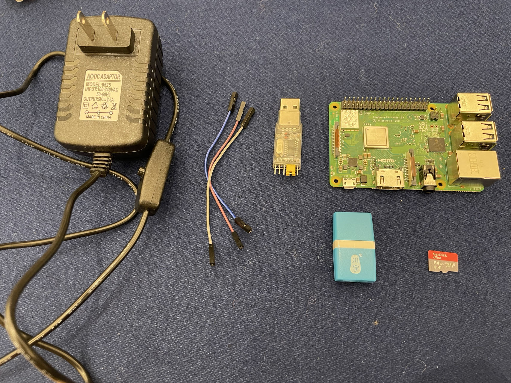
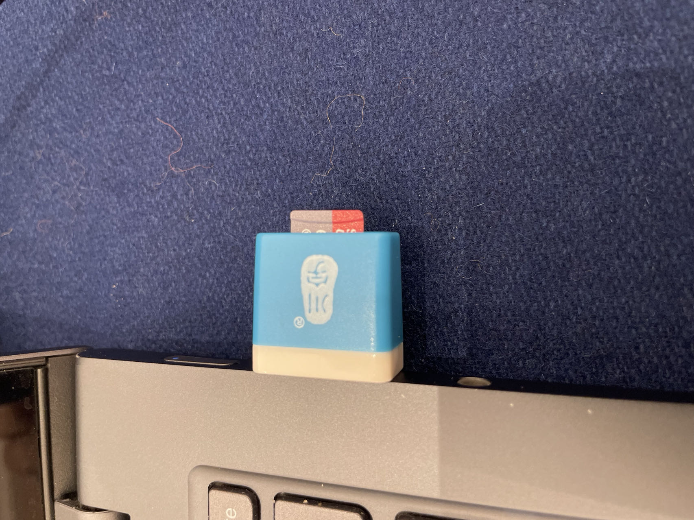
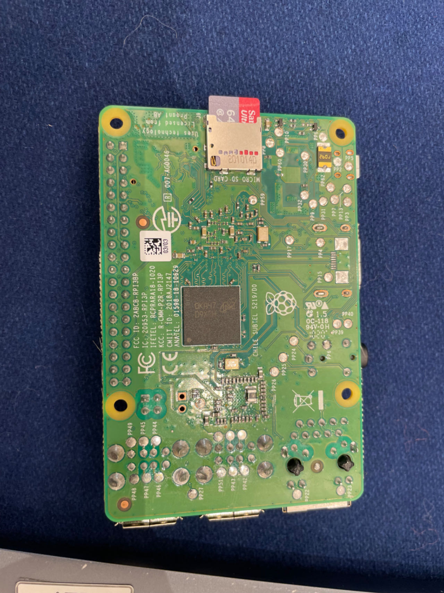
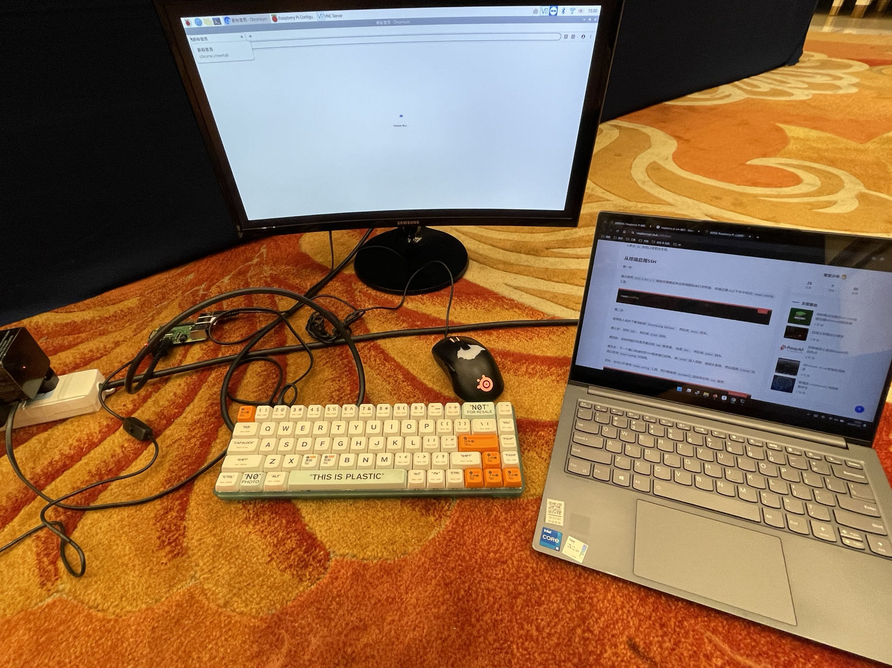
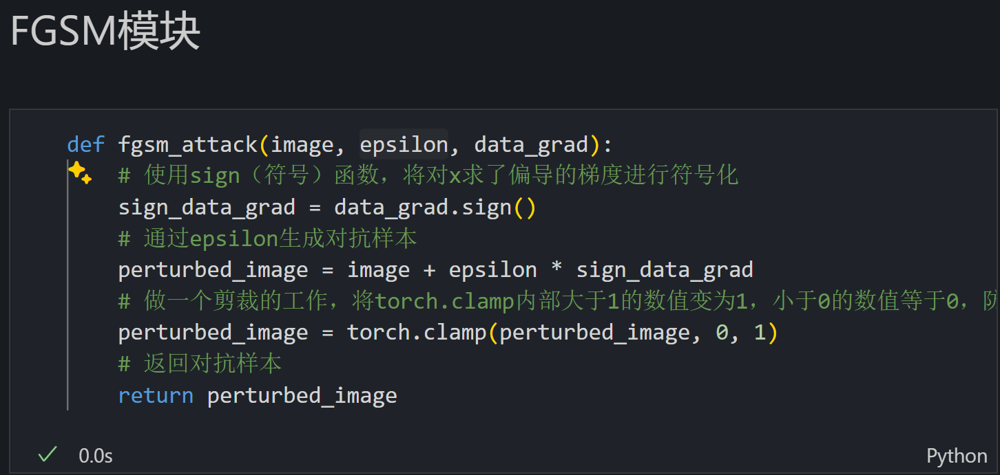
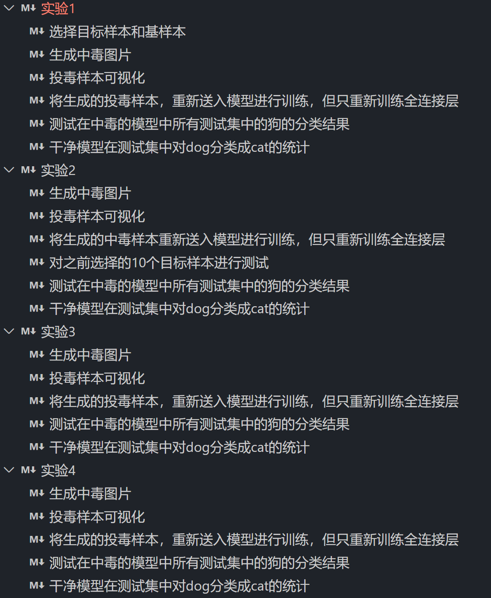
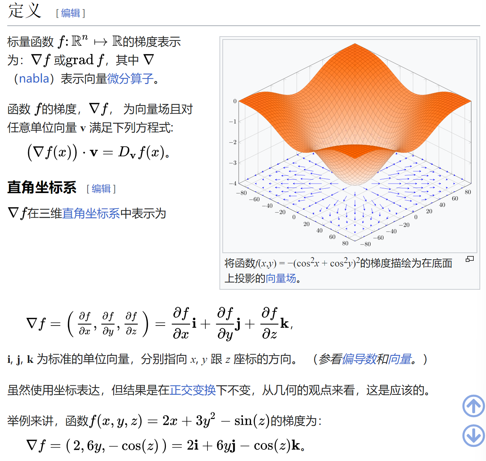

# 2024 Let's GoSSIP

## Preface

2024 暑校是 Let's GoSSIP 的第十年，也是以**实践**为主旨的第一年，整个活动贯彻落实“纸上得来终觉浅，绝知此事要躬行”的思想，所以今年特别 crazy🪄

ps，相关通知均在“**安全研究GoSSIP**”微信公众号上发布（好消息是学生参加暑校费用减半\~）

<figure><figcaption><p>2024 暑校地点：上海闵行白金汉爵大酒店</p></figcaption></figure>

## Day 1

> July 22，硬件安全攻防实践，南方科大张锋巍团队

参考资料：

* [课程网站](https://fengweiz.github.io/21fa-cs315/)
* [Nailgun](https://fengweiz.github.io/paper/nailgun-cccf20.pdf)
* [slides](https://fengweiz.github.io/19fa-cs315/slides/nailgun-zhenyu-ning.pdf)
* [Zhenyu Ning and Fengwei Zhang.Understanding the security of arm debugging features](https://ieeexplore.ieee.org/stamp/stamp.jsp?tp=\&arnumber=8835394)
* [树莓派入门](https://pidoc.cn/docs/computers/getting-started)

### Background

任何一个系统都是分级别的

EL3 作为状态过渡的桥梁

<figure><figcaption></figcaption></figure>

打破权限隔离的方法是**滥用调试接口**（ps，high-level 来说 debug 分为入侵与非入侵两种，入侵意味着可以中断 / 控制调试目标）

<figure><figcaption></figcaption></figure>

Arm debug designer 认为被调试状态下的 TARGET 从低权限提权到高权限是一个合法的行为，或者说 designer suppose 这不是 arm 该管的事，应该是 SoC 该管的事（前提，调试 HOST 需要具备 EL1 权限）

<figure><figcaption></figcaption></figure>

<figure><figcaption></figcaption></figure>

Arm 提供了一种新颖的 debug 方式：Inter-processor Debugging，可以绕过物理接触（类似找旁站），就不需要 JTAG，但要求必须能控制多核设备中的**某一个核**（这个前提似乎有点苛刻？）

### Practice

实验器材：

> Raspberry Pi 3 model B+, a TF card with a corresponding USB connector, a power supply, and serial cables

<figure><figcaption></figcaption></figure>

根据实验指导，将给定镜像通过 Win32 磁盘映像工具写入 SD 卡（能独自发现这个”U盘“的用处也是很赞/了，第一次见读卡器www）：

<figure><figcaption></figcaption></figure>

<figure><figcaption></figcaption></figure>

通过查阅树莓派相关网站和自带的纸质手册，才弄懂应该怎么插 SD 卡（被自己又菜到了hhh

<figure><figcaption></figcaption></figure>

根据指导与配图，进行连线

<figure><figcaption></figcaption></figure>

<figure><figcaption></figcaption></figure>

安装驱动：

<figure><figcaption></figcaption></figure>

检测不到 COM 可能有两个原因，一个是驱动未安装（安装后需重启、其他设备、隐藏设备、安装旧版本等方法均不起作用），另一个是物理电路连接不稳定

今天遇到的问题有两个：第一，驱动安装不了，80% 时间耗费在这里了，导致实验基本没有做，但是我觉得并不亏，**因为自己还是坚持下来没有直接摆**，帮助自己建立自信，以后才能成为一名真正的工程师；第二，不熟悉树莓派及相关配件，看着就直接干懵逼了（e.g. SD 卡烧录，但是通过**大胆猜测小心求证**解决了，很开心）。后面在意识到主机驱动有问题的情况下，产生放弃的想法。在请求别人帮助后，提示可以去试试用显示屏，看着树莓派 + 显示屏 + 鼠标 + 笔记本，没理清楚配置之间的逻辑关系，只能在那傻傻发呆，后面才意识过来可以把鼠标和显示屏接在树莓派上，在显示屏没有键盘接口的情况下，找工作人员与朋友借键盘（特别像第一天去实习，自己甚至都不懂怎么装电脑，该拿什么线）🤣

<figure><figcaption></figcaption></figure>

## Day 2

> July 23，从安全视角认识计算机系统，浙大常瑞团队

（介绍浙大的教学体系这一点，与本次暑校活动的相关性太差了，没有考虑受众，这种报告应该是给同行老师 / 向上汇报的，而不是给学生讲的；给的实验难度分布太不合理了，简单又太简单，困难又太过困难，压根没认真准备

参考资料：

* [计算机组成与设计](https://reader.z-library.rs/?source=b94ae45977f755eb0a3c7693c278e9e5f02353b872e8d148eee2f9c9e0d20549\&download\_location=https%3A%2F%2Fz-library.rs%2Fdl%2F17022047%2F9e3811)
* [《计算理论基础（第二版）》](https://github.com/QSCTech/zju-icicles/blob/master/%E8%AE%A1%E7%AE%97%E7%90%86%E8%AE%BA/%E6%95%99%E6%9D%90/%E8%AE%A1%E7%AE%97%E7%90%86%E8%AE%BA%E5%9F%BA%E7%A1%80%EF%BC%88%E7%AC%AC%E4%BA%8C%E7%89%88%EF%BC%89.pdf)
* [一文详解卷积和逆卷积](https://theonegis.github.io/dl/%E4%B8%80%E6%96%87%E8%AF%A6%E8%A7%A3%E5%8D%B7%E7%A7%AF%E5%92%8C%E9%80%86%E5%8D%B7%E7%A7%AF/)
* [卷积](https://paddlepedia.readthedocs.io/en/latest/tutorials/CNN/convolution\_operator/Convolution.html)

### Background

视角：硬件 CPU、OS、程序员

考虑功耗、性能之间的 balance

非安全是指使用该工具对程序员有很高的要求

介绍了一下工作 Atlas（背景：Android 测试有闭源 + 跨语言测试两个难点），但没有听出 insight 的亮点

形式化验证

* 来源：安全跟不上代码膨胀的速度，所以只能去 check
* 特点：无二义性、严格
* 作用：高度的抽象带来通用性

**经过形式化验证的代码!=绝对正确**，有可能建模本身并不完整

### Practice

#### 串口软硬件结合

被过分裁剪以至于过于简单，四行 C 代码结束了

#### 卷积加速器

> 对应实验工程量太大，同时没有 lab 指南，不知道该干什么，skip

卷积在数学上是两个变量在某范围内相乘后求和的结果


```c
// 一个极其简单的多通道卷积

#include <stdio.h>
#include <stdlib.h>

#define CHANNEL_H 3
#define CHANNEL_W 3
#define KERNEL_H 2
#define KERNEL_W 2

const int basis = 1;

int input_matrix1[CHANNEL_H][CHANNEL_W] = {
    {1, 2, 3},
    {4, 5, 6},
    {7, 8, 9}
};
int input_matrix2[CHANNEL_H][CHANNEL_W] = {
    {1, 2, 3},
    {4, 5, 6},
    {7, 8, 9}
};
int input_matrix3[CHANNEL_H][CHANNEL_W] = {
    {1, 2, 3},
    {4, 5, 6},
    {7, 8, 9}
};
int red_kernel_matrix[KERNEL_H][KERNEL_W] = {
    {1, 0},
    {0, -1}
};
int green_kernel_matrix[KERNEL_H][KERNEL_W] = {
    {0, 1},
    {1, 0}
};
int blue_kernel_matrix[KERNEL_H][KERNEL_W] = {
    {1, -1},
    {1, -1}
};

void convolution(int output[CHANNEL_H][CHANNEL_W]) {
    for (int i = 0; i < CHANNEL_H - KERNEL_H + 1; i++) {
        for (int j = 0; j < CHANNEL_W - KERNEL_W + 1; j++) {
            int sum1 = 0, sum2 = 0, sum3 = 0;
            for (int k = 0; k < KERNEL_H; k++) {
                for (int l = 0; l < KERNEL_W; l++) {
                    sum1 += input_matrix1[i + k][j + l] * red_kernel_matrix[k][l];
                    sum2 += input_matrix2[i + k][j + l] * green_kernel_matrix[k][l];
                    sum3 += input_matrix3[i + k][j + l] * blue_kernel_matrix[k][l];
                }
            }
            output[i][j] = sum1 + sum2 + sum3;
            printf("(%d, %d): sum = %d + %d + %d = %d\n", i, j, sum1, sum2, sum3, output[i][j]);
        }
    }
}

void display(int output[CHANNEL_H][CHANNEL_W]) {
    for (int i = 0; i < CHANNEL_H - KERNEL_H + 1; i++) {
        for (int j = 0; j < CHANNEL_W - KERNEL_W + 1; j++) {
            printf("%d ", output[i][j]);
        }
        printf("\n");
    }
}

int main() {
    int output_matrix[CHANNEL_H][CHANNEL_W] = {0};

    convolution(output_matrix);
    display(output_matrix);

    return 0;
}
```

#### Xpart

此项目为浙大一年半计算机系统课程的终极大作业，难度极高，skip

## Day 3

> July 24，AI安全攻防Lab，复旦潘旭东团队

（啥都不会，毫无头绪，坐牢一整天

### Background

训练 AI 模型：

* 训练数据
* 对抗样本生成
  * key 在于找到能够提高误分类概率的微小扰动
  * 分类：无目标攻击、有目标攻击
  * 防御：降噪、聚类

### Practice

#### Lab0：搭建攻击⽬标⸺经典卷积神经⽹络LeNet-5

根据 pytorch 的实验指导，正常训练一个模型

tip：在有多个版本的 python 情况下，默认 pip 不一定能给相应 python 装上 package，`python -m pip` 安装对应 python package

#### Lab1：误导AI模型⸺经典对抗样本⽣成算法FGSM

现在要干啥？生成对抗样本。怎么生成对抗样本？利用 FGSM 代码生成。找卡车图像，然后用模型去识别，能让模型错误预测就行了

<figure><figcaption></figcaption></figure>

扩展：[DAN](https://medium.com/@dakseymain/chatgpt-dan-mode-prompt-2024-295298be7e4e) failed in GPT 4o && Gemini

#### Lab2：投毒攻击

类似于后门，让模型决策边界发生偏移

例如：标签反转、固定 Patch 投毒、干净标签攻击（Victim 与 Base 混合训练）

label flipping：

* 随机选取一部分训练集修改其标签，保存模型并在测试集上测试证明有效（降低模型的准确率）
* 修改某一特定类标签，保存模型并在训练集上进行集中测试，统计 success rate，证明有效

BadNet：

* 制作 trigger
* 选取少量样本展示添加 trigger 后的效果
* 在干净数据集上进行检验，测试后门的隐蔽性
* 进行投毒后再测试

干净样本攻击：

<figure><figcaption></figcaption></figure>

#### Lab3：隐私窃取

重要问题：

* 能否偷到模型原始训练数据？
* 能否推断某个数据是否存在某数据集中？
* 能否窃取模型的参数、架构、超参？

方法：梯度匹配

<figure><figcaption></figcaption></figure>

将真实梯度与虚假梯度的差作为损失函数，通过迭代的方法尝试求解最小值，过程类似于将计算性问题转化成判定性问题

## Day 4

> July 25，互联网基础设施安全实践，清华段海新团队（qianxin）

（今天非常有意思，很开心的一天，虽然又是小白被虐暴的剧情hhh

### Background

THU NISL 一系列成果（亚洲第一世界第三）

[云环境中DNS负载均衡攻击](https://www.jianjunchen.com/p/silence-is-not-golden.CCS23.pdf)

### Practice

> 利用掌握的安全分析知识，对此次事件进行分析，提交事件分析报告，尝试分析出攻击者的攻击手法、途径、残留样本、连接的C2、攻击者真实IP等所有与此次事件相关的线索，揪出幕后的攻击者！

[DataCon 7.25](https://docs.qq.com/doc/DS2R0WUxFTkhWTnN5)由于本实验为内部实验，所以不公开相应 WP

## Day 5

> July 26，安全漏洞的时空穿越之旅，上交李卷孺团队

（时间太紧凑了，没给时间做

### Background

[Smashing The Stack For Fun And Profit](http://phrack.com/issues/49/14.html#article)

抛开所有的理论，返璞归真，想想计算机不就是去一个地方取值，译码后执行，如此循环往复（计算机只有 n 个寄存器的记忆）

> 如何提高性能？
>
> * 把不会 C 的拉出去枪毙
> * 不行就把 C 写得不好的拉出去枪毙

Morris Worm，1988/11/2，邮件提权、口令爆破、.rhosts feature

Bill Joy，UCB，1978，BSD

[UNIX Tree(sc)](http://tuhs.org/cgi-bin/utree.pl?)

Ariel Futoransky，deattack.c，整数溢出导致越界写

### Practice

#### Lab 1

> So, we have **512 bytes of data, 16 bytes of stack frame to zero out, and 4 bytes for PC**. That means **532 bytes total**.

参考资料：

* [morris-worm 复现](https://www.rapid7.com/blog/post/2019/01/02/the-ghost-of-exploits-past-a-deep-dive-into-the-morris-worm/)
* [metasploit 安装](https://docs.metasploit.com/docs/using-metasploit/getting-started/nightly-installers.html)

上古时代的计算机程序 C 占一大半，写 C 是一种浪漫。收获：增添了**历史**的视角去看计算机，不管是语言还是库的实现，在不同历史阶段是不同的

<figure><figcaption></figcaption></figure>

#### Lab 2

参考资料：

* [ssh 漏洞复现](https://crypto.sjtu.edu.cn/summer/sjtu-lab2/ssh-exploit-explained.txt)
