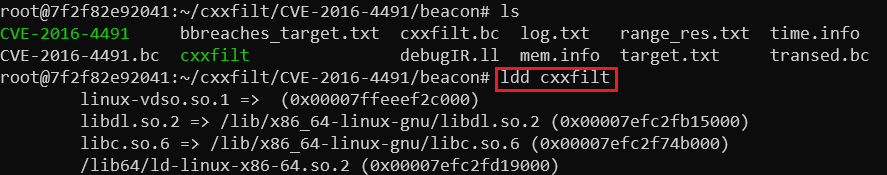

# Beacon 实验

### 前言

Beacon 实验是指将目标软件编译成 .bc 文件后再喂给 fuzzer 的过程。基础知识主要涉及到 Beacon & LLVM。bitcode 是 LLVM IR 的二进制编码（IR 是前后端的一种中间层），主要包括 bitstream container format 和 encoding LLVM IR，前者是为后者如何进行编码提供帮助的。bitstream 和 LLVM IR 有各自的格式，用不同的参数去刻画文件，在过程中可通过 Abbreviations ID 来大致理解目前的文件流。

\
本实验是针对 [Beacon](https://qingkaishi.github.io/public_pdfs/SP22.pdf) 论文中提到的 51 个 CVE 进行复现，测量其性能，并与自身 fuzzer 进行对比。\
参考文档：[LLVM](https://llvm.org/docs/BitCodeFormat.html#llvm-ir-encoding) & [Beacon document](https://outstanding-hydrogen-2d1.notion.site/Beacon-documentation-8480ed4e7fff452a989f7e77ce749951)

### 实验过程

以下按流水线的方式，记录自己踩过的坑以及对应的 solution。

#### **环境配置**

1. 首先配置一个密钥，放在 authorized\_keys 下，然后配置 config，实现优雅的 `ssh <hostname>` 的 remote login；
2. 实验环境要求在 podman 下进行（类 docker）。首先拉取对应镜像，`podman run -d --init --name beacon docker.io/yguoaz/beacon:latest sleep infinity`，在拉取的过程中可能会遇到 insufficient pids or uids 的错误，可通过 `cat /proc/self/uid_map`、`cat /proc/self/gid_map` 来查看相应的情况。
3. 解决方案——添加参数 `--storage-opt ignore_chown_errors=true`。成功拉取 image 后，进入容器，为了编译得到 Clang bitcode ⽂件，需要使⽤ wllvm，通过 `python3 -m pip install wllvm` 安装。为了通过 tmux 运⾏ Beacon AFL（使 shell 与进程分离，类 nohup），需要使用 tmux，通过`apt update; apt install tmux` 安装。至此，初期的准备工作基本完成；

#### **获取目标软件并编译**

3. 可通过查询 NVD 的方式（以 CVE-2017-7578 为例），访问 `https://nvd.nist.gov/vuln/detail/CVE-2017-7578`，即可获取该 CVE 的相关信息。重点查看下方的 hyperlink，一般情况下可获得关于源码的指向。而后采用 git clone 的方式，获取源码，并用 git checkout 的方式切换到该 CVE 对应 patch 的前一个 comitID，以对该 CVE 进行下一步测试。注意，若有连续多个 commit 对该 CVE 进行 patch，应回退到最早 commit 之前的版本。

<figure><figcaption></figcaption></figure>

3.  查看源码路径下 README / INSTALL 之类的文件，获取编译该目标软件的方法，注意在编译的过程中要传递 wllvm 环境变量。一种可能的编译方式如下：

    ```bash
    export CC=wllvm
    export LLVM_COMPILER=clang
    ./autogen.sh
    ./configure --disable-shared
    make -j$(nproc)
    ```

    当然也可能需要使用 cmake 方案，具体要求参见 README / INSTALL 文件（比较玄学的一点是，对于某类编译方式，有可能一次编译不成功，但是经过多次尝试后就成功了）。编译成功后，得到对应的可执行程序，再使用 `extract-bc <target_name>` 获取 \*.bc 文件；

**使⽤ Beacon 提供的⽂件分析⼯具对 bc ⽂件进⾏处理**

5. 对于一个 \*.bc 文件，需要提供一个分析目标文件，可建⽴⼀个 target.txt ⽂件并写⼊定向⽬标（某⽂件的某⼀⾏）。对于目标的定向，可考虑以下四种角度：
   * 参考 NVD 官网的 Discription 部分，看该 CVE 是由于哪个文件的哪个漏洞函数触发的；
   * 观察 patch 部分的增删；
   * 参考 github 下的 issue；
   * google 相关信息。
6. 使用 `/Beacon/precondInfer <target_name>.bc -target-file=target.txt -join-bound=5`，对漏洞程序进行分析。若遇到 **malformed** 的错误，可尝试调整 `-target-file` 与 `-join-bound` 这两个参数，采用排列组合的方式试错。紧接着，通过 `/Beacon/Ins -output=<target_name>.bc -byte -blocks=bbreaches_target.txt -afl -log=log.txt -load=range_res.txt transed.bc` 对漏洞程序进行插桩。最后，重新编译插桩后的漏洞程序，`clang <target_name>.bc -o <target_name> -lm -lz /Beacon/Test/afl-llvm-rt.o`。因为之前设置了 `./configure --disable-shared`，所以可能导致重编译时，缺少相关的链接文件。此时可以使用 ldd 命令手动查看可执行文件的链接文件，而后手动补齐。也可以通过下载源代码，进一步编译共享库来解决这个问题；

<figure><figcaption></figcaption></figure>

#### **模糊测试**

7.  启动一个 tmux 用于持续运行，`tmux -u new -s <tmux_name>`，进入模糊测试路径，并准备测试用例文件夹 in。对于 initial input，可参考以下顺序：

    ```bash
    /aflgo/scripts/fuzz/program_name/obj-aflgo/ 
    /aflgo/testcases/archives/exotic
    /aflgo/testcase 
    ```

    而后使用 `taskset -ac 4 /Beacon/afl-fuzz -i in -o out -m none -t 9999 -d -- ./<target_bin> @@`，其中，-ac 用来绑定 cpu，可提前使用 htop 命令查看 cpu 的具体使用情况。对于 -- 后面的参数，请参考 aflgo github 仓库中提供的 [\*.sh](https://github.com/aflgo/aflgo/tree/master/scripts/fuzz)。

#### **结果分析**

8.  对于在 24h 内能成功 fuzzing 出 crash 的 CVE，计算其首次触发 crash 的时间。通过时间戳进行计算，具体参考以下脚本：

    ```bash
    program=$1
    cveid=CVE-$2
    id=$3
    for num in {1..3} do
         # 获取首次触发 crash 的时间戳
         tmp_time1=$(date -r ~/"$program"/"$cveid"/fuzz/out1/crashes/"$id")
         time1=$(date -d "$tmp_time1" '+%s')

         # 获取 fuzzing 开始的时间戳
         tmp_time2=$(cat ~/"$program"/"$cveid"/fuzz/out1/fuzzer_stats | grep start_time)
         time2=${tmp_time2:20}

         # 得到时间差
         let time=time1-time2;

         # 实现时间单位从 s → h
         awk 'BEGIN{printf "%.4f\n", '$time'/'3600'}'
    done
    ```
9.  对于 fuzzing 出的 crash，进一步考察 beacon 对 target.txt 中提到的 vul 路径的定向能力，并计算首次成功匹配 vul 并确认执行的时间，具体参考以下脚本：

    ```bash
    #!/bin/bash

    program="$1"
    cveid="CVE-$2"
    address="$3"

    cd "./$program-$cveid/"

    # count.txt 记录命中数，以及命中 crash 的 id
    echo "$cveid:" >> count.txt

    for num in {1..3}; do
     success=0
     fail=0
     echo "reading from ./out$num/crashes/"
     echo "out$num:" >> count.txt

     # 逐个读取 ./out/crashes/ 下的文件名
     shopt -s globstar
     for line in ./out$num/crashes/*; do
         # 将 crash 喂给 CVE
         echo "reading from "$line""
         ../../../../../pin -t ../../obj-intel64/itrace.so -- "./$cveid" "$line"

         # 判断指令序列中是否有 func 对应的 address
         if grep -q "?*$address?*" ./itrace.out; then
             success=$((success+1))
             echo "hit_id: $(basename "$line")" >> count.txt
             break
         else
             fail=$((fail+1))
         fi
     done

     # 修正 fail，因为 README.txt 总是失败的
     fail=$((fail-1))
     echo "success times: $success" >> count.txt
     echo "fail times: $fail" >> count.txt
    done
    ```

    其主要思路为，用 pin 记录下所有执行地址，用 objdump -t 的方式提前从符号表中获取对应 func 的 address，最后用 grep 的方式进行匹配。在脚本运行的过程中，请注意程序是否陷入**死循环**，若出现此类情况，请及时退出并删除 crash，避免浪费大量时间。至此，实验结束。

### 结语

折腾即真理，在实验过程中反复被虐，不断寻求解决方案，从而拓展能力边界。也许人类进化的本质就是，在遇到某个问题要求的能力超出目前的可达范围，但是踮起脚尖又勉强能够到的情况下，大脑会申请一个进程，不断计算、进化，直到成功求解 / 中途手动 quit 该问题。晚上睡不着估计也是同理，大脑飞速运转，不停申请、调度资源，不允许后台运行，对褪黑素的敏感度下降，导致迟迟无法入眠……做这个实验三周以来，基本没怎么好好睡过觉。\
还有几点比较深的感受：将文件夹结构化；降低对事情进展的预期，因为每天都会碰上新问题；对于大量测试用例，注意构建自动化脚本。
