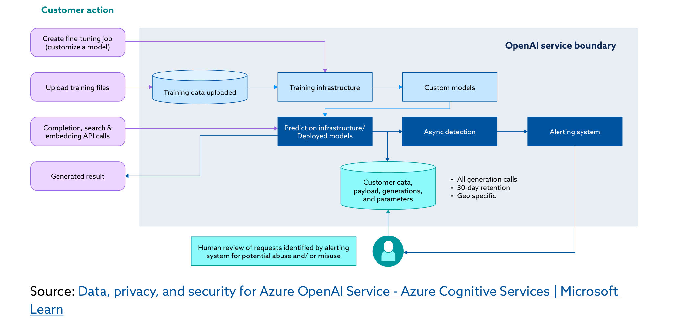
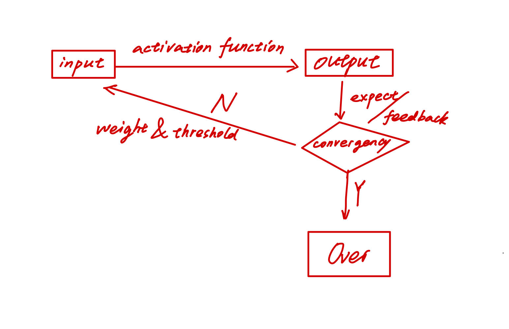
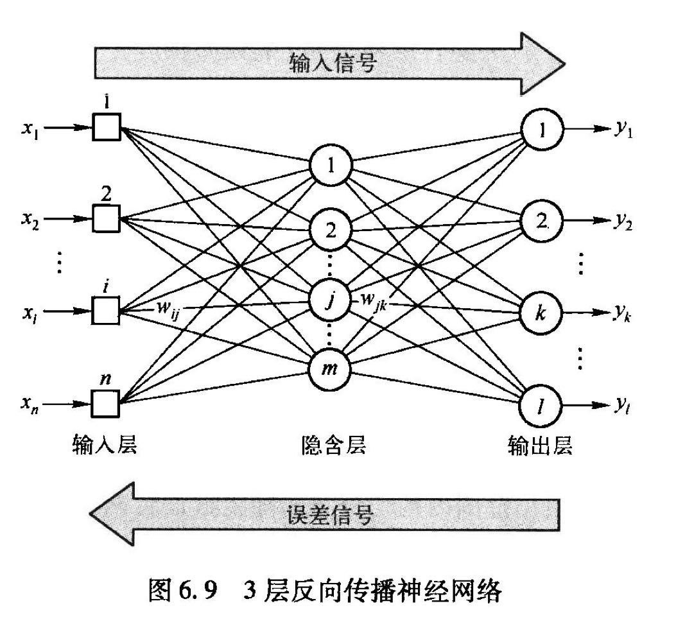
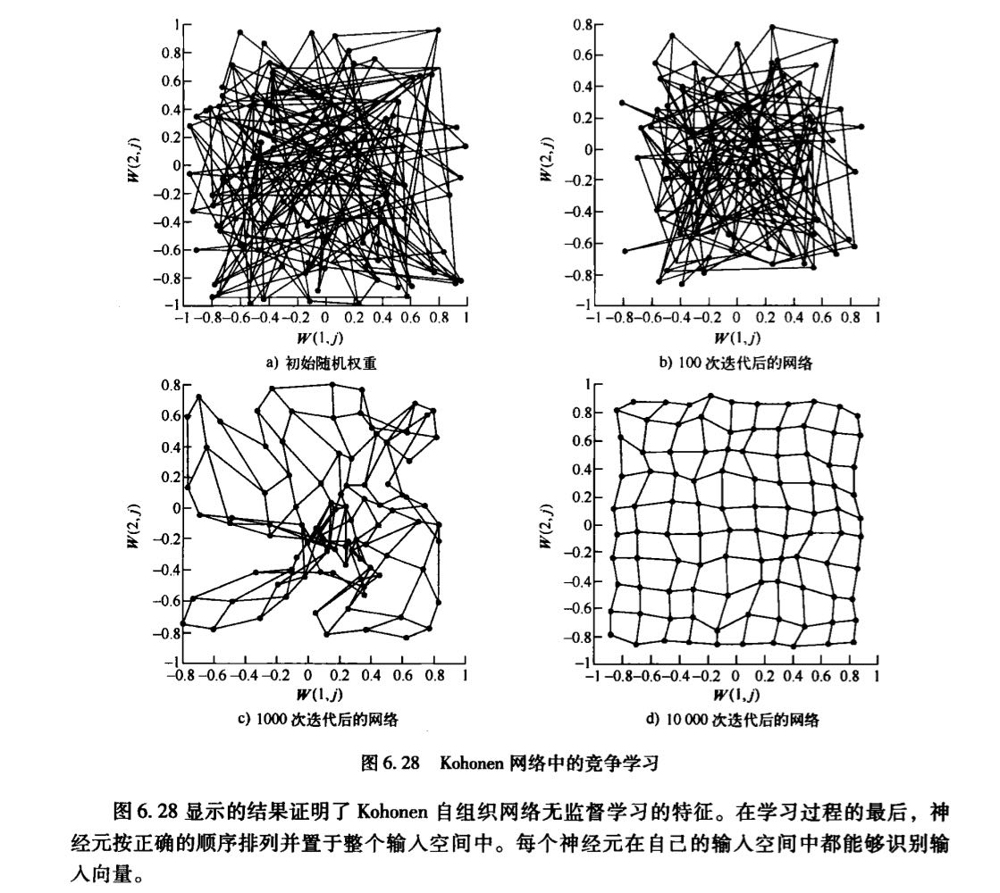

# 对 AI 的认知

### 前言

自从去年 11 月份 ChatGPT 上线之后，有关 AI 的言论层出不穷。当接收的信息量过大时，会麻木到不加以辨别什么是“别人想让我看到、听到的”，什么又是“事实”，为纠正这样的思维模式，笔者特此梳理一下自身对于 AI 的认知。

### 发展历程

1943年，神经科学家沃伦·麦卡洛克与数学家沃尔特·皮茨发表了一篇跨时代的论文——《神经活动内在概念的逻辑演算》，第一次解释了大脑内部神经元的活动和数理逻辑演算之间的相似性。其后，Turing 提出了图灵机与图灵测试的概念，该想法来源于对“为什么机器不能像人一样思考、做决策”这一问题的追问，，开启了 AI 研究的先河。然而受制于当时的计算环境，没有可持续性存储器，机器无法存储过往学习的经验，同时其计算速度也极为有限，打造出“具有人一般智能”的机器只是个美好的愿景。

1956年，马文·明斯基，约翰·麦卡锡和另两位资深科学家克劳德·香农以及内森·罗彻斯特，这四位计算机巨佬组织开展**达特矛斯会议**，会议提出的断言之一是“学习或者智能的任何其他特性的每一个方面都应能被精确地加以描述，使得机器可以对其进行模拟”。此后，对于 AI 的研究进入黄金时代。

但是研究并非一帆风顺，在随后的几十年中，[关于 AI 的研究](https://zh.wikipedia.org/zh-sg/%E4%BA%BA%E5%B7%A5%E6%99%BA%E8%83%BD%E5%8F%B2)也几经沉浮。直到 1997 年 5 月，发生了一个广为人知的标志性事件——由 IBM 开发的 Deep Blue 击败了国际象棋世界冠军卡斯帕罗夫。此后 AI 的发展，步入一个新的阶段。

在国际象棋上 AI 击败了人类后，人们想试试看在围棋方面，AI 是否也能击败人类。毕竟围棋号称是人类有史以来发明的最复杂的游戏，其状态空间复杂度大约是 10^172，而国际象棋的状态空间复杂度大约是 10^47。结果横空出世的 AlphaGO 先是在 2016年 五局四胜击败韩国职业九段选手李世石，后是在 2017年 以三局全胜的战绩击败世界围棋排名第一的柯洁，从而潇洒离去退隐江湖，具体可参考赛后柯洁接受的[采访](https://www.youtube.com/watch?v=3Nrt6ytbFQM)。

当然，迄今为止最令人震撼的 AI 产品，无疑是 OpenAI 在去年发布的 ChatGPT，会写代码、会写情诗、还能为你制定健身计划……简直是个完美且通用的专家系统，这套知识框架 _"is absolutely amazing"_。很难想到有什么东西是它不会的，而且它是面向公众开放的，人人都可以体验，于是它在两个月内日活跃用户成功从零突破至数亿，在它之前没有任何一个产品能做到这一点。

ChatGPT 基于机器学习去产生 human-like text，换句话说，它是根据预训练的结果，结合概率去生成一段文本，实质上是 **token simulation**。其训练模式是：无监督学习（囫囵吞枣式学习预测，开销巨大，占据超过 99% 的训练时长） → 有监督学习（给模板说话） → 强化学习（人工微调）。

根据 Andrej Karpathy 在 Microsoft Build 2023 上的[演讲](https://www.bilibili.com/video/BV1X24y1A7Rz/?spm_id_from=333.1007.top_right_bar_window_history.content.click\&vd_source=68401e073d6cf69f6f72f1ad56c67eaf)，ChatGPT 的一些细节以 slides 的形式展示如下：

GPT 训练过程

<figure><figcaption></figcaption></figure>

Token 的含义：

<figure><figcaption></figcaption></figure>

预训练过程：

<figure><figcaption></figcaption></figure>

可参考的架构图：

<figure><figcaption></figcaption></figure>

在度过盲目崇拜的阶段之后，需理性分析一下它存在的问题。以下总结自**吴翰清**在岳麓讲坛上的分享：

> 1.如何在可学资源枯竭的情况下，取得进一步智能上的提升？\
> 2.必然存在更为高效的算法，如何升级现有算法？\
> 3.对于“毁灭人类”这类违反道德的回答，本质上反映的仍是一种人类意志，如何去解决？\
> 4.计算存在数学 & 物理方面上限，如何去逼近？

ChatGPT 以及一系列大模型的接踵而至，笔者认为可以看作是 AI 从弱人工智能 → 强人工智能的转折点，后续会沿着上凸曲线的轨迹发展，直到 AI 的成本从边际走向固定，人人都拥有一个 AI 助手时，AI 的发展将会踏入下一个阶段。机器一定会引领人类发展，社会从数字化、网络化转型智能化。值得注意的是，当 AI 演化成一种个人资产后，要时刻问问自己“自己面对的是真的 AI 吗”，其道理就类似近几年层出不穷的电信诈骗，熟人要求 vx / 银行卡转账，只要有利可图，很多意料不到的情况都会涌现，因此让**安全**意识扎根于心是很有必要的。

#### 对人工神经网络的认知梳理

人工神经网络是仿照人的认知模型（神经元之间的电信号传递）建立起的一种机器学习的方法。其基本依据是：“正确答案”的神经元之间的连接被强化，“错误答案”的神经元之间的连接被弱化。

<figure><figcaption></figcaption></figure>

人工神经网络的 workflow：

<figure><figcaption></figcaption></figure>

发展历史：

1. 1958年提出 Rosenablatt 感知器（单层双输入感知器、线性感知器）；
2.  为了解决“不能线性分割的问题”，引入用反向传播算法训练的多层感知器（含有隐含层、采用 S 型激活函数）；

    <figure><figcaption></figcaption></figure>
3. 为了“模拟人类的联想功能”，引入循环神经网络（Hopfiled 网络、BAM）。之前的神经网络不具备知识迁移 / 自适应能力，还是学习的深度不够；
4. 神经网络最主要的特征就是具有**从环境中学习**的能力，引入无监督学习算法；
   * 目标：快速学习
   * 场景：动态变化 & 预料之外条件的处理
   * 依据：自组织神经网络（模仿人类大脑，每个感官输入都会映射到大脑皮层的相应区域）
     * Hebbian学习（考察两个神经元的联系，若同时被激活则增加权重，否则减少权重）
     * 竞争学习（“赢者通吃”，Kohonen网络）

<figure><figcaption></figcaption></figure>

### 使用、鉴别与评价 AI

为了更好地使用 AI，不妨学习一下吴恩达与 OpenAI 联合推出的 prompt 教学：\
[https://learn.deeplearning.ai/chatgpt-prompt-eng/lesson/1/introduction](https://learn.deeplearning.ai/chatgpt-prompt-eng/lesson/1/introduction)。

笔者学习之后，总结写 prompt 的两个 trick：**1.简洁；2.明确。**&#x53E6;外，在使用的时候可根据"Do Anything Now"原则，尝试让 ChatGPT 进行 roleplay，以获得更高质量的回答。也可以尝试分段描述你的要求，降低对 GPT 的推理强度要求，以获得更为准确的回答。

同时推荐阅读顶级华裔科学家陆奇最新的[演讲实录](https://wallstreetcn.com/articles/3687254)，能加深对当今大模型世界的理解。有一句话让笔者受益匪浅：

> 在 20岁，要学会快速学习、快速失败。

体验过各种各样的 AI 后，笔者认为可从以下四个方面去考察 LLM / AI 的质量：

1. 上下文能力 → 多轮对话；
2. 训练量 → 常识 / 逻辑推理 / 支持语言种类；
3. 回答多样性 → 文本 / 图片 / 视频 / **代码**；
4. 安全检查 → 敏感词 / 伦理道德。

学习 _Secutiry implications of ChatGPT_ 这份报告后，总结了判断文本是否为 AI 生成的四个角度：

1. 句式过于严谨（转折词、连接词）；
2. 主观意识弱；
3. 提供了过多非必要细节（比如“打开一个搜索引擎，点击搜索栏，输入xxx，点击确认”）；
4. 专业领域推导能力弱（如数学领域）—— 但 gpt-4 的能力肯定能 beat 99% 本科生了。

### 一些 AI 网站分享

1. [ChatGPT](https://chat.openai.com/)；
2. [New Bing](https://www.bing.com/search?form=MY02AE\&OCID=MY02AE\&pl=launch\&q=Bing+AI\&showconv=1)；
3. [Bard](https://bard.google.com/)；
4. [LLM](https://chat.lmsys.org/)；
5. [国内最好用的 LLM](https://chatglm.cn/main/detail)；
6. [AI 工具导航](https://ai.nancheng.fun/)；
7. [看论文神器](https://www.chatpdf.com/)。
