# 固件仿真

## 前言

本文主要分为两个部分，第一个部分介绍相关工具以及获取固件的思路，第二部分分享固件仿真的过程，主要是参考仿真教程进行复现，以及复现过程中的一些思考。仿真的内容总结如下：

| 品牌              | 服务           | 复现os环境                                | 仿真阻碍                                                                                                            | 解决办法                                                                                        |
| --------------- | ------------ | ------------------------------------- | --------------------------------------------------------------------------------------------------------------- | ------------------------------------------------------------------------------------------- |
| vivotek         | httpd（系统级仿真） | wsl2.kali                             | <ol><li>不理解 binwalk -E 参数；</li><li>不理解 gdb 及其远程调试原理</li></ol>                                                   | <ol><li>找 blog 看原理分析；</li><li>查 gdb manual</li></ol>                                        |
| TENDA-AC15      | httpd（用户级仿真） | wsl2.kali                             | <ol><li>在 IDA 中 patch program 未果</li></ol>                                                                      | <ol><li>换 ghidra，右键使用 “Patch Instruction”</li></ol>                                         |
| Cisco           | httpd（系统级仿真） | wsl2.kali -> archlinux -> ubuntu22.04 | <ol><li>在 kali 中无法启动 tap0 网卡；</li><li>在 archlinux 中用 binwalk 解包导致磁盘空间爆炸</li><li>根据 busybox 的属性需要配置 ld</li></ol> | <ol><li>换其它 os 继续复现；</li><li>换其他 os 或 binwalk 中添加 “-r” 参数</li><li>配置交叉编译工具链，提供解释器</li></ol> |
| TOTOLINK A3700R | lighttpd     | archlinux                             | <ol><li>需使用非 qemu 工具进行仿真：debootstrap、schroot</li></ol>                                                          | <ol><li>多试几遍，熟悉即可</li></ol>                                                                 |
| Zyxel           | -            | archlinux                             | <ol><li>由于 archlinux 的高度自定义，缺少很多底层依赖；</li><li>在直接解包 .bin 不可行的前提下，bypass 思路的获取</li></ol>                         | <ol><li>了解缺少依赖项的原理并补全依赖项；</li><li>查看官方文档，从应急系统 .ri 中解包文件系统，绕过 .bin 的强加密</li></ol>           |

在展开相关内容之前，有必要再啰嗦两句关于固件的概念。固件，firmware，介于硬件和 os 之间（有时候划分也比较模糊，不必太过较真），主要负责硬件设备的初始化，为上层 os 提供接口。简单来说，固件是一个硬件设备当中的可编程的内容。如果读者想要进一步探究固件的概念，不妨参考以下资料：

* [What is the difference between firmware and an operating system?](https://www.quora.com/What-is-the-difference-between-firmware-and-an-operating-system)
* [Difference between Firmware and Operating System](https://www.geeksforgeeks.org/difference-between-firmware-and-operating-system/)
* [驱动与固件的区别是什么？](https://www.zhihu.com/question/22175660/answer/20547502)

## 相关工具与固件获取

仿真过程中，难免与逆向打交道，因此逆向工具是不可或缺的。逆向工具推荐安装 ghidra 和 IDA Pro，关于这两个工具的安装网上有非常详细的教程，不再赘述。以下分享几点使用 ghidra 的 tips：

.png>)

第一手资料应参考：

```markup
<ghidra_install_path>/docs/
```

控制命令参考：

* [https://htmlpreview.github.io/?https://github.com/NationalSecurityAgency/ghidra/blob/stable/GhidraDocs/CheatSheet.html](https://htmlpreview.github.io/?https://github.com/NationalSecurityAgency/ghidra/blob/stable/GhidraDocs/CheatSheet.html)

注意在启动 ghidra 时本地是否开启了 18001 端口。若是通过 ghidraRun.bat 开启，应该是默认没有打开相关端口的，但不排除有其他打开该端口的途径，可以通过 netstat -ano | grep 18001 进行排查。

.png>)

通过 window → defined strings，相当于用 strings 扫描了一遍可执行程序，提取可读字符串，获取编译环境以及程序运行逻辑的信息

<figure><figcaption></figcaption></figure>

除了逆向工具之外，binwalk 作为固件解包的利器也是必不可少的。binwalk 的安装方式有两种，一种是通过源直接获取，另一种是通过源代码编译安装，前者快捷方便，后者依赖齐全，读者可根据需要自行选择安装方式。

.png>)

在坐拥 ghidra、IDA Pro 与 binwalk 三大工具之后，接下来要干的事情是学会如何检索想要的固件。仿真的对象是一个具象的固件，而我们做安全的关心有漏洞的固件，因此检索有漏洞的固件就是我们的目标。漏洞信息从何获取呢？CVE + CWE 是一个可行的方案，以下是使用 CWE 的方法论：&#x20;

关于如何使用 CWE 的经验参考：

* [https://cwe.mitre.org/about/user\_stories.html#Security\_Architect](https://cwe.mitre.org/about/user_stories.html#Security_Architect)

根据 New\_to\_CWE 的建议，我们可以先去搜索“CWE-798: Use of Hard-coded Credentials“该示例来了解 CWE 能为我们提供怎样的信息。

首先，CWE 提供了不同维度的信息呈现方式，个人认为选择 complete / custom 是比较有性价比的，前者提供完整的消息，后者提供定制化的消息。

.png>)

浏览完此示例后，可以总结 CWE 的基本构成为：

* 漏洞原因概述
* 漏洞能力（以伪代码形式呈现）
* 漏洞利用示例（以外链的 CVE 形式）
* 漏洞缓解或防御措施
* 其它相关资料

小结：

* 搜集漏洞的抓手还是 **CVE**，从 CVE 检索相关的 **CWE**，在底层归类漏洞（将 CWE 描述成 CVE 的分类分析器也并无不可），而后再参考 CNVD 交叉判断，提高漏洞信息的可信度。
* 漏洞具体信息的获取：
  * CVE
  * 固件新版本的修复说明
  * 前后版本做 diff
  * 静态分析 + 关键词检索

搜索示例：

从 CWE-798 获取一个漏洞利用示例 CVE-2022-29953，并在 cve.org 中检索，获知受漏洞影响的厂商之一是 Bently Nevada，其产品系列是 3700，并得到一个参考链接。

.png>)

从链接中，我们可以获取漏洞影响的具体版本号。

.png>)

尝试从官网 support 获取 support，但是需要登录。

.png>)

尝试从 github.com / google 获取固件信息，但 failed。此时可以尝试去论坛再去搜集一波信息，此处不展开。

## 仿真尝试

### VIVOTEK

判断文件是否被加密：

```sh
binwalk -E <firmware_filename>
```

.png>)

比较奇怪的一点是，熵值非常接近 1，但能够成功解包出文件系统？

* 通过binwalk -Me \<firmware\_filename> 的命令强制解析固件，此时如果可以正常解析出，那么就是**压缩**，否则即为**加密**。

检索了一下 entropy 的计算原理（熵仅是用来衡量不确定性的）：

> **This is a clear example of taking entropy as an accurate measure of randomness is a mistake.** In this case, the randomness of the content is low, and the next value could be predicted by simply adding one unit to the previous value. In this case, **it should be understood is that the bytes have the maximum possible variation**, as each one takes a different value from the previous ones.

检索文件熵时，发现了一篇固件检索技巧可参考，结尾的话令人警醒：

> 解决问题远不止一种。始终注意所分析的固件的上下文环境。不要期待 binwalk 能解决一切。当心存疑虑，不妨换个搜索引擎。试着学点俄语和汉语。习惯于花费数小时来细心研究这些十六进制字节，到最后你会发现这一切都值得。

通过 tree 命令，发现文件系统是 SquashFS。Squashfs（.sfs）是一套供Linux核心使用的GPL开源只读压缩文件系统，常被用于各Linux发行版的LiveCD中，也用于OpenWrt 和DD-WRT 的路由器固件。

.png>)

通过文件追踪发现 /etc/init.d/httpd 文件有如下参数调用：

.png>)

将 binpath 所指的可执行文件拖入 IDA，检索字符串常量“Content-Length”可得：

.png>)

检索其交叉引用，可发现下列漏洞函数，用户可写入任意长度的字符串，而不受 Content-length 的限制。

.png>)

在漏洞复现中，提到“我们先模拟运行vivotek的httpd服务”，需要参考：[https://jackfromeast.site/2021-01/vivotek-vul.html ](https://jackfromeast.site/2021-01/vivotek-vul.html)实现。实现后，访问相应 url 可以看到对应的 webUI。

<figure><figcaption></figcaption></figure>

运行漏洞复现提供的 fuzz 脚本，可以看到对应服务器已经捕获了 SIGSEGV 信号。

.png>)

可以看到在用户态模拟的情况下，成功触发了 crash，现在我们来尝试系统级仿真，首先下载相关文件，参考：[https://jackfromeast.site/2021-01/vivotek-vul.html ](https://jackfromeast.site/2021-01/vivotek-vul.html)。**重启时记得重新分配网卡（网卡会掉），使用 mount / df 可以查看挂载的情况。**

Q：为什么在 gdb 远程 debug 的时候需要提供 same binary？

A：（1）gdb 调试的原理是什么？

gdb程序是父进程，被调试程序是子进程，子进程的所有信号都被父进程gdb来接管，并且父进程gdb可查看、修改子进程的内部信息，包括：堆栈、寄存器等。

.png>)

gdb 查找调试信息的方式：

* 找 executable.debug
* looks in the .build-id subdirectory of each one of the global debug directories for a file named nn/nnnnnnnn.debug
* Some systems ship pre-built executables and libraries that have a special ‘.gnu\_debugdata’ section. This feature is called MiniDebugInfo. This section holds an LZMA-compressed object and is used to supply extra symbols for backtraces.

是否 strip 的差别在于 symbol information，可用 readelf -S 看到其中的差别。用 strip 并不意味着清除所有的 symbol information，而只是清除掉了 debug 相关的 section 以及一些 func name 的信息

.png>)

.png>)

（2）gdbserver 远程调试的原理是什么？

> To avoid having a full symbolic expression evaluator on the agent, GDB translates expressions in the source language into a **simpler bytecode language**, and then sends the bytecode to the agent; the agent then executes the bytecode, and records the values for GDB to retrieve later
>
> Thus, GDB needs a way to ask the target about itself. We haven’t worked out the details yet, but in general, GDB should be able to send the target a packet asking it to describe itself

.png>)

在 host machine 下载 gdb-multiarch，使用 gdb-multiarch -q httpd，而后在 qemu 中启动 start\_debug.sh，在 host machine 中通过 gef-remote 192.168.2.2 1234 远程连接，可以查看到实际发包造成 SIGSEGV 的效果，以及sp、pc 寄存器的值被覆盖。

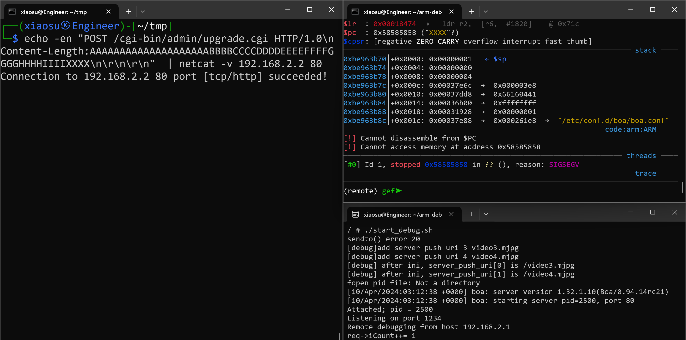

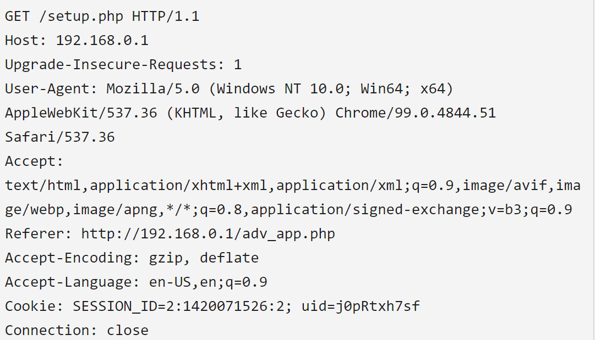

查看安全机制，考虑如何构造 payload。因为 NX 保护开启，所以考虑 ROP 的攻击方式。

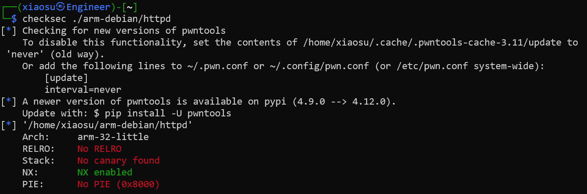

关闭 ASLR：echo 0 > /proc/sys/kernel/randomize\_va\_space

运行 httpd 后，获取 libc 基址。

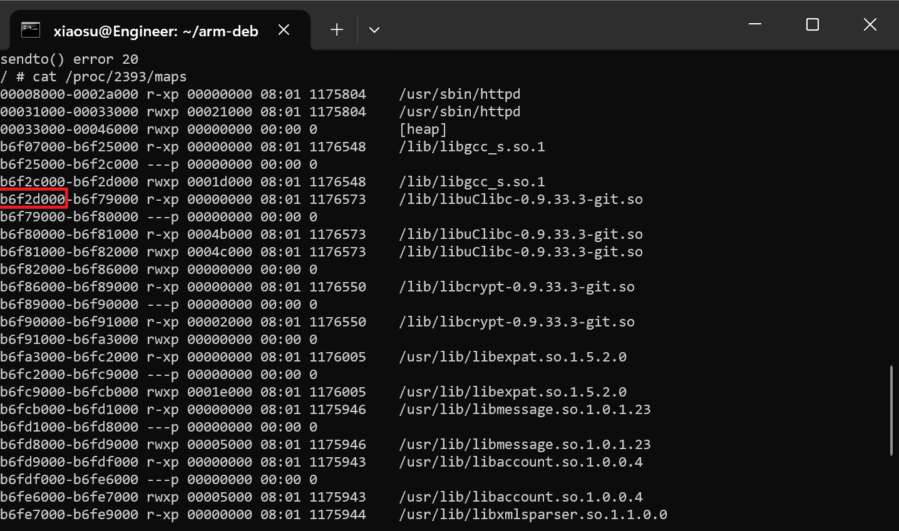

通过 ROPgadget 获取可用 gadget：

```sh
ROPgadget --binary ./libuClibc-0.9.33.3-git.so --only "mov|pop" | grep "pc" | grep -v "#"
```

要注意的一点是如果遇到 \x00，要想明白如何处理截断的问题

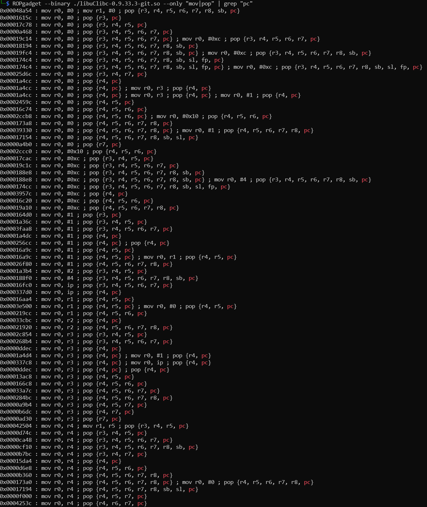

计算 padding 的长度：

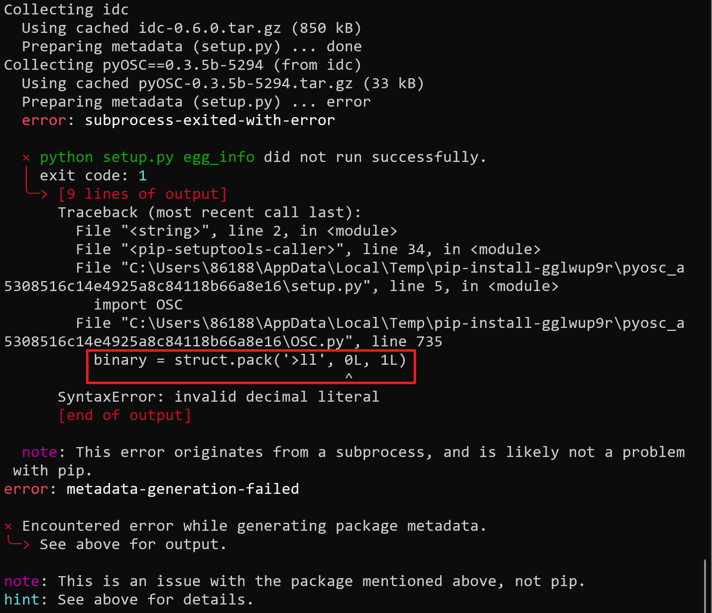

劫持具体 so 文件的依据：

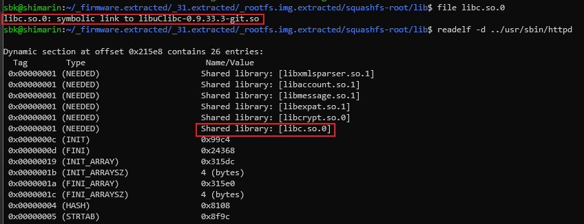

为了获得 libc 中 system 的地址，需要 pwntools，而 pwntools 需要 python2环境，为了在一台 host machine 上兼容各种 python 版本，用 conda 进行管理（注意 source \~/.bashrc 后生效，以及网络环境可能是 proxy / no proxy）。

在安装过程中，看到下载的包是 .whl 格式，学习到 .whl 格式是在 PEP 427 规定的 python 安装包的格式。

> The wheel filename is {distribution}-{version}(-{build tag})?-{python tag}-{abi tag}-{platform tag}.whl.

在 qemu 中启动 httpd（注意提前关闭 ASLR），运行 exp 成功获得反弹 shell

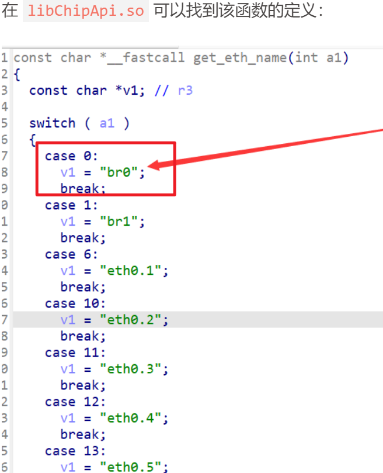

### 网络协议 Fuzz

网络协议可分为文本协议与二进制协议，文本协议的特点是数据包内容是可见字符，而二进制协议的特点是数据包内容大部分是不可见字符，通常属于私有协议。

测试框架：

* 文本协议：[Sulley](https://github.com/OpenRCE/sulley) → Boofuzz
  * Sulley 对新用户友好，特色&#x662F;_“Sulley not only has impressive data generation but has taken this a step further and includes many other important aspects a modern fuzzer should provide. ”_
* 二进制协议：[kitty](https://github.com/cisco-sas/kitty)

测试思路：发送请求 → 对目标设备监控和配置设备重启机制 → fuzz

boofuzz 学习：

* [quickstart](https://boofuzz.readthedocs.io/en/stable/user/quickstart.html) 提供了两个基本的例子：ftp + http，基本的想法是启动对应的服务，然后用相关 .py 脚本进行爆破（先规定好对应协议的字段），而后的结果存储在 ./boofuzz-results/\<run-\*.db>，可以用 boo open ./\<run-\*.db> 查看历史 log
* boofuzz 源码：[https://boofuzz.readthedocs.io/en/stable/\_modules/boofuzz.html](https://boofuzz.readthedocs.io/en/stable/_modules/boofuzz.html)
* 对于 boofuzz 更加深入的学习：[https://www.iotsec-zone.com/article/322](https://www.iotsec-zone.com/article/322)

.png>)

协议可以理解为是一组动作序列，此时要做的是构造每个字段

.png>)

Boofuzz 实例：复现的背景是CVE-2018-5767 是 TENDA-AC15 型号路由器上的一个漏洞，产生的原因是没有限制用户的输入，使用函数 sscanf 直接将输入拷贝到栈上，导致栈溢出，可以修改返回地址，进而远程执行代码。

参考资料：

* [BooFuzz的简单使用，以CVE-2018-5767为例](https://www.iotsec-zone.com/article/168)

在没有快捷键的情况下，通过如下方式查找常量字符串。看反汇编是在 “IDA View-A” window。“IDA View-A” 有图形视图和文本视图，在空白处右键可进行视图模式的切换。

.png>)

.png>)

用 qemu-arm-static 启动 httpd 发现卡死，通过字符串常量的交叉引用定位到函数

.png>)

为了 patch 分支，尝试安装 Keypatch 未果（需安装 idc module 遇到了 python 版本问题）；尝试安装另一款插件 Patching，但 IDA Pro版本不符合要求；尝试在机器码层面 patch 分支（未弄懂 arm 指令汇编未果）。

.png>)

切换到 ghidra 下进行尝试，ghidra 右键“Patch Instruction”可直接修改！

.png>)

再次启动仍然报错，回查 n 处，发现需要 br0 网卡，自行创建 br0 网卡：

```sh
sudo tunctl -t br0
sudo ifconfig br0 192.168.2.3/24
```

.png>)

执行 cp -rf ./webroot\_ro/\* ./webroot/，通过 qemu 模拟，最后借助 browser 访问的方式确认启动成功。

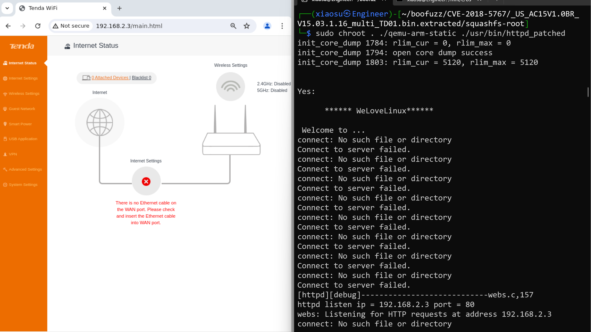

为了 fuzz passwd，应当通过以下两个 condition：

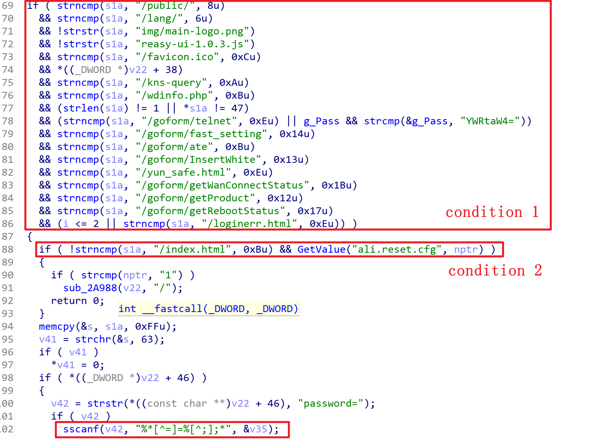

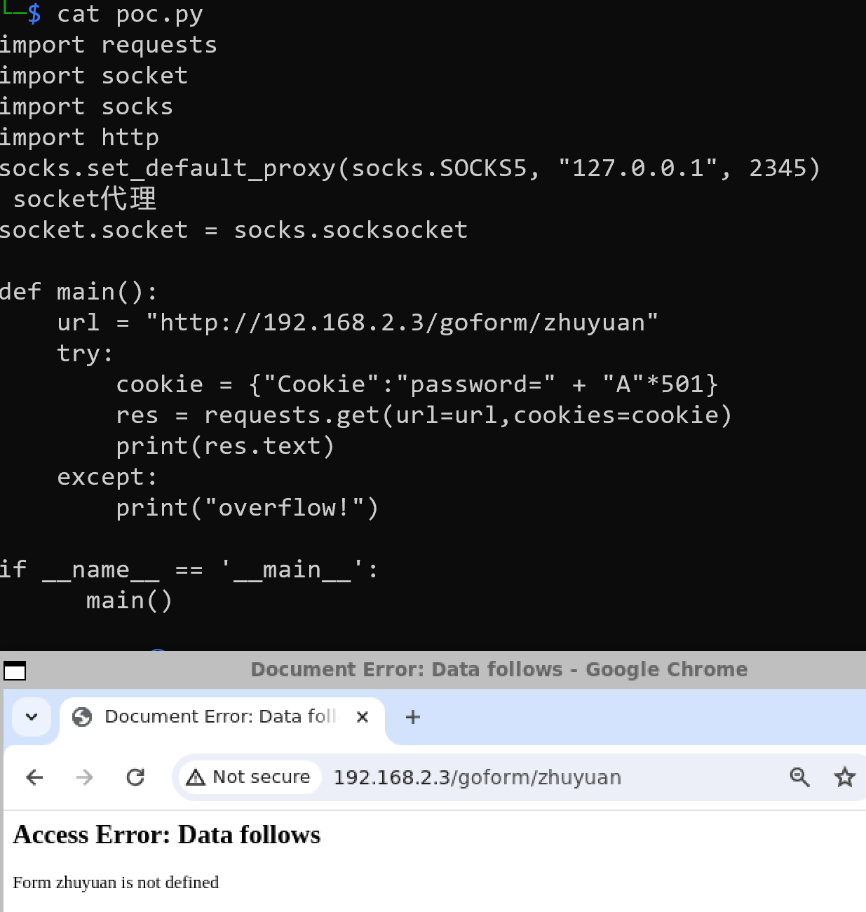

在 wsl2 通过 CLI 的方式开启 google-chrome 的代理：

<figure>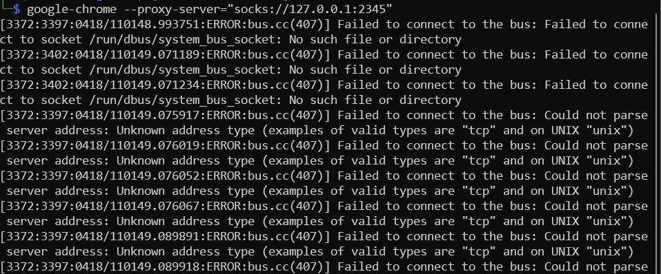<figcaption></figcaption></figure>

利用 poc 触发 exception：

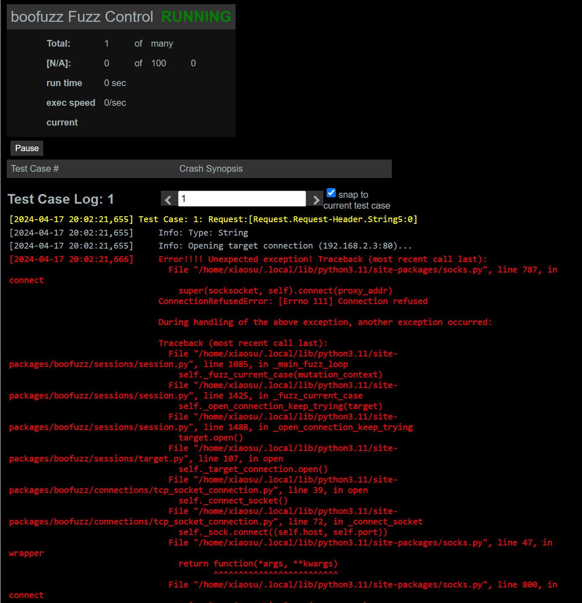

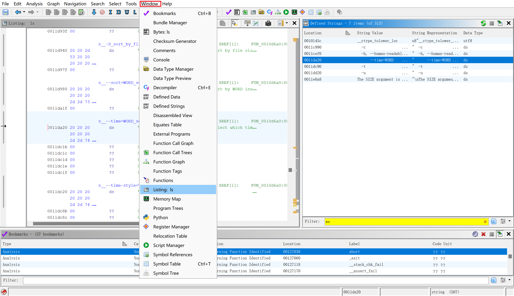

### CVE-2023-20073

参考资料：

* [https://bbs.kanxue.com/thread-278240.htm#msg\_header\_h1\_2](https://bbs.kanxue.com/thread-278240.htm#msg_header_h1_2)

Cisco RV340，RV340W，RV345 和 RV345P 四款型号的路由器中最新固件均存在一个未授权任意文件上传漏洞 （且目前尚未修复），攻击者可以在未授权的情况下将文件上传到 /tmp/upload 目录中，然后利用 upload.cgi 程序中存在的漏洞，最终造成存储型 XSS 攻击。

从思科官网下载固件包：[https://software.cisco.com/download/home/286287791/type/282465789/release/1.0.03.29](https://software.cisco.com/download/home/286287791/type/282465789/release/1.0.03.29)

直接尝试 binwalk -Me 发现无法正常解包，原因是执行失败 ubireader\_extract\_files 程序。尝试安装以下依赖：

```sh
sudo apt install liblzo2-dev
sudo pip3 install python-lzo
sudo pip3 install ubi_reader
```

安装过程中，apt-secure 阻止了相关安装过程，手动 vim /etc/apt/apt.conf.d 添加以下规则：

```sh
Acquire::AllowInsecureRepositories "true";
Acquire::AllowDowngradeToInsecureRepositories "true";
```

为了软链接指向的正确性，利用 [https://github.com/nlitsme/ubidump/blob/master/ubidump.py](https://github.com/nlitsme/ubidump/blob/master/ubidump.py) 脚本在路径 _\_RV34X-v1.0.03.29-2022-10-17-13-45-34-PM.img.extracted/\_40.extracted/\_fw.gz.extracted/\_0.extracted/\_openwrt-comcerto2000-hgw-rootfs-ubi\_nand.img.extracted/_ 下提取 0.ubi，获得文件系统 rootfs。

接下来构造网络通信环境，首先学习网桥的概念：[网桥技术介绍](https://www.h3c.com/cn/d_200805/605742_30003_0.htm)

kali 自带的 ip 命令还是不够方便，转而通过 apt install bridge-utils 安装 brctl 包，然而遇到了 tap0 网卡无法从 DOWN -> UP 的玄学问题，转战到 archlinux 进行仿真，顺便熟悉一下 archlinux😎然而 archlinux 的 binwalk 解压直接爆炸，转战熟悉的 ubuntu22.04 继续尝试😭

打包压缩 rootfs，传输至 qemu 里，而后执行以下命令：

```sh
chmod -R 777 rootfs
cd rootfs/
mount --bind /proc proc
mount --bind /dev dev
chroot . /bin/sh
```

在新根路径下执行以下命令：

```sh
/etc/init.d/boot boot
generate_default_cert
/etc/init.d/confd start
/etc/init.d/nginx start
```

用 browser 访问对应 ip 地址，即可访问到对应的 login html


### CVE-2023-46574

参考资料：

* [https://xz.aliyun.com/t/13688?time\_\_1311=mqmxnQ0Qeq0Dlxx2DUrUAodZiPD\&alichlgref=https%3A%2F%2Fxz.aliyun.com%2Fnode%2F18](https://xz.aliyun.com/t/13688?time__1311=mqmxnQ0Qeq0Dlxx2DUrUAodZiPD\&alichlgref=https%3A%2F%2Fxz.aliyun.com%2Fnode%2F18)

> An issue in **TOTOLINK A3700R v.9.1.2u.6165\_20211012** allows a remote attacker to execute arbitrary code via the **FileName parameter** of the UploadFirmwareFile function.

下载“参考资料”文末的附件，用 sudo binwalk --run-as=root -Me TOTOLINK\_A3700R\_V9.1.2u.6165\_20211012.web。通过 find . -name "cstecgi.cgi" 查找漏洞程序的路径，拖入 ghidra 分析。通过查找字符串 “Filename” 定位漏洞程序的位置，反编译查看代码，但是漏洞并不明显。

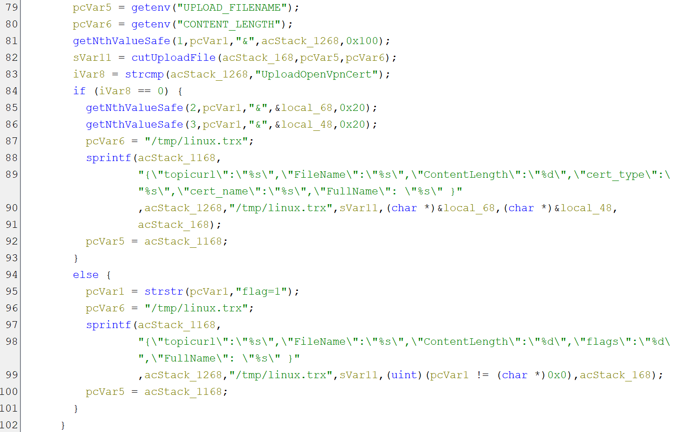

借用作者这张图可以看到，是因为 FileName 没有被过滤而直接放入到 doSystem() 导致了任意代码执行的漏洞。

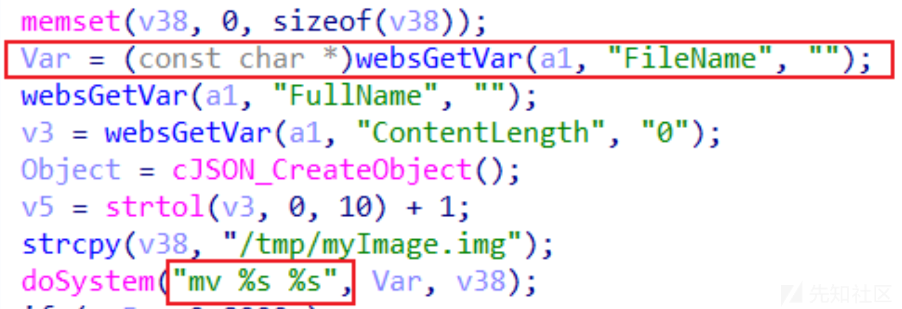

配置 mipsel 环境：

```sh
sudo apt-get install \
schroot debootstrap debian-archive-keyring qemu-user-static binfmt-support
sudo mkdir -p /iotconfig/debootstrap/mipsel # 注意要放置在根目录，而不能放置在自行指定的目录，否则在 schroot 环节会报错
debootstrap --arch=mipsel bookworm /iotconfig/debootstrap/mipsel https://mirrors.aliyun.com/debian
```

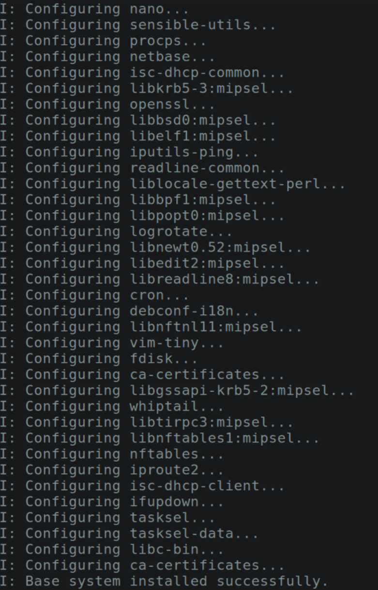

接下来配置 schroot：sudo vim /etc/schroot/chroot.d/mipsel.conf

```markup
[mipsel]
type=directory
directory=/iotconfig/debootstrap/mipsel/
users=root
groups=root
root-groups=root
```

而后 schroot 进入验证是否配置成功：sudo schroot -c chroot:mipsel -u root

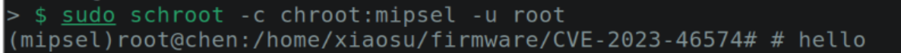

再将 TOTOLINK 的 squashfs-root 复制到 mispel 路径下：sudo cp -r squashfs-root /iotconfig/debootstrap/mipsel/root

进入 mispel 切换根路径，再创建一个启动所需的文件即可成功访问登陆界面

```sh
sudo schroot -c chroot:mipsel -u root
chroot ~/squashfs-root
# 创建 lighttpd 空文件
mkdir /var/run
touch /var/run/lighttpd.pid
lighttpd -f lighttp/lighttpd.conf
```

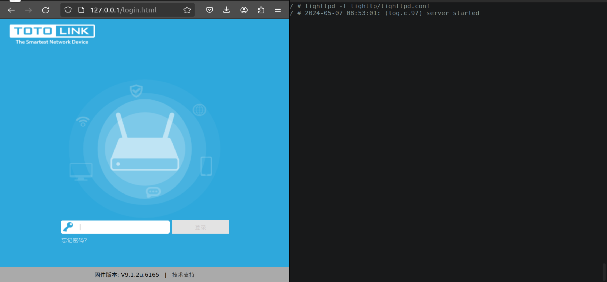

因为没设置密码，所以直接空密码登录，看到跳转的 protal 复制粘贴至地址栏后访问，开 F12 拿 session id 用 curl 访问对应 cgi 程序验证漏洞。

```shell
curl http://127.0.0.1/cgi-bin/cstecgi.cgi -b "SESSION_ID=<YOUR_SESSION_ID>" -X POST -d '{"topicurl":"UploadFirmwareFile","FileName":";ls -a;"}'
```


### Zyxel 设备：固件提取分析

参考资料：

* [https://paper.seebug.org/3137/](https://paper.seebug.org/3137/)
* [https://security.humanativaspa.it/zyxel-firmware-extraction-and-password-analysis/](https://security.humanativaspa.it/zyxel-firmware-extraction-and-password-analysis/)

固件获取：[https://support.zyxel.eu/hc/en-us/articles/360013941859-Security-Products-Firmware-Overview-and-History-Downloads-for-FLEX-ATP-USG-VPN-ZYWALL](https://support.zyxel.eu/hc/en-us/articles/360013941859-Security-Products-Firmware-Overview-and-History-Downloads-for-FLEX-ATP-USG-VPN-ZYWALL)

本次主要学习在固件被加密的情况下，获取固件。

尝试直接用 binwalk 解包，解出来一堆 .zip && .7z，解包失败。（binwalk 记得加 -r 参数，自动 delete carved file，节省空间，避免 archlinux 爆炸）

.png>)

参考文章的 bypass 思路是找 **\*.ri**，由于.ri文件通常用于恢复损坏的固件，它可能包含完整的系统映像，所以尝试分析 .ri 文件（攻击面的知识又增加了）。依据是来自官方 pdf 中对 .ri 文件功能的介绍 && Appendix3 Firmware Recovery（强调了别在更新期间做一些骚操作）。

.png>)

.png>)

承上，继续解包 \*.ri，而后继续解包 240 文件（若解包 \*.ri 后得到的仅有 240.7z，那么对该文件解压缩即可）。观察发现存在 zyinit 文件，用 file 命令查看其文件属性。

```
zyinit: ELF 32-bit MSB executable, MIPS, N32 MIPS64 rel2 version 1 (SYSV), statically linked, for GNU/Linux 2.6.9, stripped
```

根据查到的文件属性，下载 mips 架构的 kernel 镜像以及文件系统。

访问 [https://people.debian.org/\~aurel32/qemu/mips/](https://people.debian.org/~aurel32/qemu/mips/) 后，可以看到有四个不同的 kernel 镜像以及两个不同的文件系统，该如何确认应用哪个呢？

* 通过 Linux 源码版本，即上述文件属性中“GNU/Linux 2.6.9”，可以排除一半 kernel 镜像，至于是 4kc 还是 5kc 版本，只能通过测试 qemu 能否正常启动来判定。
* 文件系统 squeeze 和 wheezy 分别对应 Debian6.0、Debian7。具体应该使用哪个，也只能通过尝试来确定。

```sh
wget https://people.debian.org/~aurel32/qemu/mips/vmlinux-2.6.32-5-5kc-malta
wget https://people.debian.org/~aurel32/qemu/mips/debian_squeeze_mips_standard.qcow2
```

下载完 kernel 镜像以及文件系统后，就可以通过以下脚本（需要确保反斜杠位于行末，没有后续的空格或字符）启动 qemu：

```sh
qemu-system-mips64 -M malta \
-kernel vmlinux-2.6.32-5-5kc-malta \
-hda debian_squeeze_mips_standard.qcow2 \
-append "root=/dev/sda1 console=tty0" \
-net nic \
-net tap,ifname=tap0,script=no,downscript=no \
-nographic
```

再通过以下脚本配置宿主机与 qemu 之间的通信环境：

```sh
sudo ip tuntap add dev tap0 mode tap
sudo ip link set dev tap0 up
sudo sysctl -w net.ipv4.ip_forward=1
sudo iptables -F
sudo iptables -X
sudo iptables -t nat -F
sudo iptables -t nat -X
sudo iptables -t mangle -F
sudo iptables -t mangle -X
sudo iptables -P INPUT ACCEPT
sudo iptables -P FORWARD ACCEPT
sudo iptables -P OUTPUT ACCEPT
sudo iptables -t nat -A POSTROUTING -o ens33 -j MASQUERADE
sudo iptables -I FORWARD 1 -i tap0 -j ACCEPT
sudo iptables -I FORWARD 1 -o tap0 -m state --state RELATED,ESTABLISHED -j ACCEPT
sudo ifconfig tap0 192.168.100.254 netmask 255.255.255.0
```

进入 qemu 后，配置 qemu 内部的网络环境。网络环境的配置逻辑是，宿主机和 qemu 各自有一个网卡，但是 qemu 需要依赖宿主机的网络环境，所以一个网络桥梁，即 qemu 启动脚本中指定的 tap0 设备（可以将其理解为网桥）。如果有问题，可以先按下 ctrl+a，再按 x 退出。

```sh
ifconfig eth0 192.168.100.2 netmask 255.255.255.0
route add default gw 192.168.100.254
```

由于archlinux 的高度自定义，因此可能会缺少很多 package，在 scp 文件系统给 qemu 时，报了如下错误：

```
/usr/bin/dbclient: No such file or directory
```

解决方案是为 dbclient 创建一个软连接，链接到 dropbear ：[https://gumstix-users.narkive.com/HEPLFCWt/is-anyone-else-having-this-problem-using-scp-and-ssh-on-the-gumstix](https://gumstix-users.narkive.com/HEPLFCWt/is-anyone-else-having-this-problem-using-scp-and-ssh-on-the-gumstix)

但又报 “lost connection”的问题，scp 的底层依旧是 invoke ssh，所以可以尝试 ssh 测试连接。在 archlinnux 上安装 openssh 解决了 lost connection 的问题。但是又碰上了以下报错：

```
Unable to negotiate with 192.168.100.2 port 22: no matching host key type found. Their offer: ssh-rsa,ssh-dss
scp: Connection closed
```

看样子是算法协商不一致，在 scp 过程中添加以下参数“-o HostKeyAlgorithms=+ssh-dss”，解决问题，终于将相关文件传入到 qemu 中。

进入到上述 240 解包后的目录，并给以下命令用到的程序添加可执行权限，在 /rw 路径下得到 compress.img，将得到的 img 传回到宿主机利用 binwalk 解包就可以得到 squashfs。（中间解包在 archlinux 中还需要安装一些 package，根据报错安装即可）

```sh
./zld_fsextract 530ABFV0C0.bin ./unzip -s extract -e code
```

最后在 archlinux 中用 binwalk 解包得到 squashfs！

.png>)

在第二篇参考文章中，作者对 Zyxel ZyWALL Unified Security Gateway (USG) appliances 的固件逆向解包做了详细的说明。基本步骤同上，就不再浪费时间。有意思的一个思路是，可以用 strace + qemu-xxx-static 去观察 syscall 的情况，来验证解包思路的正确性。

总结一下思路：直接解 .bin 发现遇到了强加密，无法直接解包。发现同路径下有关于文件功能说明的 .pdf，查阅 .pdf 之后发现 .ri 可以用来紧急启动，说明其内包含相关启动程序，遂用 binwalk 对其层层解包，浏览解包结果发现两个有意思的文件：zyinit 以及 zld\_fsextract。用 ghidra 一通分析 zld\_fsextract 可以得知其能绕过 unzip 过程中的密码，于是用 qemu 搭建系统仿真环境进行尝试。

.png>)

### OpenWrt

参考资料：

* [OWASP固件安全性测试指南](https://m2ayill.gitbook.io/firmware-security-testing-methodology/v/zhong-wen-fstm)
  * 自动固件分析工具：firmwalker
* [固件靶标安全评估（一）](https://m.freebuf.com/articles/endpoint/338885.html)
* [OpenWrt 设备下载](https://firmware-selector.openwrt.org/)、[OpenWrt 设备下载（二）](https://downloads.openwrt.org/)

下载固件：openwrt-23.05.3-mvebu-cortexa9-linksys\_wrt1900acs-squashfs-factory.img

参考前面解决 binwalk 中 ubi\_reader 缺失的问题后，并没有解压出目标 fs，于是放弃更换另一个目标。

.png>)

换了一个目标也是如此。

.png>)

思考是不是因为 factory 不包含相应的文件，于是下载 sysupgrade 尝试解包，成功解出 fs，但是碰上链接被重定向至 /dev/null 的问题。参考 [link](https://bbs.kanxue.com/thread-278240.htm#msg_header_h1_2) 解决（git clone 后修改 extractor.py），如果 python 版本过高如 3.12，会报找不到 imp 包的错误，将包全部修改为 importlib.util 解决（ps，conda 没办法直接配置 3.3 版本的 python）。

上 openwrt.org 检索镜像区别的结果如下：

> **工厂镜像**旨在取代供应商的原厂固件。它与供应商提供的文件格式相匹配。您通常使用供应商的网页界面来安装工厂映像。
>
> **sysupgrade镜像文件** (以前称为trx镜像) 旨在替换OpenWrt镜像.使用sysupgrade镜像用来升级LEDE或OpenWrt系统到更新的OpenWrt.

简单来说：

.png>)

.png>)

现在明白为什么需要切换根目录时需要配合 qemu-arm-static，因为如果不这么做，执行 bash 实际上是重定向执行 squashroot 下 /bin/busybox，然而 busybox 是 arm 架构与本机架构不匹配，所以切换根目录时会触发“Exec format error”错误。

.png>)

进入 qemu 之后 ，无法执行任何可执行文件，利用 file ./bin/busybox 命令后，在对应路径缺少 ld-musl-arm.so.1 解释器：

```
./bin/busybox: ELF 32-bit LSB executable, ARM, EABI5 version 1 (SYSV), dynamically linked, interpreter /lib/ld-musl-arm.so.1, no section header
```

搜索后整理解决办法如下：

```sh
# 下载 musl 库包并解压缩
wget http://www.musl-libc.org/releases/musl-1.2.2.tar.gz
tar -xzf musl-1.2.2.tar.gz
cd musl-1.2.2
# 为了在本机 x86_64 的情况下编译出arm 架构的 .so，需要构建交叉编译工具链
sudo pacman -Syu arm-none-eabi-gcc arm-none-eabi-newlib
export CC=arm-none-eabi-gcc
export CXX=arm-none-eabi-g++
export AR=arm-none-eabi-ar
export AS=arm-none-eabi-as
export RANLIB=arm-none-eabi-ranlib
# 编译 musl
./configure --prefix=/tmp/musl-install
make
make install
# 将编译好的 musl 解释器复制到目标文件系统
sudo cp /tmp/musl-install/lib/ld-xxx squashfs-root/lib/
# 而后可以进行相应的用户级仿真 / 系统级仿真
```

理论上是这么干，但是实际上弄不出来，先 give up，暂且留作 future work😭

