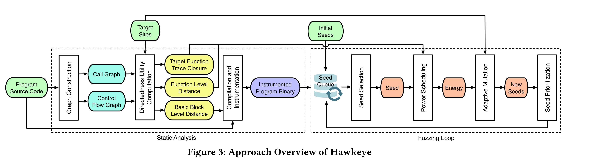
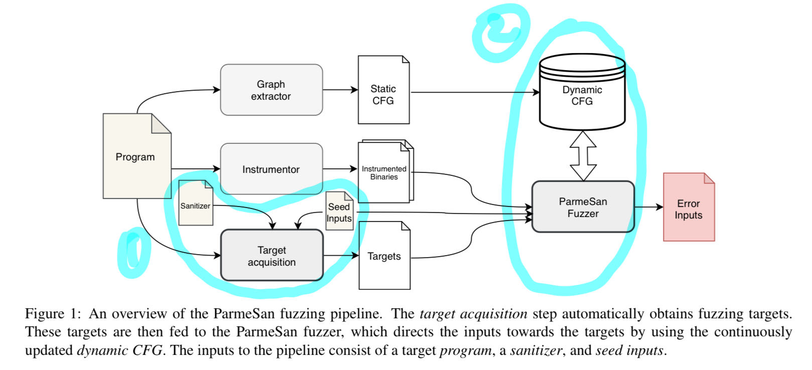
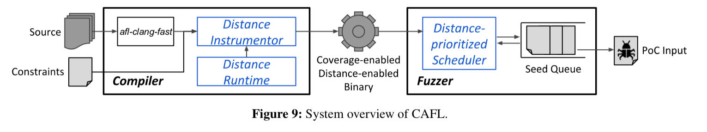
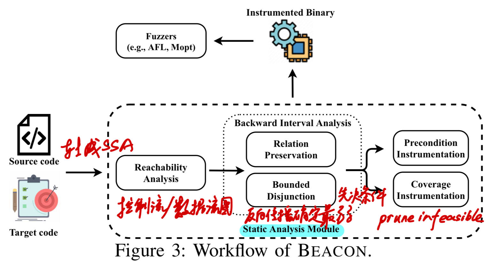
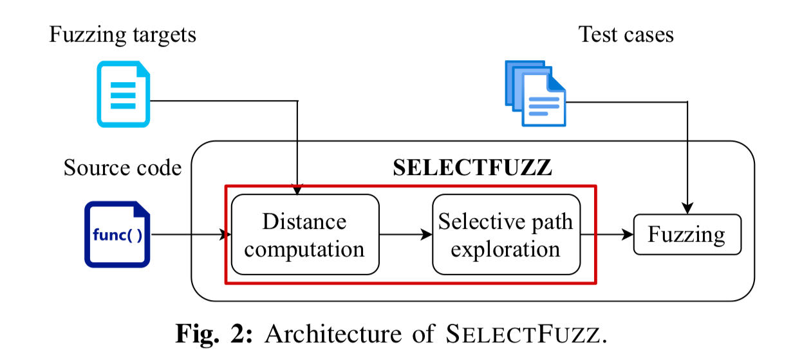

# 关于定向 fuzz 的总结

### 前言

笔者在之前的学习中接触过 beacon，利用其跑了一些实验，但是并不明白其原理。如今通过阅读了同类的 5 篇论文，对定向 fuzz 有了一些初步的认知，特此做一些总结。

### Hawkeye: Towards a Desired Directed Grey-box Fuzzer (2018)

**workflow**

<figure><figcaption></figcaption></figure>

**思路**

面对 seed starve & miss target 的情况，决定对种子输入队列进行调整，在种子挑选中添加了平衡系数。此篇论文主要是在**工程**方面进行了优化，在前期的静态分析中采用了更为合理的度量方式，在中期的种子挑选中添加了平衡系数，在后期的种子变异中采用了动态调整的策略。

**特点**

> Equipped with a better evaluation of the distance between input execution traces and the user specified target sites, Hawkeye can precisely and adaptively adjust its seed prioritization, power scheduling as well as mutation strategies to reach the target sites rapidly.

***

### ParmeSan:Sanitizer-guided Greybox Fuzzing (2020)

**workflow**

<figure><figcaption></figcaption></figure>

**思路**

现代编译器的潜能不止于检测 fuzzing 引起的条件错误，它还可以用于指导 fuzzing 的进程（包括挑选种子），从而使 fuzzing 找 bug 的效率能比肩找内存错误的效率，同时取得比现存 fuzzer 方案更少 TTE 的效果。\
其流程大致为：依赖 DFA(Data Flow Analysis) 去构建一个动态的 CFG(Control Flow Graph)，而后获得 distance metric 去指导 tareget acquistion 这一过程，最终使得 ParmeSan 能帮助 fuzzing 更快地逼近目标。

**特点**

> ParmeSan is able to target specific kinds of bugs based on the sanitizer used for target acquistion and can thus be used to fuzz applications more effectively.

***

### Constraint-guided Directed Greybox Fuzzing (2021)

**workflow**

<figure><figcaption></figcaption></figure>

**思路**

对于现有 DGF 的 metric 提出了质疑，认为其在有特定顺序要求的多 target 场景表现效果不佳。因此提出了一种新的 metric，该 metric 主要由 ordered target site & data conditions 组成。ordered target site 主要是衡量当前 basic block 距离目标 basic block 还有多远，data conditions 主要用于衡量自定义的约束条件的满足情况。总体上来说，距离目标 basic block 越近、满足越多约束条件、满足之前从未被满足过的条件的这三类种子都会受到偏爱。

**特点**

> We attempts to satisfy the constraints in the specified order.

***

### Beacon: Directed Grey-Box Fuzzing with Provable Path Pruning (2022)

**workflow**

<figure><figcaption></figcaption></figure>

**思路**

现有的定向 fuzz 浪费了太多时间在不可达路径上，导致 fuzzing 效率低下（文中以 AFLGo 为例对此观点进行证明）。为了解决这个问题，Beacon 在 static analysis 阶段引入了两种方法：1.**relationship preservation**——在区间抽象中显式跟踪变量间关系；2.**bounded disjunction**——为了在反向传播中有选择地加入路径。通过这两种办法，可以提取、整合一系列规则，筛选出不符合规则的路径，从而直接剔除，避免做无用功，最终达到提高效率的目的。\
在**实操**的过程中，Beacon 要求先进行一步 precondInfer，其目的是为了计算最弱先决条件。然而在这一步会经常报 malformed 错误。结合论文猜测，malformed 应该是指 Beacon 将 program 转化成 SSA form 的时候出现了错误，从而无法进行可达性分析与静态分析。报 malformed 错误的时候，应该没执行到“定向”这一步。同时在 precondInfer 这一步，其后跟随着的 `-join-bound` 是指 Beacon 的 static analysis 阶段中 "Bounded Disjunction" 策略的 threshold 参数，一般默认设置为 5，该参数一般不会导致 malformed 错误。一旦出现了 malformed 的玄学错误，基本上针对该 program 的实验就无法继续进行而被迫中止了。

**特点**

> BEACON **prunes** the infeasible paths through instrumentation.

***

### SELECTFUZZ: Efficient Directed Fuzzing with Selective Path Exploration (2023)

**workflow**

<figure><figcaption></figcaption></figure>

**思路**

事实证明，永远选择最短路径并非最优解，根据概率去选择是一种更好的方式。SELECTFUZZ 的模式是具有代表性的。通过控制流图与数据流图，给 path 赋概率，找出 **Relevant**，在其附近插桩、设置 assertation、对不可达路径与可达路径区别对待，实现定向 fuzz 又快又准的理想。在其实现的过程中，SELECTFUZZ 重视插桩，强调**精准插桩**。

**特点**

> The result suggested that prioritizing inputs based on reaching probability is more efficient than always favoring the shortest code paths.

***

#### 总结

定向 fuzz 的 target 一般是待测 program 的某些特定代码，因此定向 fuzz 的目标是明确的。定向 fuzz 要做到的就是：**快且准**地验证 Poc / 复现漏洞。实现这一目标最复杂的地方在于：如何制定合理的规则去**定向**，从而引导 fuzzing 挑选、生成相关的 seed，使其尽快地去触发漏洞。

现今 fuzzer 的基本流程：

1. control / data flow;
2. reachability analysis;
3. forward / backward → make metric to choose seed;
4. assertation / prune to get closer to target.

新 fuzzer idea 的来源：

1. combination;
2. seed selection;
3. scenario solution;
4. project optimization.
