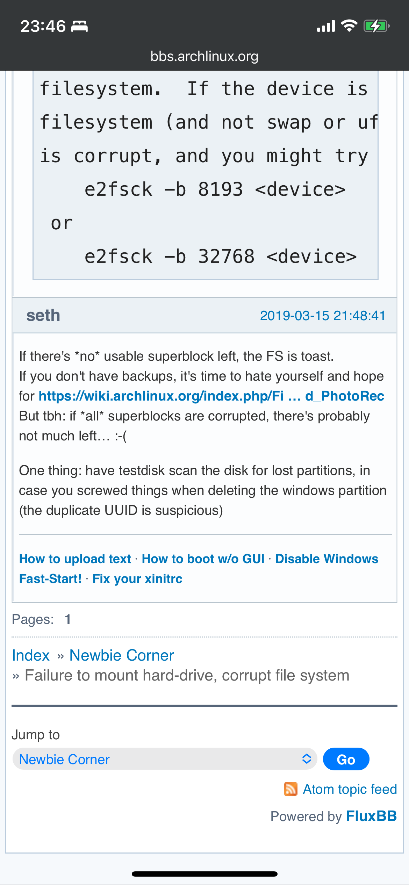
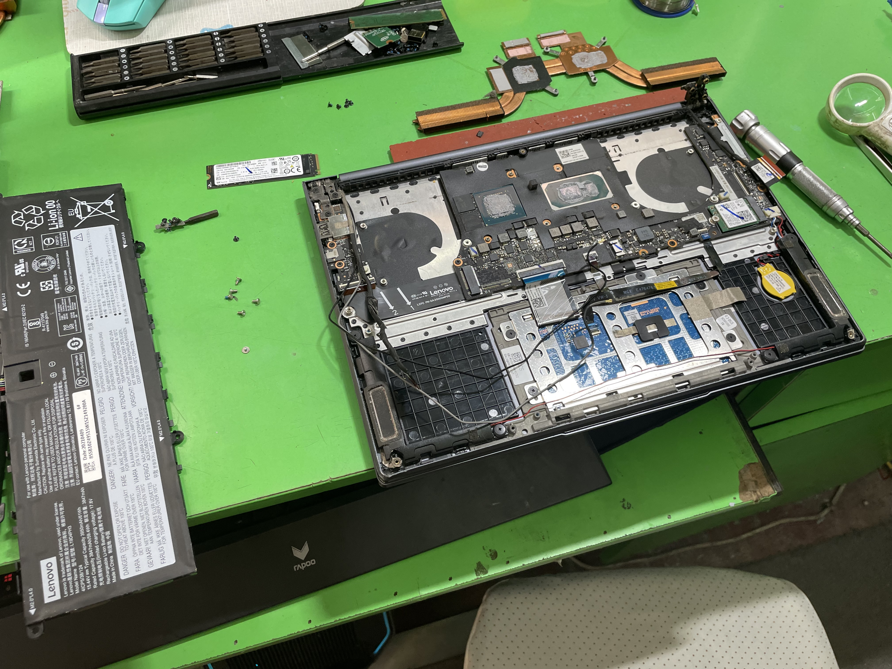

# os折腾——Arch & Win11 双系统

## 为什么想装双系统？

答：~~闲得蛋疼。~~

自从升级了 win11 之后，UI 操作备感舒适（e.g. 加入了窗口缩放动画，操作更加自然），加之各种快捷键的配合，基本上可以实现手不离键盘实现各种操作，但 windows 比起 Linux 还是缺少了一点儿 self-defined 文化，掌控计算机的体验感无法到达极致。再加上 Linux 是必备的环境，可在 win 上借助 VMware 和 VirtualBox 使用 Linux 总是会出现一点儿奇奇怪怪的小问题，比如时不时粘贴板坏了、wsl2 要求开启 Hype-V，可 Hype-V 会 block VirtualBox ，导致 VirtualBox 与 wsl2 不能同时使用……没有理由不试试在物理机上直接安装一个 Linux。

那为什么不彻底抛弃 win，只留下 Linux 呢？

一来是因为这是笔者第一次在物理机上安装 Linux，怕一个不慎万劫不复，那就真栓Q了；二来是有些 app 只能在 win 上使用（e.g. IDA）。出于上述两点考虑，最终选择保留 win 走双系统之路。

那么接下来就应该进入挑选 Linux 发行版的环节了，先来看看现在流行的发行版：

<figure><figcaption>
<a href="https://zh.wikipedia.org/wiki/Linux%E5%8F%91%E8%A1%8C%E7%89%88">https://zh.wikipedia.org/wiki/Linux%E5%8F%91%E8%A1%8C%E7%89%88</a>
</figcaption></figure>

笔者个人不想选 Ubuntu 感觉不够新颖，不敢选 Red Hat 系列因为没试过，于是选择了曾经试过且体感不错的 Arch Linux。笔者认为 Arch Linux 的特点是：

1. 有活跃的社区。完善的 archwiki 是 Arch Linux 的维基百科，遇到问题先上那去瞅一瞅准没错
2. rolling + pacman。滚动更新避免面临点版本大换血的困扰
3. self-defined。一切你说了算，「The Arch Way」 的体现！判断自己是否适合可以去阅读➡️[常见问题](https://wiki.archlinuxcn.org/zh-sg/%E5%B8%B8%E8%A7%81%E9%97%AE%E9%A2%98)

更加令人满意的是 Arch Linux 的兼容性，笔者常用的 app Arch Linux 上都有对应的软件包：

* [ ] vscode
* [ ] typora
* [ ] google-chrome
* [ ] qq、vx
* [ ] office
* [ ] 腾讯文档

说了这么多好处，还不快快来 Arch Linux 一起~~挨打~~玩吗😉

## 前期一个「很蠢」的操作

上文提及这是笔者第一次在物理机上装 Linux，整体态度偏谨慎，产生了一些很清奇的脑回路：

> 考虑先借一台吃灰电脑试试？→ 借不到，g 了
>
>
>
> 考虑买一台旧电脑试水，看看能否把所有必备玩意儿从 win 迁移到 Linux 环境，如果能的话，就彻底开始改造主机：
>
> * 预算：1k → 钱不够折腾不了（正常二手得 3k） → 京东 7天 无理由退换，确认保真后极速下单（此行为还是不太好，纯白嫖，等我有钱了一定不这样）
> * 要求：
>   * 内存 16G，存储 64G
>   * Intel的至少是8代酷睿，ert最好是11代或以上；AMD的至少是Ryzen 3000系列，最好是Ryzen 5000系列或以上
> * 试水需要解决的问题：
>   * 如何更换主机 os
>   * 必备软件的兼容性如何？

**事实证明，没有必要额外拿一台电脑试水**。当然，如果你真得像笔者一样头铁，抱着捡破烂的想法尝试去买一台价格不合理的电脑试水，你可能就会碰到⬇️

**「千元神机」评测——假网卡 or 假驱动？**

<figure><figcaption></figcaption></figure>

买回来之后，兴致勃勃开始装 os，然后就过了一晚上。。。装了一晚上发现根本连网卡都没有，网都连不上，这还玩啥🥲排除了网卡检测不到、驱动未加载、rfkill 屏蔽等原因，并更换 wifi、数据流量数次，还是无法联网，一度陷入自我怀疑。遂决定在本机上复现一波操作，发现这种诡异情况根本不存在，当时心情一言难尽😑

其实如果只是为了试水，完全可以通过压缩磁盘的方式，格一个空白分区来玩，这样既不用担心💰开销问题，也不会碰上两台电脑环境不一致从而引申出来的奇奇怪怪的问题。友情提醒：在压缩磁盘的时候可以胆子大一点，这样就不会像笔者一样，由于第一次只弄了 30GB 的空间，一切都安装好了之后，只剩个位数磁盘空间，日常使用无以为继，无奈只能狠心重新清理磁盘空间，导致了第二次没多大必要的重装。

## 安装踩坑

参考资料：

* [在 VMware Workstation 上安装 Arch Linux（UEFI + GPT）](https://ericclose.github.io/Installing-Arch-as-a-guest-with-UEFI-and-GPT.html#%E5%AE%89%E8%A3%85-Arch-Linux-%E7%9A%84%E5%85%A8%E8%BF%87%E7%A8%8B)
* [在旧的笔记本上安装 Arch Linux](https://lifeni.life/article/install-arch-linux/)

安装详细过程可参考上述两篇教程，以下仅记录一些踩坑经历：

1. **注意备份重要文件，谨防数据丢失**。
2. 刷写 `.iso` 工具：之前采用的是 USBWriter，其足够简单，但麻烦在于万一你需要换一个 `.iso` 需要重新刷写，或者 U盘 不再承担系统引导盘作用之后，希望恢复文件存储的功能，需要重新格式化 U盘。那么有没有什么工具可以使 U盘 兼具文件存储和多个 `.iso` 系统引导功能呢？有的，它就是 [Ventoy](https://www.ventoy.net/en/index.html)。
3. 联网：看 `.iso` 提供的是什么网络服务。如果是 iwd 服务那么可键入 `iwctl` 进行联网，如果是 NetworkManager 服务那么可键入`nmcli` 进行联网。此外若还是无法联网，注意是否能检测到网卡硬件，相关的驱动是否加载，网卡是否被`rfkill` 屏蔽。
4.  启动引导（针对双系统引导需求）：

    * 关闭 windows 安全启动
    * grub：先保证确定能正常进入 Arch Linux 后，再利用 os-prober 等工具探测，再重新配置 `grub-mkconfig` 从而实现 Arch & Win11 正常引导
    * system-boot：为了能正常引导 win11 启动，目前笔者探索的一个可行方案是 cp 一个 `shell64.efi` 在 `/boot` 路径下，同时配置 `windows.nsh` 和 `windows.conf` 文件（之前看到一个教程在 `windows.conf` options 中添加了 `-noconsolein && -noconsoleout` 这俩个参数，这会导致在 win C盘 有 Bitlocker 加密的情况下，无法输入 Bitlocker 密钥验证）。`shell64.efi` 附在了本文最后。

    <figure><figcaption>
windows.nsh &#x26;&#x26; windows.conf
</figcaption></figure>

    <figure><figcaption></figcaption></figure>
5. 编译安装 yay  `makepkg -si` 时过于缓慢：
   * `export GO111MODULE=on && export GOPROXY=https://goproxy.cn`
6. 输入法：
   * `fcitx-config-gtk3` 可视化配置
   * 编辑 `/etc/enviroment` 指定输入法框架为 fcitx 实现全局输入，配置之后就可以在 terminal、menu、vx 等地方实现中文输入了（在安装中文输入法的前提下）
7. 菜单快捷搜索后访问 app：`~/.local/usr/applications` 新建 `.desktop` 文件，而后 update。
8. 自启动可以借助 systemd service 或者将相关 app 的 `.desktop`复制到`/etc/xdg/autostart`。

## 重装血泪史

### 导火索

一日中午，外接 HDMI 后放大了分辨率，下午拔出 HDMI 带电脑至院楼学习，发觉分辨率没有自适应导致图标、文字等过小，遂想调整分辨率。此时怪事发生，无论是手动进入「设置」调整分辨率亦或在 terminal 中使用 xrandr 工具进行调整均失效，重启两三回未果，遂问 gpt-4o 何至于此。奈何当日头昏脑胀，轻信 gpt-4o，执行了下列操作：添加分辨率配置文件、**更新 firmware & linux**，**然后直接重启 desktop manager**。

重启之后黑屏，仅剩左上角光标频闪。当时估摸着是分辨率配置文件有问题，在 Win11 上尝试用 0.69版本的 ext2fsd 删除配置文件，但是失败了。想着既然不行，那就回寝室后接上 HDMI，恢复显示之后把配置文件删了就完事了。即便无法恢复显示，大不了用系统引导盘，在 CLI 总可以删除配置文件，小 case。然而回到寝室之后重启，直接进入到了 emergency shell，那时意识到可能事情没我想象的那么简单。

### 抢救我的电脑

先来看看为什么会进入到 emergency shell：

<figure><figcaption>
看到 FAILED 是在 mount /boot 时发生的 
</figcaption></figure>

后续查看日志了解到，进入到 emergency shell 的原因是**「Superblock checksum does not match superblock while trying to open /dev/nvme0n1p7」**。这是个什么鬼？了解了一下 mount 的过程：从 userspace 发起 mount 请求 → kernel mount() 接口 → 创建 fs 上下文，添加 suplerblock，校验 fs 上下文，将上下文信息传递到 VFS，并保存挂载信息到 `/etc/mtab` 与 `/proc/mounts`（`/etc/mtab` 是 `/proc/self/mounts` 软链接，而 `/proc/self/mounts` 与 `/proc/mounts` 文件内容是相同的）。

看来 checksum 不匹配是在校验 fs 上下文阶段发生的错误，上 archwiki 检索一下，有两种修复说法：

1. 用 e2fsck -b 修复。
2. checksum 不匹配是因为在 win 上使用了 0.68 版本 ext2fsd，解决方案俩字，重装。

对于第一种说法，笔者已遍历所有 back up superblock，发现此方法不适用。同时在 win 上查看了一下 S.M.A.R.T 信息，没发现磁盘有啥问题。

<figure><figcaption></figcaption></figure>

<figure><figcaption>
再次提醒备份的重要性！
</figcaption></figure>

对于第二种说法，笔者使用的是据说已修复 bug 的 ext2fsd 0.69 版本，所以没多大参考价值。加上笔者使用的 filesystem format 是 ext4，并不是支持快照回滚的 btrfs，同时没有备份系统镜像文件，可谓回天乏术，思来想去，除了重装别无他路。哎，人生啊～

在重装之前，非常让笔者纠结的一件事情是：怎么抢救 Arch 上最新的笔记？如果笔记无法抢救，那么重写笔记又是一笔巨大的时间开销。抓耳挠腮之际，想起一位大佬，打开 vx 深夜咨询，在大佬的提醒下，重启在 win 上吃灰已久的 DiskGenius！DiskGenius 没有辜负信赖！只需选中对应磁盘分区（分区是否损坏并没有影响），右键选择**「已删除或格式化后的文件恢复」**，静等两分钟，惊喜的一幕就诞生了！！

<figure><figcaption>
DiskGenius 为什么是神！
</figcaption></figure>

看到众多笔记、文件浮现在眼前，老泪众横，紧急备份后上床安稳睡觉，这一夜睡得香甜🎑

次日早晨复盘本次事故的 root cause，想来并不是分辨率配置文件导致的，**而是在更新了 firmware 和 linux 之后，没有第一时间重启，而是仅重启了 desktop manager**。为什么更新 firmware 和 linux 后最保险的做法是立即重启呢？笔者并没有找到非常可信的说法，只在 archwiki 上看到有人闲聊：[新手问一个问题，arch 可以 每日滚动更新，但每周只重启一次吗？](https://bbs-archlinuxcn-org.translate.goog/viewtopic.php?id=12989&\_x\_tr\_sl=zh-CN&\_x\_tr\_tl=en&\_x\_tr\_hl=en&\_x\_tr\_pto=sc)

以及在[系统维护](https://wiki.archlinuxcn.org/zh/%E7%B3%BB%E7%BB%9F%E7%BB%B4%E6%8A%A4)中提到的：

> 内核很难在重启前更新。**升级内核后重启系统永远是最安全的选择**，如果不方便重启可以通过内核热补丁在不重启系统的情况下应用更新。

本次事故让笔者下定决心一定要建立一个健全的备份体系，目前采用了如下做法：

* 在 Win11 上利用 DiskGenius 备份 Arch 系统镜像到本地
* 在 Arch 上通过 timeshift 创建系统镜像
* Arch 本地构建基础设施（git、Makefile）适时备份到服务器，或者通过挂载的方式同步相关文件到 Win11 上
* 使用 `rsync` 每日定点将重要数据备份到服务器

说来也巧，在笔者🔧电脑软件方面（os）问题时，电脑硬件也来凑热闹搞罢工，先是触摸板形变导致右键失效，再是键盘左上角开裂愈发严重。硬件方面笔者真无能为力，故找学校神仙技师维修。技师先利用钳子把触摸板形变位置矫正，后帮笔者把最新购买的 C壳 换上，最后清灰➕添硅胶。经历了这折腾的一周后，电脑直接实现了软硬件蜕变！

<figure><figcaption>
掀起你的后盖来好好看看你.jpg
</figcaption></figure>

## 装 Arch 不过瘾？试试看 NixOS

> 什么，你不会写 Rust？什么，你不用 Nix？什么，你这个没听说过？……

学院集中实训期间，幸得与 HNU Nix & Rust 教主为伴。教主凭借硬核实力，摧枯拉朽般瓦解笔者所有的信念和自信，结果自然是被教主狠狠洗脑。一点儿脾气没有，技术领域，菜是原罪。

考虑到 512GB 分配给三个 os 实在是过于憋屈，于是购买 PSSD 装 NixOS。得益于 Nix 严谨的计算，NixOS 的安装确实简单，只要能搞定配置文件就搞定了一切。当然「搞定」说得简单，事实上嘛，你试试就知道了🤭


笔者的 Nix 配置文件


[上文第四点](os-zhe-teng-arch-win11-shuang-xi-tong.md#an-zhuang-cai-keng)提到的 shellx64.efi 文件：&#x20;



全剧终
