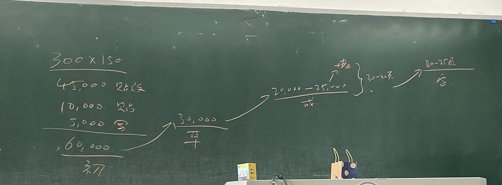

# 《信息安全论文写作》方法论

## 前言

基于对[肖老师](https://xiaolab.net/)的个人崇拜，笔者本学期全程旁听了他开设的课程——《信息安全论文写作》，受益匪浅。故将课程所学的方法论加以整合，供日后参考。

## 学士、硕士与博士

学士、硕士与博士是高等教育的三个不同阶段，但该体系并非一成不变的。在最初，高等教育体系中只有学士与博士两个阶段，然而人们发现对于博士的要求过于苛刻，以至于许多人都无法毕业（至今仍是如此），于是引入了硕士（苏联还引入了“[副博士](https://zh.wikipedia.org/wiki/%E5%89%AF%E5%8D%9A%E5%A3%AB%E5%AD%A6%E4%BD%8D)”）阶段。至此才演化到如今中西方普遍采用的“学士—硕士—博士”这样的高等教育体系。

<figure><figcaption>
学位体系
</figcaption></figure>

高等教育体系对不同阶段的学习者提出了不同的能力要求，可简单概括如下：

* 学士：面对问题，能查阅现成方案并解决；
* 硕士：成为某个方面的专家，面对问题，能多方法对比并进行应用与评估；
* 博士：面对**新问题**，做人类从未做过的事情。

在西方，大学授予的博士学位是 Philosophy Doctor（philosophy 在古希腊中的意思是“[爱智慧](https://zhuanlan.zhihu.com/p/376918933)”）。若能获得 Ph.D 学位，则能被称为“Doctor”，这是一种无上的荣耀。这说明你在接受高等教育的过程中，在某领域认知达到了人类前沿水平，并通过思考，为人类在该领域的发展做出了贡献。论文是证明你为人类做出了贡献的一种方式。

论文（paper，起源于 thesis、dissertation）是科学研究成果的载体，往大了说，它用于记录人类的科技进步；往小了说，它关乎到每个学生是否能够毕业，从而取得相应的学位证书。然而，必须指出的是：**发论文是手段，而不是目的，目的是科学研究。**

## 科学研究的基本素养

笔者认为，科学研究是带着**批判精神，**去探究自然界的客观规律。科学研究的出发点是你发现了一个**明确而有趣**的问题（要求是**悬而未决**的），明确是指问题能被客观衡量（形如“我好像爱上了 Ta”的问题不在此范畴），有趣是指探索此类问题能满足你的好奇心，使得探索问题不是沉重的负担，而是一场有意思的游戏。遗憾的是，这场游戏并不适合所有人入场。

### 科学研究的必要条件

1. **衣食无忧**。如果你每天都在担心下一秒会不会死去，下一顿饭吃什么，那么大概率是没有心情搞科学研究的。可参考中科院曹则贤教授的[说法](https://www.cas.cn/cm/201612/t20161216\_4584940.shtml)；
2. **天分**。牛顿 **22岁** 发明了微积分（瘟疫在家休假期间创造的），**27岁** 得到查理二世的特准，获得了卢卡斯数学教授席位；伽罗瓦在短暂的 **21年** 人生中发明了群论，利用群论彻底解决了根式求解代数方程的问题。天分决定了科学研究工作的上限，学术道德决定了科学研究工作的下限。顺带多提一句，学术道德的底线是❌抄袭，抄袭的定义是对“原创 idea copy” && “对引用不加标识”；
3. **追求**。博士阶段的工作是 single track，是绝望之谷，美国 1/3 的博士患有抑郁。如果不是有特殊的癖好，有诸如“**Knowledge make you different**”这样坚定的信仰，否则换个非科学研究的人生赛道是明智之举。

### 批判性思维

科学研究存在的先决条件：**critical thinking** → make a point → improvement。

学会批判，在看别人的工作时，就会主动去分析工作中好 / 不好的地方，养成 overclaim 的习惯。慢慢就能做到同类问题的扩展与问答，能够连续问出有深度的问题，成长为一名成熟的科学研究工作者。因此批判性思维是科学研究不可或缺的组成部分。

但在中国，以笔者了解到的受教育经历来看，中小学教育绝大部分是填鸭式教育 && 灌输式教育。一方面老师往往只注重讲解知识点【是什么】，而很少提及知识点【为什么】是这样；另一方面只有极少部分的学生具有质疑精神，能够有理有据地论证教科书是否存在问题、老师讲解的部分是否存在问题。可以说，在中国的教育模式下，我们在批判性思维方面存在**后天不足**，这一点在白岩松的《幸福了吗》以及康辉的《平均分》都有提及。

既然存在不足，那么正视不足并加以弥补就是了。以下是一些笔者认为值得学习的资料：

* [书评：《学会提问——批判性思维指南》](https://program-think.blogspot.com/2010/10/book-review-asking-right-questions.html)
* [批判性思维扫盲：学会区分“事实”与“观点”](https://program-think.blogspot.com/2013/05/difference-between-fact-and-opinion.html)
* [how-to-ask](https://stackoverflow.com/help/how-to-ask)
* [How-To-Ask-Questions-The-Smart-Way](https://github.com/ryanhanwu/How-To-Ask-Questions-The-Smart-Way/blob/main/README-zh\_CN.md)

## 论文工具：Zotero && Overleaf

建立了以上基本认知后，可以进一步探讨科学研究。科学研究的一般路径是：调研某领域 → 发现问题 → 解决问题 → 写论文展示成果。因此在学写论文之前，还有一件**极其重要**的事情——学会读论文。读论文是“调研某领域”的手段，能帮助自己建立对某领域系统、准确的认知，确保自己所做的工作是前人没有做过的，是有意义的。

读论文首先得有论文可读，那么论文获取的方式有哪些呢？论文获取途径：

* [google scholar](https://scholar.google.com/)
* [知网](https://www.cnki.net/)
* [connectedpapers](https://www.connectedpapers.com/)

为了建立对某领域全面的认知，必须阅读大量相关论文，如何组织大量论文的存储，就需要工具加以辅助。秉承“免费、好用”的基本原则，找到了 [Zotero](https://www.zotero.org/) 这款论文管理工具。

<figure><figcaption>
Zotero 界面1
</figcaption></figure>

<figure><figcaption>
Zotero 界面2
</figcaption></figure>

### **Zotero 使用方法**

Zotero 的相关资料非常丰富，这里不再赘述，直接给出相应的参考链接。

* [基本操作](https://sspai.com/post/56724)
* [浏览器插件](https://www.zotero.org/download/connectors)
* [多人共享与同步](https://zhuanlan.zhihu.com/p/348626383)

### **Zotero 技术原理**

以下引用来自[该网站](https://blog.openmindclub.com/2021/06/02/Alex-Zoter/)：

> Zotero 默认的协议是**「Bibliographic Ontology」。它是定义信息世界的协议，包括了实体信息的载体，如图书、打印出来的论文；也包括了虚拟信息的载体：软件、聊天记录等等。**
>
> 在 Zotero 中无论是 Paper、Book、Film 等实体…..都用 Bibliographic Ontology 协议抽象统称为一个最小的基本单位 Item。然后再对这个实体进行调用，创建，修改等操作……
>
> Zotero 把信息处理的过程抽象为对 Item 的四个操作：**CRUD**。
>
> * C - 创造实体（Create）
> * R - 读取实体（Retrieve）
> * U - 更新实体（Update）
> * D - 删除实体（Delete）
>
> 这里就不得不提到 Zotero 两个超级伟大的发明：Translators 和 CSL。
>
> 「**Translators**」（https://www.zotero.org/support/translators）是编写好的 js 脚本，**用于识别不同类型的网站、文献库中的元数据，并批量添加到 Zotero 中进行管理。**
>
> 「**CSL**」全称 Citation Style Language，**引文风格语言**。在 Zotero 提供的 「Zotero style repository」（https://www.zotero.org/styles）中有 9201 种引文的款式，包含了各种学科。随便点击一个就可以下载。这个网站链接了「CSL 官网」（https://citationstyles.org/），惊讶发现 Zotero 是 CSL 的赞助商之一。并且有很多其他软件也使用了这个 CSL 底层协议。

想要了解更多的技术细节，不妨访问 [Zotero 官网](https://www.zotero.org/support/dev/start)。

### Overleaf

有了读论文的工具，那么写论文用什么工具呢？

答案是[Overleaf](https://en.wikipedia.org/wiki/Overleaf)。

<figure><figcaption></figcaption></figure>

Overleaf 是一种在线协作科学文档写作和发布工具，它基于 LaTeX，一个广泛使用的文档排版系统，特别适用于复杂的数学公式和科学文档。以下是关于 Overleaf 的详细介绍：

#### 发明者

Overleaf 最初是由 John Hammersley 和 John Lees-Miller 于 2012 年创建的，最初名为 WriteLaTeX。两位创始人都是科学背景的学者，他们创立这个平台的目的是为了简化科学写作和协作过程。

#### 技术原理

1. **基于 LaTeX**：Overleaf 使用 LaTeX 作为其核心排版系统。LaTeX 是一种基于 TeX 的排版系统，由 Leslie Lamport 在 80 年代创建，专门用于处理复杂的科学和数学文档排版。它允许用户通过标记语言来编写文档，这使得文档的格式化更加精确和灵活。
2. **在线协作**：Overleaf 的一个主要特点是支持多用户实时在线协作。它允许多位作者同时编辑同一文档，并能实时看到彼此的更改，类似于 Google Docs。
3. **云存储和版本控制**：Overleaf 将文档存储在云端，用户可以从任何地方访问它们。此外，它还提供版本控制功能，用户可以轻松地回溯到文档的早期版本。
4. **集成编译器**：Overleaf 内置 LaTeX 编译器，这意味着用户不需要在本地安装 LaTeX。用户可以直接在网页界面上编写 LaTeX 代码，并实时预览最终的文档输出。

#### 与 TeX 的关系

Overleaf 与 TeX 的关系密切。TeX 是由 Donald Knuth 在 1978 年发明的排版系统，主要用于数学、计算机科学和工程等领域的文档排版。LaTeX 是建立在 TeX 之上的一层，提供了更高层次的结构和命令集合，以简化文档的编写和排版。Overleaf 则是一个将 LaTeX 带入云端，提供现代化界面和协作工具的平台。

## 理解论文的构成

有了读、写论文的工具后，可以一探论文的庐山真面目，以下从“论文分类”与“论文细分”两部分介绍论文的构成。

### 论文分类

对研究者而言，若其选择的科学问题**细致而具体**，则需要做学术攻关准备；若其选择的科学问题**宽广而确定**，则需要做综述论文准备。因此论文大体上分为两类：研究型论文 && 综述型论文。

研究型论文的特点：

* 研究新现象，发明新技术、新工具
* 创新点决定价值

综述型论文的特点：

* 作为后人的垫脚石，总结前人的工作
* 选题、调研、写作决定价值

### 论文细分

论文可以理解为是现代的八股文，有其写作规范与要求，一般而言理工科的论文由以下八个部分组成（学术大牛可以随心所欲）。

| 章节   | 要求 / 作用                                   |
| ---- | ----------------------------------------- |
| 标题   | 客观、准确、吸引人                                 |
| 摘要   | 介绍你对这个领域的认知，做了哪些贡献                        |
| 引言   | 扩展摘要，介绍背景、困难、成果、阅读导引                      |
| 相关工作 | 证明给读者看，你是这个问题的专家，认知达到人类前沿水平；区分别人的工作与自己的贡献 |
| 问题   | 介绍自己要解决个什么事                               |
| 理论   | 应用数学公式、图表、计算等方式说明insight && design        |
| 实验评估 | 证明你的理论与事实相吻合                              |
| 结论   | 分享感想与对该工作未来发展的畅想                          |

## 撰写总结与学术评论

理解论文的构成只是学会读论文的第一步，读论文的第二步是真正理解论文的内容。那么如何判断是否真的理解论文的内容？撰写总结与学术评论，是一个行之有效的检验方法，而且在校验的过程中，能更加深入地体会作者的写作思路，培养科学 taste。

> 插一句，我们可以通过以下两个标准来判断某论文是否属于高质量论文。
>
> 语句构成：宇宙真理、别人已证明的结论、本文将证明的成果
>
> 写作风格：unambiguity, clearance, **flow**, stylish

那么该如何撰写论文总结与学术评论呢？

### 论文总结

论文总结可以想象自己将在组会上分享，强迫自己进行深度思考。阅读论文后，按照以下五个方面对论文进行总结：

* 发表信息
  * 期刊会议
  * 单位、团队、作者
* 目标问题
  * 问题是什么
  * 问题价值
  * 前人工作
* 解决方案
  * 方案框架
  * 方案创新点
* 论证过程
  * 论文方法框架
  * 论证突出细节
* 评估结论
  * 作者自我评估
  * 读者评估感受

论文总结的示例可参考如下：



### 论文学术评论

Review ∈ Critique，一般而言由以下两个部分组成：

* 论文规范性
  * 格式规范性
  * 学术规范性（抄袭？）
  * 表达规范性（语法、遣词造句、规范等）
* 论文学术价值 - **review** ≠ detail
  * 学术问题
  * 解决办法
  * 创新点 / 系统性 / 工作量

论文学术评论的示例可参考如下：

> 《基于超级计算机的医疗数据集并行处理技术研究》针对 MIMIC 数据集提取工作，利用经典算法和超级计算机的并行优化技术，实现了一个可用的 MIMIC 数据集提取程序，克服了之前提取工作中开销大、没有自定义接口导致无法扩展的缺陷。
>
> 该论文格式规范，符合基本的论文写作要求。论文整体框架逻辑性强，从写作细节上看，也体现了作者对 MIMIC 提取工作的思考，引用标注得当，无抄袭痕迹。美中不足的是，论文表达方面存在多处欠缺，例如正文 p3 出现错别字、p5 末尾标点符号遗漏、p6 表格跨页影响美观、p8-9 多种缩进混合显得文章排版杂乱。
>
> 该论文的工作提升了 MIMIC 数据集提取的程序效率，解决了现实世界中的一个复杂问题，具有一定的学术价值。该论文首先设计了 MIMIC 提取工作的框架，而后通过 MPL + OpenCL 的组合，将程序并行化，总体而言是一个系统性的解决方案。
>
> 作者可以尝试在以下三点加以改进：
>
> 1. 在 3.1 首段借助表格罗列两种解决方案的优缺点，使脉络更加清晰；
> 2. 在 **5 测试与结果分析** 章节开头，交代清楚测试环境的 CPU 型号、内存等细节，便于读者复现；
> 3. 添加提取前后效果的 demo，使读者对工作价值有更直观的感受。

## 撰写标题、摘要与引言

学会对别人的工作进行鉴赏后，现在可以尝试撰写论文的标题、摘要与引言啦！先来看一下对这三个部分写作的要求：

| 部分 | 要求                   | trick                                                                                                                                         |
| -- | -------------------- | --------------------------------------------------------------------------------------------------------------------------------------------- |
| 标题 | 与文章适配、**大小合适**、风格鲜明  | 

词汇：基于、技术、研究（不涉及实现）、设计与实现、系统实现、应用（需要体现场景）、方法（数据集）；

e.g., 基于机器视觉的铁路轨道扣件病害检测关键技术研究、一种信息网络聚类算法的研究。不断缩小领域、场景、技术
         |
| 摘要 | 准确、精炼（体现问题、方法、效果）    | 展现提出方法的 **ituition；第一句话往往斩钉截铁**                                                                                                               |
| 引言 | 扩展摘要，介绍背景、困难、成果、阅读导引 | 

动机：阐明问题和问题的价值，解决它有什么好处

方法：踩别人的工作，凸显自己工作的牛逼

创新点：请注意到作者往往有夸大自己贡献的倾向，大部分需要做“减法”

导读：介绍论文章节安排
 |

训练“标题、摘要与引言”这三部分的写作能力，可以将已发表论文的相应部分遮挡，自行阅读论文其他部分后撰写，再与原作者所写进行比对。

<figure><figcaption></figcaption></figure>

学习完“标题、摘要与引言”这三部分的写作，《信息安全论文写作》课程就进入尾声了。课程的最后，肖老师告诉我们：

> 好的论文都是改出来的，好论文往往是先搭好框架，往里填充，再通过快速的迭代优化写作质量。

<figure><figcaption></figcaption></figure>

这里贴一张结课的大作业（主要是形式，内容都是 gpt 写的🤣）。

<figure><figcaption></figcaption></figure>

## 论文投稿与评审

论文写作后，需要投稿到相应的期刊 / 会议，由同行专家进行评审，审查论文质量是否合格，并决定论文能否发表。以下分享两张有关投稿与评审的截图。

<figure><figcaption></figcaption></figure>

<figure><figcaption></figcaption></figure>

国内对于论文的评审是等级制，对论文的**选题、文献综述、研究成果、论文写作**这四个方面进行评定。更加具体的评议项目参考如下：

| 评议项目     | 分数 | 评分 |
| -------- | -- | -- |
| 选题意义     | 20 | x  |
| 研究方法     | 10 | x  |
| 逻辑构建     | 10 | x  |
| 专业能力     | 30 | x  |
| 学术规范     | 20 | x  |
| 创新性及论文价值 | 10 | x  |

笔者曾搜寻过网上的评审方法论，整理如下：

* 评审：评是给出自己的评价，判断该论文是否对 filed 有所贡献；审是审核此文是否能自圆其说
* 评价：
  * 概述 finding
  * 是否提出新的 insight、新的 method？
  * major points（研究问题、主要贡献、解决方法、实验的完整性？）
  * minor points（证据是否够多够强，图表与论证过程是否紧密相关？）
* 站在**作者**的角度想一想
* **科学价值**：是否对科学进行了改变、改进、修改、提出异议或增加了新内容（至少一点点）？是否有助于促进科学进展？
